# Language Context System

Relevant source files

The following files were used as context for generating this wiki page:

- [src/extension/typescriptContext/serverPlugin/src/common/baseContextProviders.ts](src/extension/typescriptContext/serverPlugin/src/common/baseContextProviders.ts)
- [src/extension/typescriptContext/serverPlugin/src/common/classContextProvider.ts](src/extension/typescriptContext/serverPlugin/src/common/classContextProvider.ts)
- [src/extension/typescriptContext/serverPlugin/src/common/contextProvider.ts](src/extension/typescriptContext/serverPlugin/src/common/contextProvider.ts)
- [src/extension/typescriptContext/serverPlugin/src/common/methodContextProvider.ts](src/extension/typescriptContext/serverPlugin/src/common/methodContextProvider.ts)
- [src/extension/typescriptContext/serverPlugin/src/common/sourceFileContextProvider.ts](src/extension/typescriptContext/serverPlugin/src/common/sourceFileContextProvider.ts)
- [src/extension/typescriptContext/vscode-node/inspector.ts](src/extension/typescriptContext/vscode-node/inspector.ts)
- [src/extension/typescriptContext/vscode-node/languageContextService.ts](src/extension/typescriptContext/vscode-node/languageContextService.ts)

This document covers the Language Context System, which provides TypeScript and JavaScript language-aware context for AI code completion and chat interactions. The system analyzes TypeScript code structure, symbols, and relationships to generate relevant context items including code snippets, type information, and semantic traits.

For information about how this context integrates with chat participants, see [Chat Participants and Language Model Tools](#3). For details about the TypeScript server plugin implementation, see [TypeScript Server Plugin](#5.1).

## System Architecture

The Language Context System operates through a client-server architecture where the VS Code extension communicates with a TypeScript server plugin to analyze code and generate context.

### High-Level Architecture

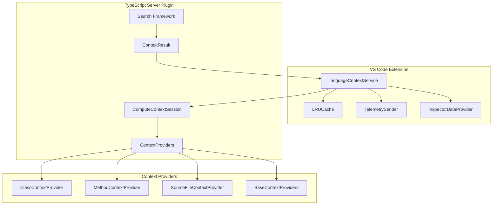

**System Flow**
1. Extension requests context via `ILanguageContextService`
2. Request is forwarded to TypeScript server plugin
3. Plugin analyzes code using various context providers
4. Context items are computed and cached
5. Results are returned to extension with telemetry

Sources: [src/extension/typescriptContext/vscode-node/languageContextService.ts:1-1968](), [src/extension/typescriptContext/serverPlugin/src/common/contextProvider.ts:1-1200]()

## Core Components

### Language Context Service

The `ILanguageContextService` is the main interface for requesting context from TypeScript/JavaScript code.

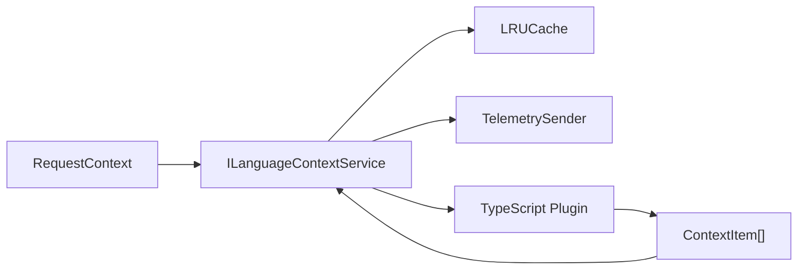

**Key Classes:**
- `ILanguageContextService`: Main service interface
- `RequestContext`: Contains request metadata and configuration
- `ContextItem`: Base type for context results (snippets, traits)
- `RunnableResultManager`: Manages caching and invalidation

The service supports both immediate context requests and speculative context computation for performance.

Sources: [src/extension/typescriptContext/vscode-node/languageContextService.ts:10-21](), [src/extension/typescriptContext/vscode-node/languageContextService.ts:591-625]()

### Context Provider API

The system exposes a public API for other extensions to contribute context items:

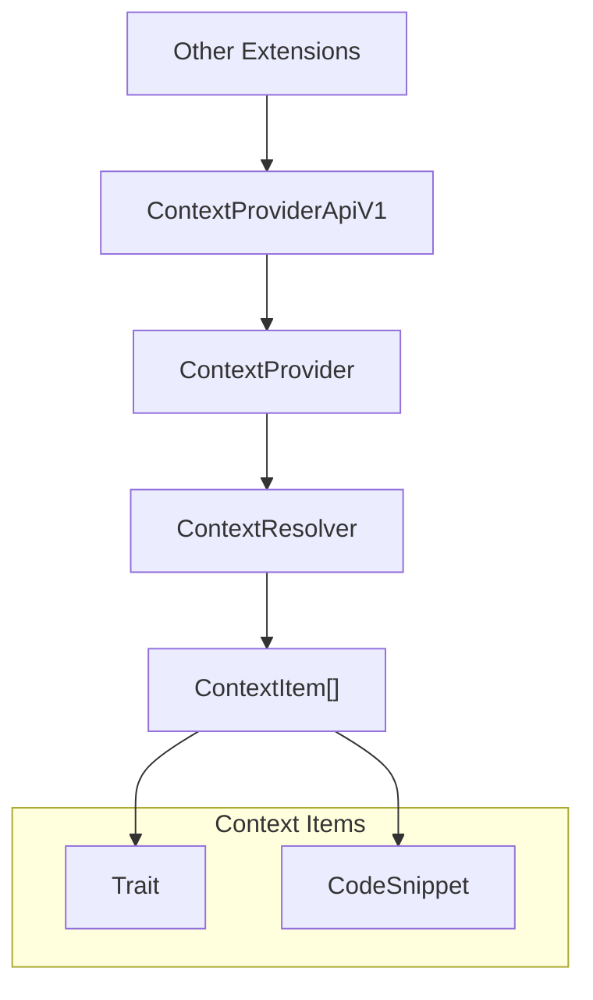

**API Structure:**
- `ContextProviderApiV1`: Main API interface
- `ContextProvider`: Extension-provided context source
- `ContextResolver`: Function that computes context for requests
- `ResolveRequest`: Contains document context and time budget

Sources: [src/extension/typescriptContext/vscode-node/languageContextService.ts:42-44](), [src/extension/typescriptContext/vscode-node/languageContextService.ts:65-75]()

## Context Computation Framework

### Search Framework

The server plugin uses a `Search` framework to find relevant code elements across TypeScript programs:

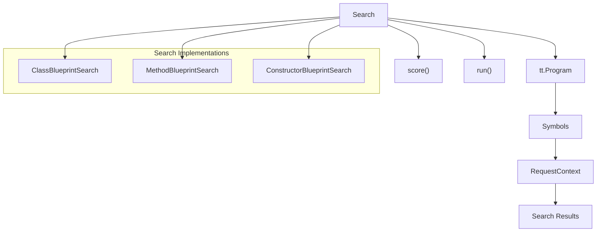

**Search Process:**
1. `score()`: Evaluates program relevance for the search
2. `run()`: Executes search logic across multiple programs
3. Returns typed results (e.g., `SimilarClassDeclaration`)

Sources: [src/extension/typescriptContext/serverPlugin/src/common/contextProvider.ts:91-182](), [src/extension/typescriptContext/serverPlugin/src/common/classContextProvider.ts:25-260]()

### Context Providers

Different context providers handle various TypeScript constructs:

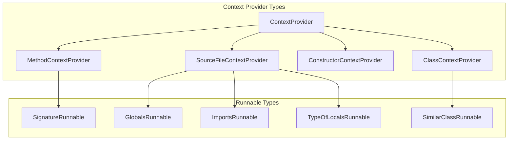

**Provider Responsibilities:**
- Analyze specific TypeScript constructs
- Generate appropriate context runnables
- Handle caching and priority management
- Support speculative execution

Sources: [src/extension/typescriptContext/serverPlugin/src/common/contextProvider.ts:722-728](), [src/extension/typescriptContext/serverPlugin/src/common/classContextProvider.ts:332-375]()

## Context Types and Results

### Context Items

The system generates two main types of context items:

| Type | Description | Example |
|------|-------------|---------|
| `Trait` | Key-value metadata about code | `{ name: "module", value: "CommonJS" }` |
| `CodeSnippet` | Relevant code fragments | Function signatures, class definitions |

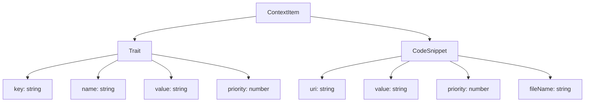

Sources: [src/extension/typescriptContext/vscode-node/languageContextService.ts:158-172](), [src/extension/typescriptContext/serverPlugin/src/common/protocol.ts:1-50]()

### Runnable Results

Context computation is organized into `ContextRunnable` instances that produce `RunnableResult` objects:

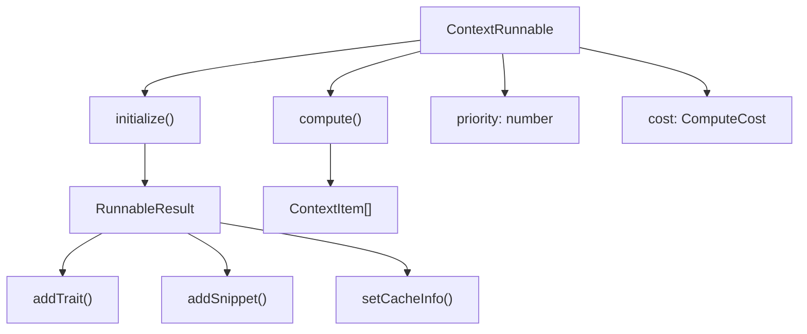

**Execution Flow:**
1. `initialize()`: Sets up result container
2. `compute()`: Executes context logic
3. Results are collected and cached
4. Token budget prevents excessive computation

Sources: [src/extension/typescriptContext/serverPlugin/src/common/contextProvider.ts:413-498](), [src/extension/typescriptContext/serverPlugin/src/common/contextProvider.ts:785-847]()

## Caching and Performance

### Cache Management

The system uses sophisticated caching to improve performance:

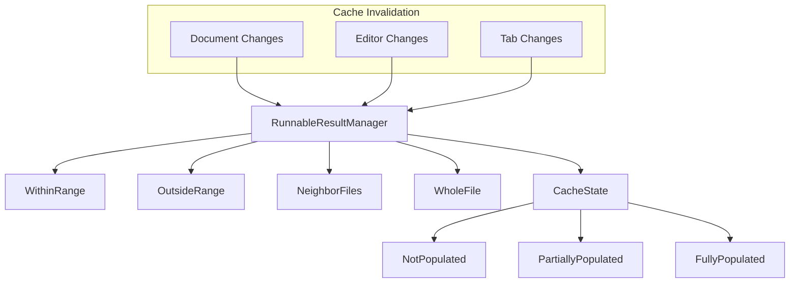

**Cache Scopes:**
- `WithinRange`: Cache valid within specific code ranges
- `OutsideRange`: Cache valid outside specific ranges
- `NeighborFiles`: Cache valid for related files
- `File`: Cache valid for entire file

Sources: [src/extension/typescriptContext/vscode-node/languageContextService.ts:613-617](), [src/extension/typescriptContext/vscode-node/languageContextService.ts:720-816]()

### Token Budget Management

Context computation is bounded by token budgets to prevent excessive processing:

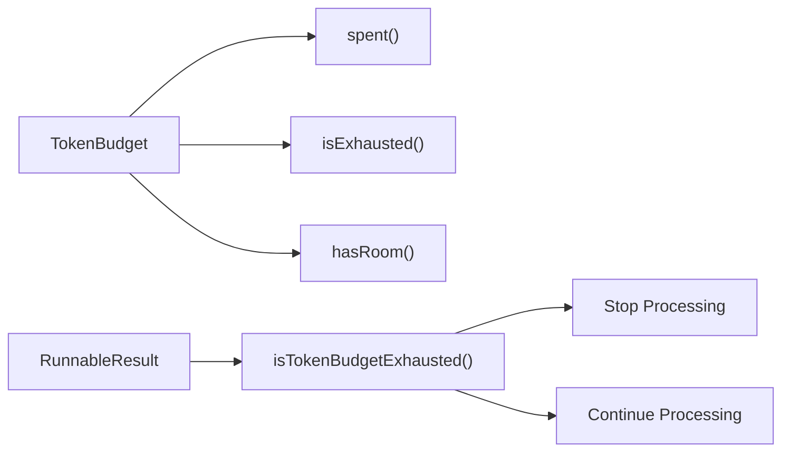

Sources: [src/extension/typescriptContext/serverPlugin/src/common/contextProvider.ts:434-440](), [src/extension/typescriptContext/serverPlugin/src/common/contextProvider.ts:477-487]()

## Integration Points

### TypeScript Language Service

The system integrates deeply with TypeScript's language service:

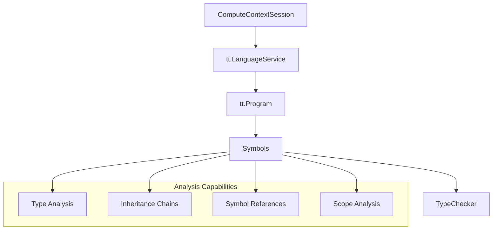

**Integration Features:**
- Multi-project support via `LanguageServerSession`
- Symbol resolution and type checking
- Inheritance hierarchy analysis
- Cross-file reference tracking

Sources: [src/extension/typescriptContext/serverPlugin/src/common/contextProvider.ts:293-351](), [src/extension/typescriptContext/serverPlugin/src/common/contextProvider.ts:317-340]()

### Telemetry and Monitoring

Comprehensive telemetry tracks system performance and usage:

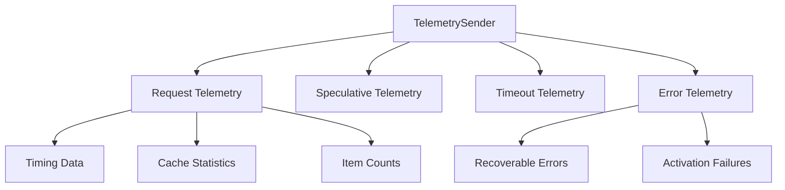

**Telemetry Categories:**
- Performance metrics (timing, cache hits)
- Usage statistics (request patterns)
- Error tracking (failures, timeouts)
- Activation diagnostics

Sources: [src/extension/typescriptContext/vscode-node/languageContextService.ts:221-589](), [src/extension/typescriptContext/vscode-node/languageContextService.ts:273-372]()