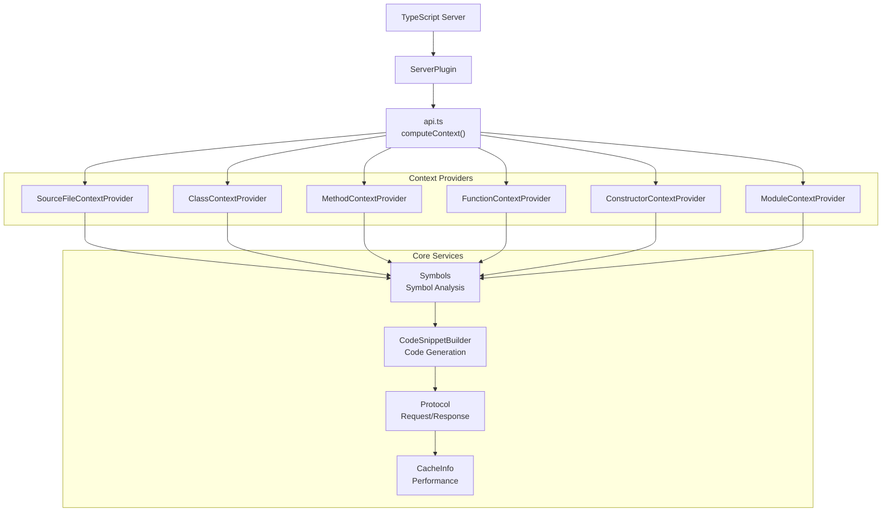
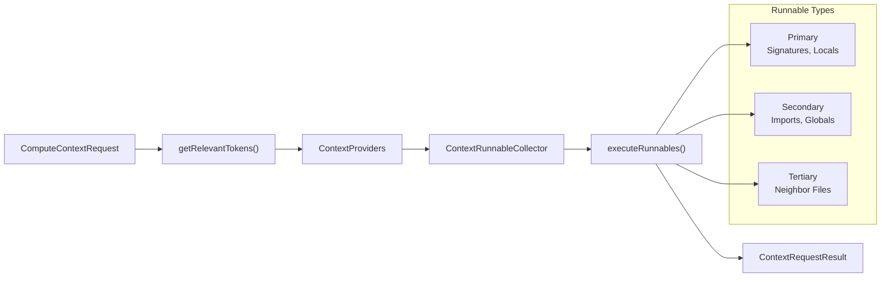
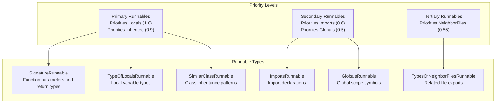
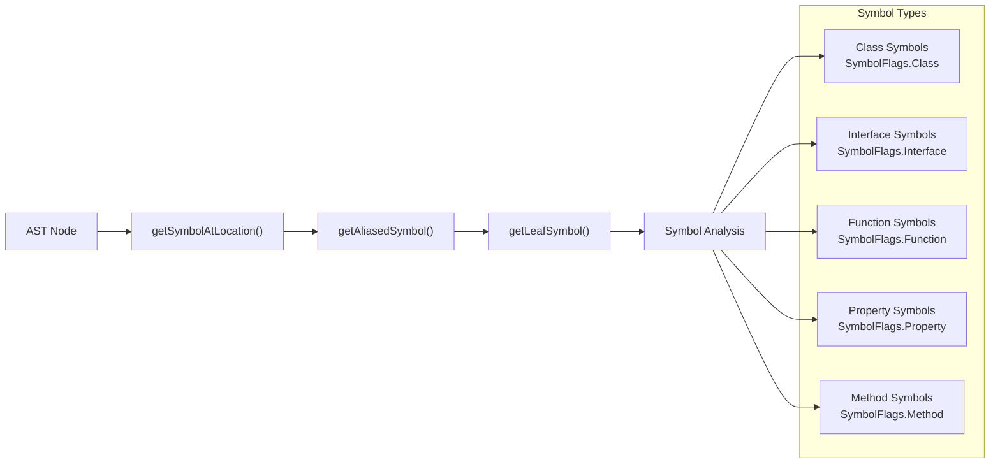
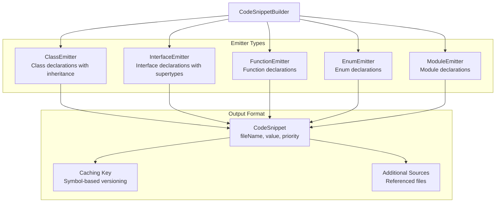
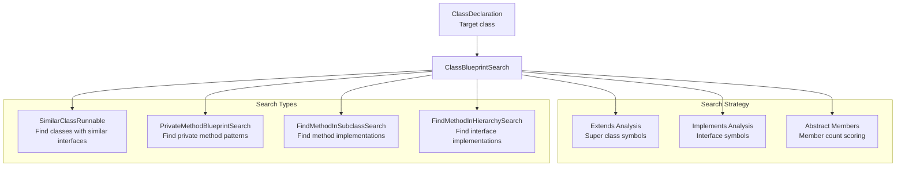
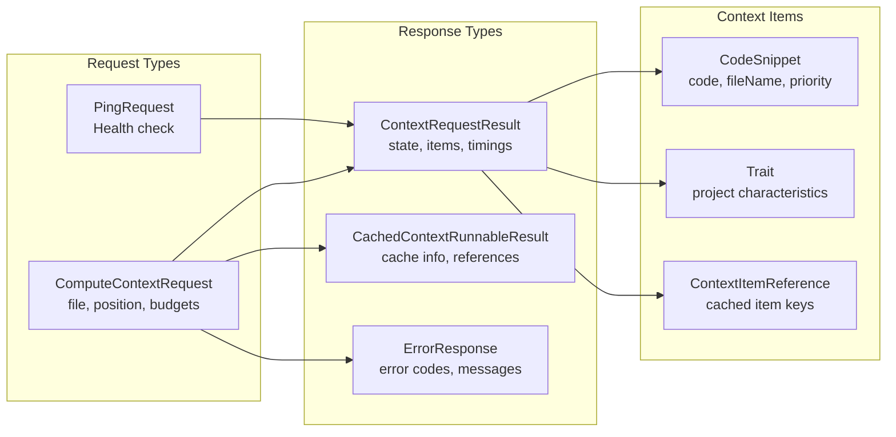
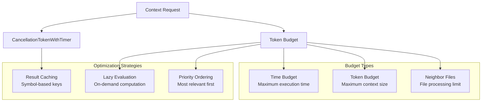
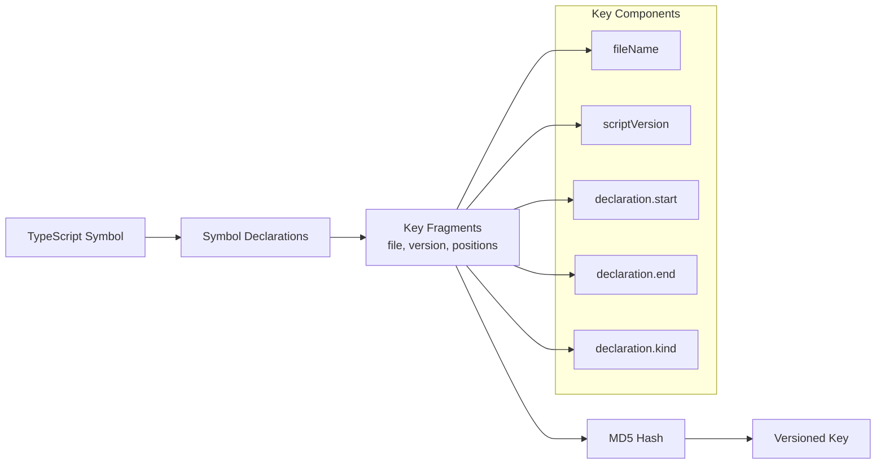

# TypeScript Server Plugin

Relevant source files

The following files were used as context for generating this wiki page:

- [src/extension/typescriptContext/common/serverProtocol.ts](src/extension/typescriptContext/common/serverProtocol.ts)
- [src/extension/typescriptContext/serverPlugin/src/common/api.ts](src/extension/typescriptContext/serverPlugin/src/common/api.ts)
- [src/extension/typescriptContext/serverPlugin/src/common/baseContextProviders.ts](src/extension/typescriptContext/serverPlugin/src/common/baseContextProviders.ts)
- [src/extension/typescriptContext/serverPlugin/src/common/classContextProvider.ts](src/extension/typescriptContext/serverPlugin/src/common/classContextProvider.ts)
- [src/extension/typescriptContext/serverPlugin/src/common/code.ts](src/extension/typescriptContext/serverPlugin/src/common/code.ts)
- [src/extension/typescriptContext/serverPlugin/src/common/methodContextProvider.ts](src/extension/typescriptContext/serverPlugin/src/common/methodContextProvider.ts)
- [src/extension/typescriptContext/serverPlugin/src/common/protocol.ts](src/extension/typescriptContext/serverPlugin/src/common/protocol.ts)
- [src/extension/typescriptContext/serverPlugin/src/common/sourceFileContextProvider.ts](src/extension/typescriptContext/serverPlugin/src/common/sourceFileContextProvider.ts)
- [src/extension/typescriptContext/serverPlugin/src/common/typescripts.ts](src/extension/typescriptContext/serverPlugin/src/common/typescripts.ts)
- [src/extension/typescriptContext/serverPlugin/src/node/test/simple.spec.ts](src/extension/typescriptContext/serverPlugin/src/node/test/simple.spec.ts)

## Purpose and Scope

The TypeScript Server Plugin provides server-side context computation for AI-powered code assistance in TypeScript and JavaScript projects. It runs as a plugin within the TypeScript Language Server and analyzes code structure, symbols, and relationships to generate relevant context information for AI models.

This plugin specifically handles the computation of TypeScript/JavaScript context on the server side, including symbol resolution, type analysis, and code snippet generation. For information about the broader language context system integration, see [Language Context System](#5). For client-side context consumption and caching, see [Configuration System](#6).

## Architecture Overview

The plugin operates as a TypeScript server plugin that hooks into the language service to provide context computation capabilities. It follows a provider-based architecture where different context providers handle specific code constructs.

### Core Components

Sources: [src/extension/typescriptContext/serverPlugin/src/common/api.ts:40-51](), [src/extension/typescriptContext/serverPlugin/src/common/api.ts:129-142]()

### Request Processing Flow

Sources: [src/extension/typescriptContext/serverPlugin/src/common/api.ts:62-72](), [src/extension/typescriptContext/serverPlugin/src/common/api.ts:88-97]()

## Context Provider System

The plugin uses a hierarchical context provider system that analyzes different code constructs and generates appropriate context items.

### Provider Factory Registration

Context providers are registered based on TypeScript syntax kinds and instantiated dynamically based on cursor position:

| Syntax Kind | Provider Class | Purpose |
|-------------|----------------|---------|
| `SourceFile` | `SourceFileContextProvider` | File-level context |
| `FunctionDeclaration` | `FunctionContextProvider` | Function signatures and locals |
| `ArrowFunction` | `FunctionContextProvider` | Arrow function context |
| `ClassDeclaration` | `ClassContextProvider` | Class inheritance and structure |
| `MethodDeclaration` | `MethodContextProvider` | Method signatures and blueprints |
| `Constructor` | `ConstructorContextProvider` | Constructor patterns |
| `ModuleDeclaration` | `ModuleContextProvider` | Module exports and structure |

Sources: [src/extension/typescriptContext/serverPlugin/src/common/api.ts:42-51]()

### Context Runnable Execution

Each provider generates context runnables that are executed in priority order:

Sources: [src/extension/typescriptContext/serverPlugin/src/common/baseContextProviders.ts:558-578](), [src/extension/typescriptContext/serverPlugin/src/common/protocol.ts:106-115]()

## Symbol Analysis and Code Generation

The plugin performs sophisticated symbol analysis using the TypeScript compiler API to understand code structure and relationships.

### Symbol Resolution Pipeline

Sources: [src/extension/typescriptContext/serverPlugin/src/common/typescripts.ts:746-752](), [src/extension/typescriptContext/serverPlugin/src/common/typescripts.ts:792-798](), [src/extension/typescriptContext/serverPlugin/src/common/typescripts.ts:814-835]()

### Code Snippet Generation

The `CodeSnippetBuilder` generates formatted code snippets from TypeScript symbols:

Sources: [src/extension/typescriptContext/serverPlugin/src/common/code.ts:598-617](), [src/extension/typescriptContext/serverPlugin/src/common/code.ts:689-698](), [src/extension/typescriptContext/serverPlugin/src/common/code.ts:711-720]()

## Blueprint Search System

The plugin includes a sophisticated blueprint search system that finds similar code patterns to provide relevant examples for AI code generation.

### Class Blueprint Search

Sources: [src/extension/typescriptContext/serverPlugin/src/common/classContextProvider.ts:25-115](), [src/extension/typescriptContext/serverPlugin/src/common/methodContextProvider.ts:54-139]()

## Protocol and Communication

The plugin communicates using a structured protocol for context computation requests and responses.

### Request/Response Structure

Sources: [src/extension/typescriptContext/serverPlugin/src/common/protocol.ts:398-404](), [src/extension/typescriptContext/serverPlugin/src/common/protocol.ts:358-396](), [src/extension/typescriptContext/serverPlugin/src/common/protocol.ts:183-210]()

### Cache Scope Management

The plugin implements sophisticated caching with different scope strategies:

| Cache Scope | Description | Use Case |
|-------------|-------------|----------|
| `File` | Valid for entire file | Compiler options, traits |
| `WithinRange` | Valid within specific range | Function/method bodies |
| `OutsideRange` | Valid outside specific ranges | Import declarations |
| `NeighborFiles` | Valid while neighbor files unchanged | Cross-file references |

Sources: [src/extension/typescriptContext/serverPlugin/src/common/protocol.ts:10-29](), [src/extension/typescriptContext/serverPlugin/src/common/protocol.ts:58-69]()

## Performance and Optimization

The plugin includes several performance optimizations to handle large codebases efficiently.

### Cancellation and Budget Management

Sources: [src/extension/typescriptContext/serverPlugin/src/common/typescripts.ts:142-167](), [src/extension/typescriptContext/serverPlugin/src/common/protocol.ts:398-404]()

### Symbol Key Generation

The plugin generates versioned keys for symbols to enable efficient caching:

Sources: [src/extension/typescriptContext/serverPlugin/src/common/typescripts.ts:636-683]()

## Testing and Validation

The plugin includes comprehensive testing infrastructure to validate context computation across different code patterns.

### Test Coverage Areas

The test suite covers various TypeScript/JavaScript constructs:

- **Class Analysis**: Inheritance patterns, interface implementations, abstract members
- **Method Analysis**: Public/private methods, signature types, blueprint search
- **Function Analysis**: Parameter types, return types, local variables
- **Constructor Analysis**: Inheritance patterns, parameter types
- **Type Analysis**: Type aliases, intersections, generic types
- **Import Analysis**: Named imports, namespace imports, module resolution

Sources: [src/extension/typescriptContext/serverPlugin/src/node/test/simple.spec.ts:39-402]()