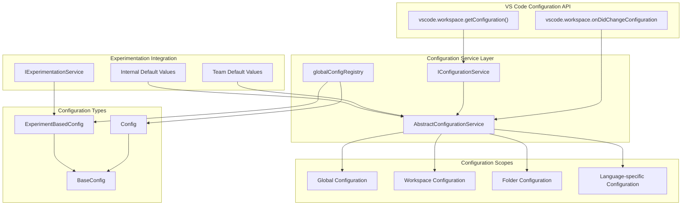
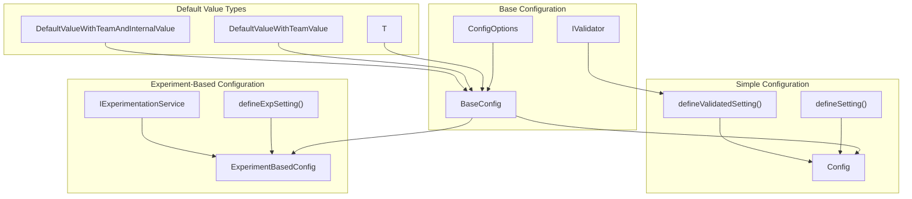
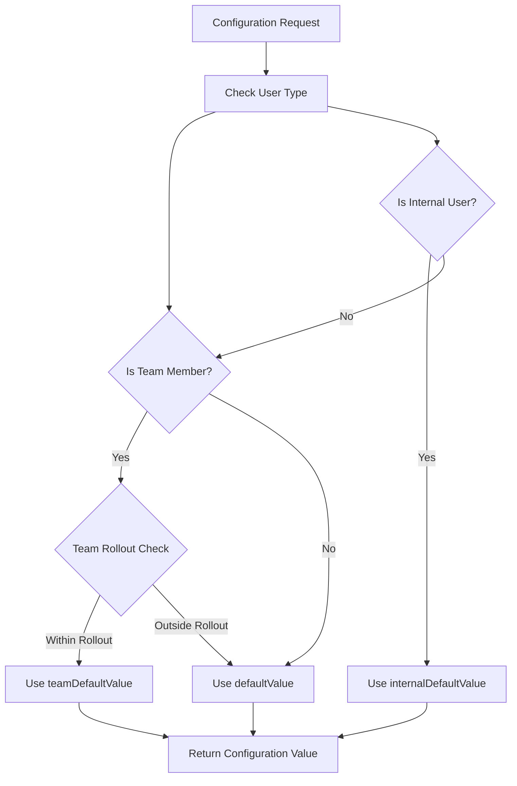
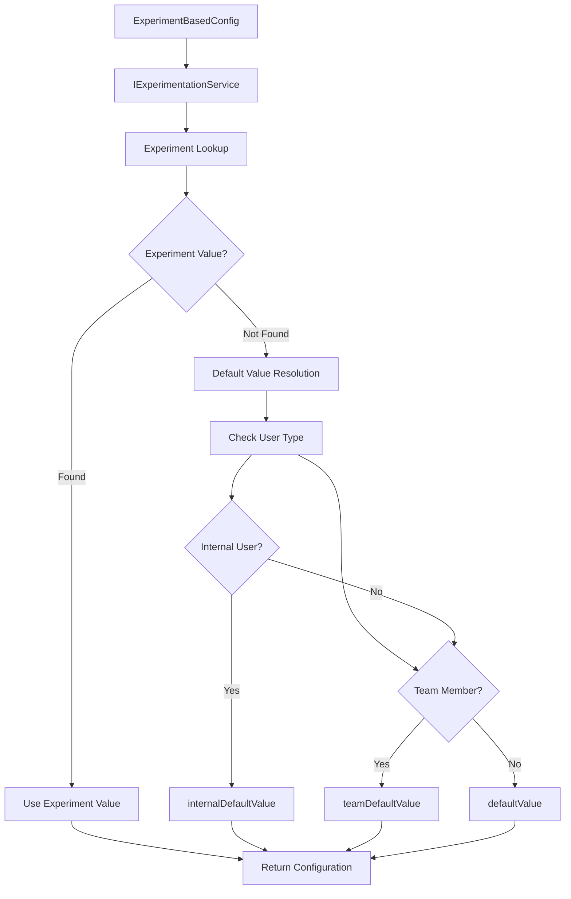
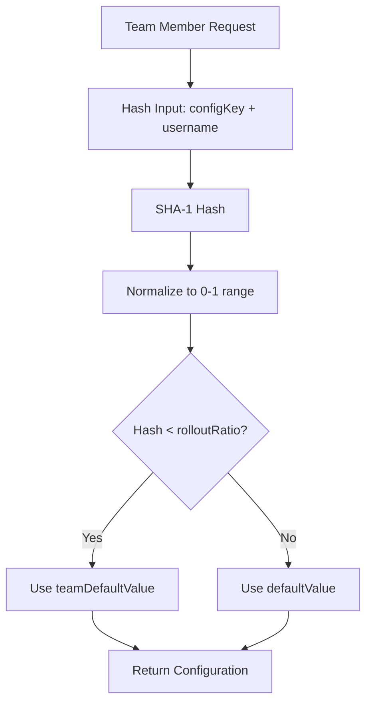

# Configuration System

<details>
<summary>Relevant source files</summary>

The following files were used as context for generating this wiki page:

- [src/extension/xtab/common/promptCrafting.ts](src/extension/xtab/common/promptCrafting.ts)
- [src/extension/xtab/node/xtabProvider.ts](src/extension/xtab/node/xtabProvider.ts)
- [src/extension/xtab/test/common/promptCrafting.spec.ts](src/extension/xtab/test/common/promptCrafting.spec.ts)
- [src/platform/configuration/common/configurationService.ts](src/platform/configuration/common/configurationService.ts)
- [src/platform/inlineEdits/common/dataTypes/xtabPromptOptions.ts](src/platform/inlineEdits/common/dataTypes/xtabPromptOptions.ts)

</details>


## Purpose and Scope

This document covers the configuration system that manages settings, experimentation service integration, and configuration keys for all extension features. The system provides a centralized way to manage user preferences, feature flags, and experimental settings across the GitHub Copilot Chat extension.

The configuration system supports multiple configuration scopes (global, workspace, folder), experimentation-based rollouts, and team-specific defaults. It integrates with VS Code's configuration API while providing additional functionality for internal settings and feature experimentation.

## Configuration Service Architecture

The configuration system is built around the `IConfigurationService` interface and `AbstractConfigurationService` class, providing a unified way to access and manage settings across the extension.

### Core Components

**Configuration Service Architecture**



Sources: [src/platform/configuration/common/configurationService.ts:25-153]()

### Service Interface

The `IConfigurationService` provides methods for accessing configuration values with different levels of detail:

| Method | Purpose | Return Type |
|--------|---------|-------------|
| `getConfig<T>()` | Get configuration value with defaults | `T` |
| `getConfigObservable<T>()` | Get observable configuration value | `IObservable<T>` |
| `inspectConfig<T>()` | Get detailed configuration information | `InspectConfigResult<T>` |
| `isConfigured<T>()` | Check if user has configured a setting | `boolean` |
| `setConfig<T>()` | Set configuration value | `Thenable<void>` |
| `getExperimentBasedConfig<T>()` | Get experiment-based configuration | `T` |

Sources: [src/platform/configuration/common/configurationService.ts:77-153]()

## Configuration Key Organization

Configuration keys are organized into hierarchical namespaces to provide structure and control access to different types of settings.

### Configuration Namespaces

**Configuration Key Hierarchy**

```mermaid
graph TB
    subgraph "ConfigKey Namespace"
        SHARED["ConfigKey.Shared"]
        INTERNAL["ConfigKey.Internal"]
        EXPERIMENTAL["ConfigKey.Experimental"]
    end
    
    subgraph "Shared Settings"
        DEBUG_PROXY["DebugOverrideProxyUrl"]
        DEBUG_CAPI["DebugOverrideCAPIUrl"]
        AUTH_PROVIDER["AuthProvider"]
        ENABLE_LANGS["Enable"]
    end
    
    subgraph "Internal Settings"
        CHAT_ENGINE["DebugOverrideChatEngine"]
        INLINE_EDITS["InlineEdits*"]
        WORKSPACE_SETTINGS["Workspace*"]
        AGENT_SETTINGS["Agent*"]
    end
    
    subgraph "Experimental Settings"
        FEATURE_FLAGS["Feature Flags"]
        ROLLOUT_CONFIGS["Rollout Configurations"]
        TEAM_SETTINGS["Team-specific Settings"]
    end
    
    SHARED --> DEBUG_PROXY
    SHARED --> DEBUG_CAPI
    SHARED --> AUTH_PROVIDER
    SHARED --> ENABLE_LANGS
    
    INTERNAL --> CHAT_ENGINE
    INTERNAL --> INLINE_EDITS
    INTERNAL --> WORKSPACE_SETTINGS
    INTERNAL --> AGENT_SETTINGS
    
    EXPERIMENTAL --> FEATURE_FLAGS
    EXPERIMENTAL --> ROLLOUT_CONFIGS
    EXPERIMENTAL --> TEAM_SETTINGS
```



### Shared Configuration Settings

Shared settings are coordinated with the Completions extension and visible in VS Code settings:

| Setting | Purpose | Default |
|---------|---------|---------|
| `advanced.debug.overrideProxyUrl` | Override CAPI proxy URL | `undefined` |
| `advanced.debug.overrideCapiUrl` | Override CAPI URL | `undefined` |
| `advanced.authProvider` | Authentication provider | `AuthProviderId.GitHub` |
| `enable` | Language enablement | `{"*": true, "plaintext": false}` |

### Internal Configuration Settings

Internal settings are hidden from users and used for debugging and development:

| Setting Category | Examples | Purpose |
|------------------|----------|---------|
| Inline Edits | `InlineEditsMaxAffectedLines`, `InlineEditsDebounce` | Control inline edit behavior |
| Workspace | `WorkspaceMaxLocalIndexSize`, `WorkspaceEnableCodeSearch` | Configure workspace features |
| Agent | `AgentTemperature`, `SweBenchAgentPrompt` | Control AI agent behavior |
| Chat | `DebugOverrideChatEngine`, `DebugOverrideChatMaxTokenNum` | Debug chat functionality |

Sources: [src/platform/configuration/common/configurationService.ts:560-712]()

## Configuration Types and Validation

The configuration system supports different types of configurations with validation and default value handling.

### Configuration Types

**Configuration Type Hierarchy**



### Default Value Resolution

The system supports different default values based on user type:

| User Type | Default Source | Priority |
|-----------|---------------|----------|
| External User | `defaultValue` | Lowest |
| Team Member | `teamDefaultValue` | Medium |
| Internal User | `internalDefaultValue` | Highest |

**Default Value Resolution Flow**



Sources: [src/platform/configuration/common/configurationService.ts:317-338](), [src/platform/configuration/common/configurationService.ts:202-214]()

### Configuration Validation

The system includes validation for configuration values using the `IValidator<T>` interface:

```typescript
// Example validators
vBoolean()  // Validates boolean values
vString()   // Validates string values
```

Configuration definitions can include validators to ensure type safety:

```typescript
const InlineEditsIgnoreCompletionsDisablement = defineValidatedSetting<boolean>(
    'chat.advanced.inlineEdits.ignoreCompletionsDisablement', 
    vBoolean(), 
    false, 
    INTERNAL_RESTRICTED
);
```

Sources: [src/platform/configuration/common/configurationService.ts:640-641]()

## Experimentation Service Integration

The configuration system integrates with the experimentation service to enable controlled rollouts and A/B testing of features.

### Experiment-Based Configuration

**Experimentation Flow**



### Experiment Configuration Examples

Common experiment-based configurations include:

| Setting | Purpose | Default Values |
|---------|---------|----------------|
| `InlineEditsAsyncCompletions` | Enable async completions | `true` |
| `InlineEditsRevisedCacheStrategy` | Use revised caching | `true` |
| `WorkspaceEnableCodeSearch` | Enable code search | `true` |
| `ProjectLabelsExpanded` | Use expanded project labels | `false` |

Sources: [src/platform/configuration/common/configurationService.ts:641-643](), [src/platform/configuration/common/configurationService.ts:624-625]()

### Team Rollout Configuration

Team-specific rollouts use hash-based distribution for gradual feature enablement:

```typescript
// Team rollout with 50% distribution
const setting = defineExpSetting('feature.enabled', {
    defaultValue: false,
    teamDefaultValue: true,
    teamDefaultValueRollout: 0.5  // 50% of team members
});
```

The system uses SHA-1 hashing of the configuration key and username to determine rollout membership:

**Team Rollout Hash Distribution**



Sources: [src/platform/configuration/common/configurationService.ts:271-283](), [src/platform/configuration/common/configurationService.ts:289-296]()

## Development Workflow Usage

These configurations are automatically utilized throughout the development lifecycle without requiring manual intervention.

### Automatic Version Management

The configuration files enable seamless environment setup:

1. **Local Development**: `nvm use` reads `.nvmrc` and switches to Node.js 22.15.1
2. **Package Installation**: `npm install` validates engine requirements using `.npmrc` settings
3. **Build Process**: Build tools inherit the configured Node.js version and strict package validation
4. **CI/CD Execution**: Automated pipelines use these configurations for consistent builds

### Configuration Validation

The repository enforces these configurations through multiple validation layers:

- Pre-commit hooks validate Node.js version alignment
- CI/CD pipelines fail if version requirements are not met
- Development containers automatically apply version constraints
- Build processes verify configuration consistency before compilation

Sources: [.nvmrc:1-2](), [.npmrc:1-2]()