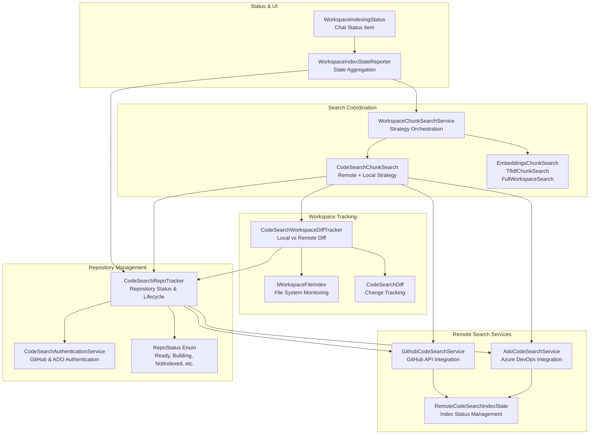
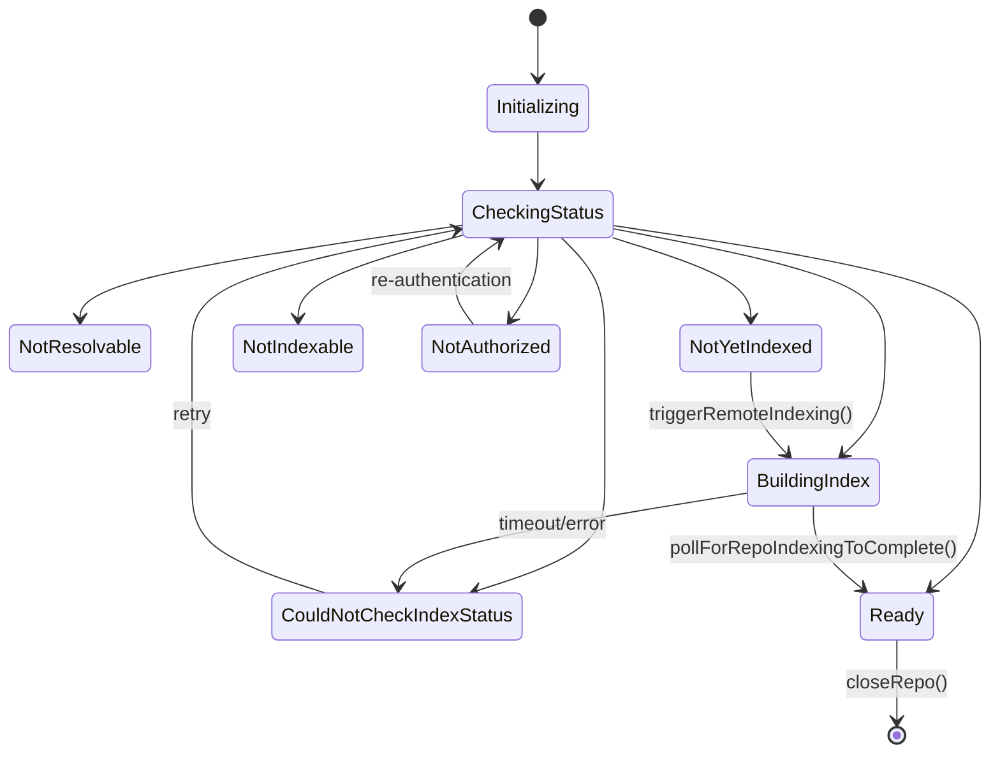
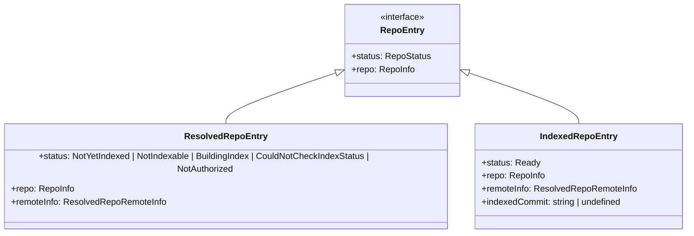
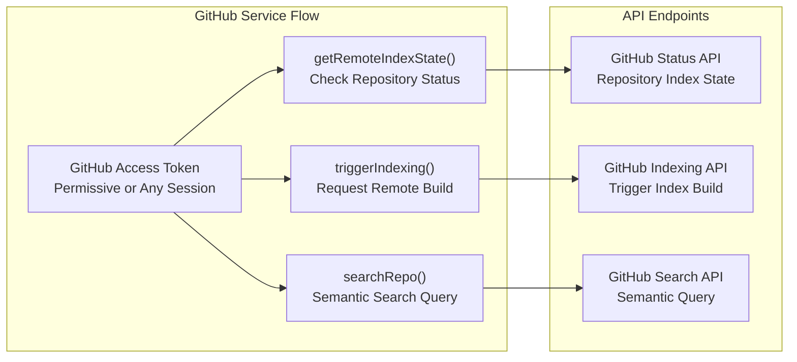
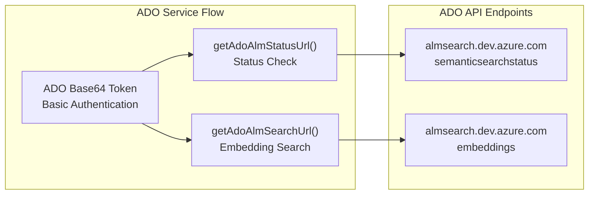
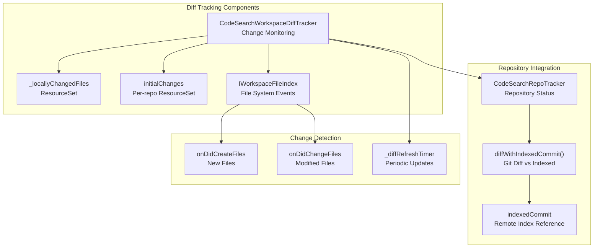
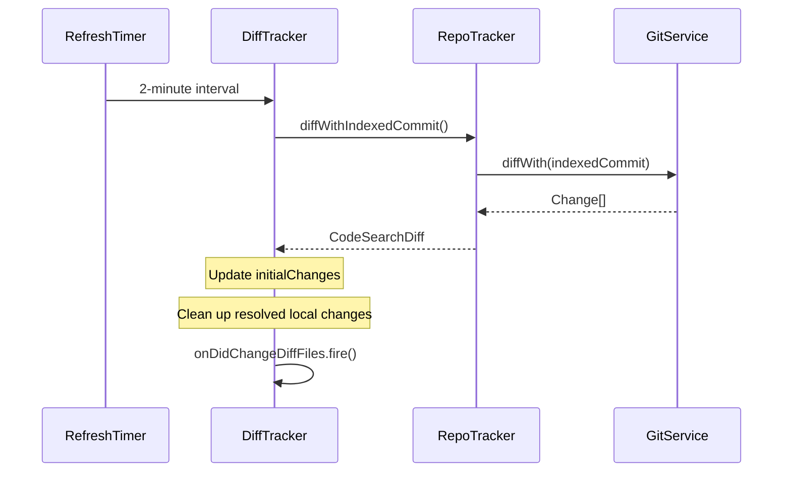
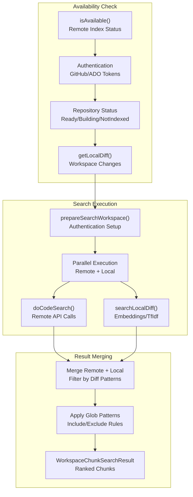
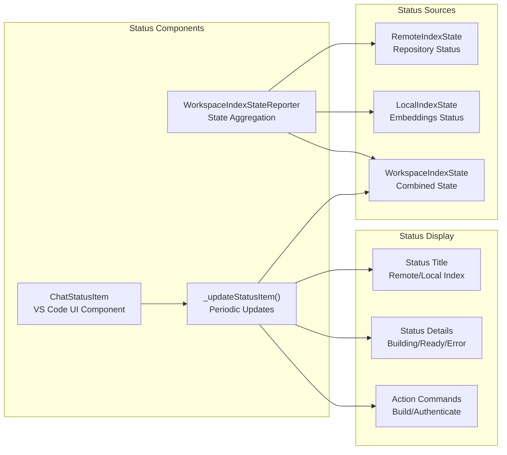
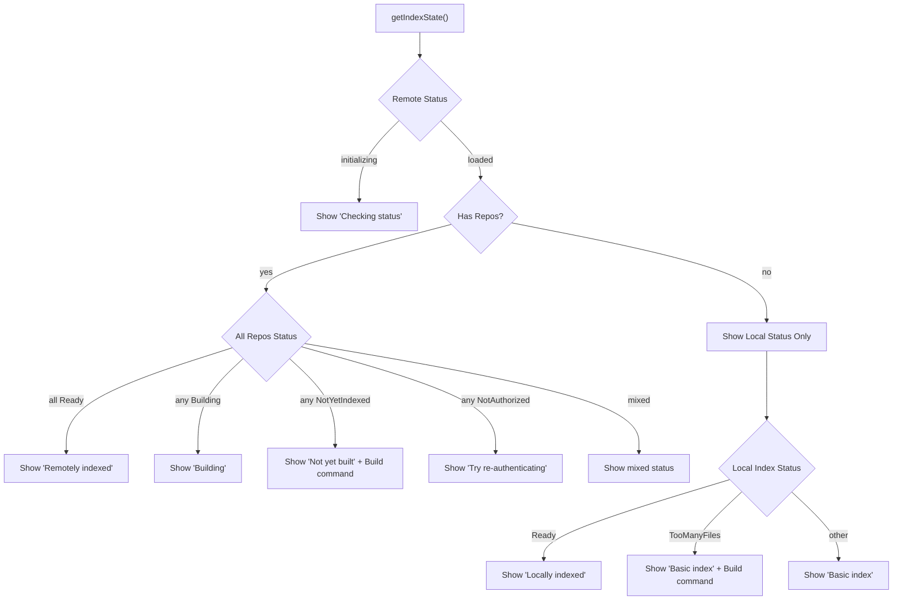

# Code Search and Workspace Management

<details>
<summary>Relevant source files</summary>

The following files were used as context for generating this wiki page:

- [src/extension/workspaceChunkSearch/vscode-node/workspaceIndexingStatus.ts](src/extension/workspaceChunkSearch/vscode-node/workspaceIndexingStatus.ts)
- [src/platform/remoteCodeSearch/common/adoCodeSearchService.ts](src/platform/remoteCodeSearch/common/adoCodeSearchService.ts)
- [src/platform/remoteCodeSearch/node/codeSearchRepoTracker.ts](src/platform/remoteCodeSearch/node/codeSearchRepoTracker.ts)
- [src/platform/workspaceChunkSearch/node/codeSearchChunkSearch.ts](src/platform/workspaceChunkSearch/node/codeSearchChunkSearch.ts)
- [src/platform/workspaceChunkSearch/node/codeSearchWorkspaceDiff.ts](src/platform/workspaceChunkSearch/node/codeSearchWorkspaceDiff.ts)
- [src/platform/workspaceChunkSearch/node/workspaceChunkSearchService.ts](src/platform/workspaceChunkSearch/node/workspaceChunkSearchService.ts)

</details>


This document covers the code search and workspace management system, which provides remote code indexing, repository tracking, and workspace synchronization capabilities for the GitHub Copilot Chat extension. This system manages the integration between remote code search services (GitHub and Azure DevOps) and local workspace state to enable intelligent code search across both indexed and unindexed content.

For information about the inline editing system's workspace tracking, see [Workspace and Document Tracking](#4.2). For details about language-specific context provision, see [Language Context System](#5).

## System Architecture

The code search and workspace management system consists of several interconnected components that work together to provide seamless code search capabilities across remote and local sources.



Sources: [src/platform/remoteCodeSearch/node/codeSearchRepoTracker.ts:1-1004](), [src/platform/remoteCodeSearch/common/adoCodeSearchService.ts:1-360](), [src/platform/workspaceChunkSearch/node/codeSearchWorkspaceDiff.ts:1-230](), [src/platform/workspaceChunkSearch/node/codeSearchChunkSearch.ts:1-696]()

## Repository Tracking and Status Management

The `CodeSearchRepoTracker` class serves as the central coordinator for managing repository indexing state across the workspace. It tracks multiple repositories and their remote indexing status, handling the lifecycle from initialization through ready state.

### Repository Status States



| Status | Description | Code Reference |
|--------|-------------|---------------|
| `NotResolvable` | Repository cannot be resolved or has no valid remotes | [codeSearchRepoTracker.ts:35-36]() |
| `Initializing` | Repository is being set up and remote info is being resolved | [codeSearchRepoTracker.ts:38]() |
| `CheckingStatus` | Checking remote index status via API | [codeSearchRepoTracker.ts:41]() |
| `NotYetIndexed` | Repository exists but has not been indexed | [codeSearchRepoTracker.ts:44]() |
| `NotIndexable` | Repository cannot be indexed by the remote service | [codeSearchRepoTracker.ts:47]() |
| `CouldNotCheckIndexStatus` | Failed to check remote index status | [codeSearchRepoTracker.ts:59]() |
| `NotAuthorized` | User lacks access to the repository | [codeSearchRepoTracker.ts:66]() |
| `BuildingIndex` | Remote index is being built | [codeSearchRepoTracker.ts:69]() |
| `Ready` | Repository is indexed and ready for search | [codeSearchRepoTracker.ts:72]() |

### Repository Entry Types

The system uses different entry types based on repository state:



Sources: [src/platform/remoteCodeSearch/node/codeSearchRepoTracker.ts:34-114](), [src/platform/remoteCodeSearch/node/codeSearchRepoTracker.ts:215-314]()

## Remote Code Search Services

The system supports two remote code search providers through dedicated service interfaces.

### GitHub Code Search Service

The `GithubCodeSearchService` provides semantic search capabilities against GitHub's remote code index:



### Azure DevOps Code Search Service

The `AdoCodeSearchService` provides similar functionality for Azure DevOps repositories:



| Service Method | Purpose | Authentication |
|---------------|---------|---------------|
| `getRemoteIndexState()` | Check if repository is indexed | GitHub: OAuth token, ADO: Base64 token |
| `triggerIndexing()` | Request remote indexing | GitHub: OAuth token, ADO: Status check only |
| `searchRepo()` | Perform semantic search | GitHub: OAuth token, ADO: Base64 token |

Sources: [src/platform/remoteCodeSearch/common/adoCodeSearchService.ts:64-104](), [src/platform/remoteCodeSearch/common/adoCodeSearchService.ts:137-207]()

## Workspace Diff Tracking

The `CodeSearchWorkspaceDiffTracker` monitors local workspace changes against the remote indexed state to provide accurate search results.

### Diff State Management



The diff tracker maintains two types of changes:

1. **Initial Changes**: Files that differ between the current workspace and the indexed commit
2. **Locally Changed Files**: Files modified during the current session

### Diff Refresh Cycle

The system periodically refreshes the diff state to maintain accuracy:



Sources: [src/platform/workspaceChunkSearch/node/codeSearchWorkspaceDiff.ts:32-228](), [src/platform/workspaceChunkSearch/node/codeSearchWorkspaceDiff.ts:94-110]()

## Search Coordination and Strategy Selection

The `CodeSearchChunkSearch` class coordinates between remote code search and local workspace indexing to provide comprehensive search results.

### Search Strategy Flow



### Search Strategy Coordination

The system uses multiple strategies with fallback mechanisms:

| Strategy | Purpose | Fallback | Timeout |
|----------|---------|----------|---------|
| `CodeSearchChunkSearch` | Remote + Local coordination | Local embeddings/TfIdf | 12.5 seconds |
| `EmbeddingsChunkSearch` | Local semantic search | TfIdf search | 8 seconds |
| `TfIdfWithSemanticChunkSearch` | Keyword + semantic hybrid | TfIdf only | N/A |
| `FullWorkspaceChunkSearch` | Complete workspace scan | Code search strategies | N/A |

### Instant Indexing Support

For repositories that are not yet indexed, the system supports instant indexing:

```mermaid
sequenceDiagram
    participant Search as CodeSearchChunkSearch
    participant Tracker as RepoTracker
    participant Remote as RemoteService
    
    Search->>Tracker: triggerRemoteIndexingOfRepo()
    Tracker->>Remote: triggerIndexing('auto')
    Remote-->>Tracker: indexing started
    
    Note over Tracker: Status: BuildingIndex
    
    loop Polling (5 attempts, 1s delay)
        Tracker->>Remote: updateRepoStateFromEndpoint()
        Remote-->>Tracker: RemoteIndexState
        
        alt Ready
            Note over Tracker: Status: Ready
            break
        else Still Building
            Note over Tracker: Continue polling
        end
    end
    
    alt Success
        Search->>Search: proceed with search
    else Timeout
        Search->>Search: fallback to local search
    end
```

Sources: [src/platform/workspaceChunkSearch/node/codeSearchChunkSearch.ts:83-696](), [src/platform/workspaceChunkSearch/node/codeSearchChunkSearch.ts:598-652]()

## Status Reporting and UI Integration

The system provides comprehensive status reporting through the VS Code chat interface.

### Status Item Management



### Status Display Logic

The status item prioritizes information display based on remote index state:



### Command Integration

The status system integrates with VS Code commands for user actions:

| Command | Purpose | Handler |
|---------|---------|---------|
| `buildRemoteIndexCommandId` | Trigger remote indexing | `triggerRemoteIndexing()` |
| `buildLocalIndexCommandId` | Trigger local indexing | `triggerLocalIndexing()` |
| `reauthenticateCommandId` | Re-authenticate for repo access | `tryReauthenticating()` |
| `signInFirstTimeCommandId` | Initial authentication | `tryAuthenticating()` |

Sources: [src/extension/workspaceChunkSearch/vscode-node/workspaceIndexingStatus.ts:66-327](), [src/platform/workspaceChunkSearch/node/workspaceChunkSearchService.ts:67-95]()

## Configuration and Telemetry

The system includes comprehensive configuration options and telemetry tracking for monitoring performance and usage patterns.

### Key Configuration Options

| Configuration Key | Purpose | Default |
|------------------|---------|---------|
| `WorkspaceEnableCodeSearch` | Enable remote code search | Experiment-based |
| `WorkspaceUseCodeSearchInstantIndexing` | Allow instant indexing | Experiment-based |
| `WorkspacePrototypeAdoCodeSearchEnabled` | Enable ADO code search | Experiment-based |

### Telemetry Events

The system tracks various telemetry events for monitoring and optimization:

- `codeSearchChunkSearch.isAvailable` - Availability check results
- `codeSearchChunkSearch.search.success` - Successful search operations
- `codeSearchChunkSearch.triggerRemoteIndexing` - Indexing trigger events
- `workspaceChunkSearchStrategy` - Strategy selection and performance
- `adoCodeSearch.searchRepo.success/error` - ADO search results

Sources: [src/platform/workspaceChunkSearch/node/codeSearchChunkSearch.ts:193-224](), [src/platform/workspaceChunkSearch/node/workspaceChunkSearchService.ts:351-373]()