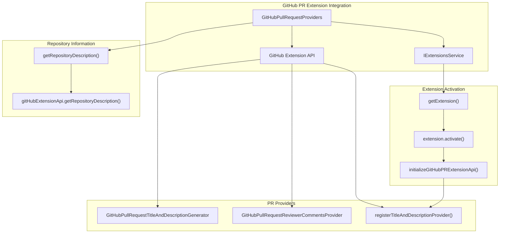

# User Interface Integration

Relevant source files

The following files were used as context for generating this wiki page:

- [package.nls.json](package.nls.json)
- [src/extension/contextKeys/vscode-node/contextKeys.contribution.ts](src/extension/contextKeys/vscode-node/contextKeys.contribution.ts)
- [src/extension/conversation/node/githubPullRequestProviders.ts](src/extension/conversation/node/githubPullRequestProviders.ts)
- [src/extension/conversation/vscode-node/userActions.ts](src/extension/conversation/vscode-node/userActions.ts)
- [src/extension/inlineChat/vscode-node/inlineChatCodeActions.ts](src/extension/inlineChat/vscode-node/inlineChatCodeActions.ts)
- [src/extension/inlineChat/vscode-node/inlineChatCommands.ts](src/extension/inlineChat/vscode-node/inlineChatCommands.ts)
- [src/extension/inlineEdits/vscode-node/inlineCompletionProvider.ts](src/extension/inlineEdits/vscode-node/inlineCompletionProvider.ts)
- [src/extension/intents/common/intents.ts](src/extension/intents/common/intents.ts)
- [src/extension/intents/node/allIntents.ts](src/extension/intents/node/allIntents.ts)
- [src/extension/intents/node/editCodeIntent2.ts](src/extension/intents/node/editCodeIntent2.ts)

This document covers how the GitHub Copilot Chat extension integrates with VS Code's user interface through commands, code actions, context keys, and user feedback systems. It details the mechanisms for registering UI components, handling user interactions, and providing contextual actions throughout the VS Code interface.

For information about the core chat functionality and language model tools, see [Chat Participants and Language Model Tools](#3). For configuration management, see [Configuration System](#6).

## Command System

The extension registers numerous commands that provide entry points for Copilot functionality throughout VS Code. Commands are organized into logical groups and registered through the VS Code API.

### Command Registration Architecture

**Sources:** [src/extension/inlineChat/vscode-node/inlineChatCommands.ts:51-350]()

### Key Command Categories

| Category | Examples | Purpose |
|----------|----------|---------|
| Explain | `github.copilot.chat.explain` | Code explanation and diagnostics |
| Review | `github.copilot.chat.review` | Code review workflows |
| Generate | `github.copilot.chat.generate` | Code generation tasks |
| Fix | `github.copilot.chat.fix` | Error fixing and diagnostics |
| Terminal | `github.copilot.chat.explainTerminalSelection` | Terminal integration |

The command system uses a `DisposableStore` to manage lifecycle and proper cleanup of registered commands.

**Sources:** [src/extension/inlineChat/vscode-node/inlineChatCommands.ts:63-349](), [package.nls.json:7-28]()

## Code Actions

Code actions provide contextual suggestions and fixes directly in the editor. The extension implements two main code action providers: `QuickFixesProvider` and `RefactorsProvider`.

### Code Action Provider Architecture

**Sources:** [src/extension/inlineChat/vscode-node/inlineChatCodeActions.ts:33-394]()

### Quick Fix Provider

The `QuickFixesProvider` offers contextual fixes based on diagnostics and selection:

- **Fix Action**: Triggered by diagnostics, launches inline chat with `/fix` command
- **Explain Action**: Provides explanations for diagnostics or selected code
- **Review Action**: Offers code review when selection is not empty
- **Alt Text Generation**: Detects image markdown and offers alt text generation

**Sources:** [src/extension/inlineChat/vscode-node/inlineChatCodeActions.ts:33-187]()

### Refactor Provider

The `RefactorsProvider` offers code generation and documentation actions:

- **Generate/Modify**: Context-sensitive code generation based on cursor position
- **Documentation**: Uses Tree-sitter AST to identify documentable nodes
- **Test Generation**: Identifies testable code structures for test generation

**Sources:** [src/extension/inlineChat/vscode-node/inlineChatCodeActions.ts:189-394]()

## Context Keys

Context keys control the visibility and behavior of UI elements based on authentication state, feature flags, and user preferences.

### Context Key Management

**Sources:** [src/extension/contextKeys/vscode-node/contextKeys.contribution.ts:20-208]()

### Context Key Categories

| Category | Keys | Purpose |
|----------|------|---------|
| Welcome View | `github.copilot-chat.activated` | Controls welcome view visibility |
| Authentication | `github.copilot.offline` | Handles offline/connection states |
| Feature Flags | `github.copilot.previewFeaturesDisabled` | Controls preview feature access |
| Debug | `github.copilot.chat.debug` | Debug mode functionality |

**Sources:** [src/extension/contextKeys/vscode-node/contextKeys.contribution.ts:20-38]()

## User Feedback and Telemetry

The extension captures detailed user interactions and feedback through the `UserFeedbackService`.

### User Action Handling Flow

**Sources:** [src/extension/conversation/vscode-node/userActions.ts:38-538]()

### Telemetry Data Collection

The extension tracks various user interactions:

- **Panel Actions**: Copy, insert, run in terminal, follow-up actions
- **Inline Chat**: Accept/reject suggestions, vote on helpfulness
- **Edit Survival**: Tracks how long accepted edits remain in code
- **Diagnostics**: Problem counts and diagnostic information

**Sources:** [src/extension/conversation/vscode-node/userActions.ts:66-537]()

## Inline Completions

The extension provides inline edit suggestions through the `InlineCompletionProviderImpl`.

### Inline Completion Architecture

**Sources:** [src/extension/inlineEdits/vscode-node/inlineCompletionProvider.ts:86-498]()

### Completion Item Processing

The provider handles multiple completion sources through a racing mechanism:

1. **LLM Provider**: Primary source for AI-generated suggestions
2. **Diagnostics Provider**: Provides fixes for compiler errors
3. **Race Strategy**: Returns first available suggestion while collecting all results

**Sources:** [src/extension/inlineEdits/vscode-node/inlineCompletionProvider.ts:160-195]()

## Extension Integration

The extension integrates with other VS Code extensions to provide enhanced functionality.

### GitHub Pull Request Integration

**Sources:** [src/extension/conversation/node/githubPullRequestProviders.ts:17-131]()

### Extension Discovery and Activation

The extension uses the `IExtensionsService` to discover and activate the GitHub Pull Request extension, then registers providers for enhanced PR functionality.

**Sources:** [src/extension/conversation/node/githubPullRequestProviders.ts:33-65]()

## Configuration and Localization

The extension uses extensive configuration options and localization strings to provide a customizable user experience.

### Localization Structure

The extension includes comprehensive localization through `package.nls.json` with categorized strings:

| Category | Examples | Purpose |
|----------|----------|---------|
| Commands | `github.copilot.command.explainThis` | Command titles and descriptions |
| Welcome Views | `github.copilot.viewsWelcome.signIn` | Welcome screen messages |
| Tools | `copilot.tools.applyPatch.name` | Tool names and descriptions |
| Configuration | `github.copilot.config.enableCodeActions` | Setting descriptions |

**Sources:** [package.nls.json:1-297]()

### Participant Mode Mapping

The extension maps chat participant IDs to telemetry mode names through the `participantIdToModeName` function:

- **ask**: Default, workspace, vscode, and terminalPanel participants
- **agent**: Edits agent participant
- **edit**: Editing session participants
- **inline**: Editor and terminal participants

**Sources:** [src/extension/intents/common/intents.ts:11-30]()

This comprehensive user interface integration ensures that Copilot functionality is accessible throughout VS Code while maintaining proper telemetry, feedback collection, and user experience standards.