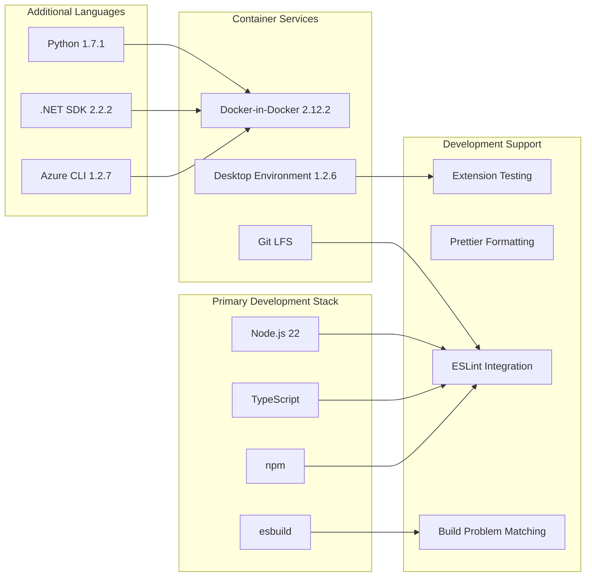

# Development Environment

<details>
<summary>Relevant source files</summary>

The following files were used as context for generating this wiki page:

- [CONTRIBUTING.md](CONTRIBUTING.md)
- [docs/media/debug-view.png](docs/media/debug-view.png)
- [docs/media/expandable-tool-result.png](docs/media/expandable-tool-result.png)
- [docs/media/file-widget.png](docs/media/file-widget.png)
- [docs/media/tool-log.png](docs/media/tool-log.png)
- [docs/tools.md](docs/tools.md)
- [src/extension/prompt/vscode-node/requestLoggerImpl.ts](src/extension/prompt/vscode-node/requestLoggerImpl.ts)

</details>


This document covers the development environment setup for the GitHub Copilot Chat VS Code extension. It provides an overview of the containerized development approach, toolchain integration, and workflow enablement that supports the extension's multi-language, multi-platform development requirements.

For detailed dev container configuration, see [Dev Container Setup](#5.1). For Git repository configuration including hooks and LFS setup, see [Git Configuration](#5.2).

## Development Environment Architecture

The development environment is built around a containerized approach using VS Code dev containers, providing a consistent, reproducible development experience across different host systems. The environment supports the extension's complex build requirements including Node.js/TypeScript compilation, multi-language tooling, and desktop environment access for testing.

## Container-Based Development Environment

```mermaid
graph TB
    subgraph "Host System"
        H1[VS Code]
        H2[Docker Engine]
        H3[Git Repository]
    end
    
    subgraph "Dev Container"
        C1[typescript-node:1-22]
        C2[Node.js Runtime]
        C3[TypeScript Compiler]
        C4[Development Tools]
    end
    
    subgraph "Container Features"
        F1[docker-in-docker]
        F2[azure-cli]
        F3[python]
        F4[dotnet]
        F5[desktop-lite]
        F6[git-lfs]
    end
    
    subgraph "VS Code Extensions"
        E1[vscode-eslint]
        E2[prettier-vscode]
        E3[esbuild-problem-matchers]
        E4[GitHub.copilot@prerelease]
        E5[extension-test-runner]
    end
    
    H1 --> C1
    H2 --> C1
    H3 --> C1
    
    C1 --> F1
    C1 --> F2
    C1 --> F3
    C1 --> F4
    C1 --> F5
    C1 --> F6
    
    C1 --> E1
    C1 --> E2
    C1 --> E3
    C1 --> E4
    C1 --> E5
```

The development environment is defined in [.devcontainer/devcontainer.json:1-36]() and uses the Microsoft-provided `typescript-node:1-22` base image. The container includes multiple development features that are version-locked in [.devcontainer/devcontainer-lock.json:1-29]() for reproducible builds.

**Sources:** `.devcontainer/devcontainer.json`, `.devcontainer/devcontainer-lock.json`

## Multi-Language Toolchain Integration



The environment supports multiple programming languages and tools required for the extension's development:

| Tool | Version | Purpose |
|------|---------|---------|
| Node.js | 22 | Primary runtime for extension development |
| Python | 1.7.1 | Supporting scripts and AI model integration |
| .NET SDK | 2.2.2 | Cross-platform development tools |
| Azure CLI | 1.2.7 | Cloud service integration |
| Docker-in-Docker | 2.12.2 | Container-based testing and CI/CD |
| Desktop Environment | 1.2.6 | GUI testing and development |

**Sources:** `.devcontainer/devcontainer.json`, `.devcontainer/devcontainer-lock.json`

## Development Workflow Configuration

The development environment is configured with specific VS Code extensions and container settings that enable the extension development workflow:

### VS Code Extension Integration

The dev container automatically installs essential VS Code extensions:

- `dbaeumer.vscode-eslint` - Code quality enforcement
- `esbenp.prettier-vscode` - Code formatting
- `connor4312.esbuild-problem-matchers` - Build error integration
- `GitHub.copilot@prerelease` - Self-hosting development version
- `ms-vscode.extension-test-runner` - Extension testing framework

### Container Environment Setup

The container is configured with:

- **Base User**: `node` user for development work [.devcontainer/devcontainer.json:31]()
- **Resource Requirements**: Minimum 4 CPUs for build performance [.devcontainer/devcontainer.json:28-30]()
- **Environment Variables**: `DEBIAN_FRONTEND=noninteractive` for automated setup [.devcontainer/devcontainer.json:14-16]()

### Initialization Commands

The container executes setup commands on creation:

```json
"onCreateCommand": {
    "initGitLfs": "git lfs install --force",
    "npmInstall": "npm install || true"
}
```

This ensures Git LFS is properly configured and Node.js dependencies are installed automatically.

**Sources:** `.devcontainer/devcontainer.json`

## Repository Configuration Integration

The development environment works with Git repository settings defined in [.gitattributes:1-5]():

- **Line Ending Normalization**: All text files use LF line endings
- **Git LFS Integration**: SQLite database files are automatically tracked with Git LFS
- **Cross-Platform Compatibility**: Consistent file handling across Windows, macOS, and Linux

This configuration ensures that the development environment produces consistent results regardless of the host operating system.

**Sources:** `.gitattributes`

## Development Environment Benefits

The containerized development environment provides:

1. **Reproducible Builds**: Version-locked features ensure consistent toolchain versions
2. **Multi-Platform Support**: Works identically on Windows, macOS, and Linux hosts
3. **Integrated Tooling**: All necessary development tools pre-configured and ready to use
4. **Extension Testing**: Desktop environment support for GUI testing
5. **Cloud Integration**: Azure CLI for cloud service development and testing
6. **Container Support**: Docker-in-Docker for containerized testing scenarios

This setup enables developers to immediately begin working on the extension without complex local environment configuration, while ensuring that all team members work with identical development tools and configurations.

**Sources:** `.devcontainer/devcontainer.json`, `.devcontainer/devcontainer-lock.json`, `.gitattributes`