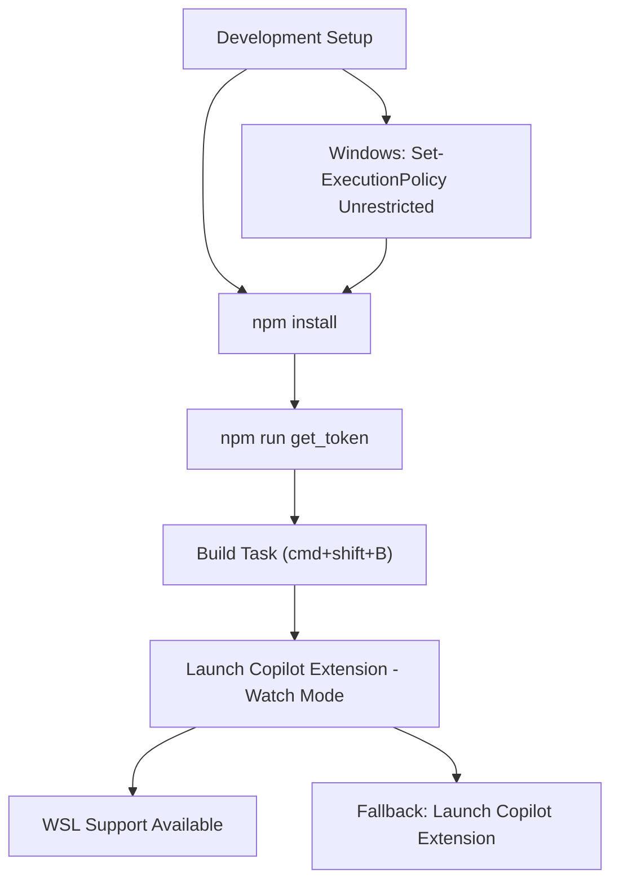
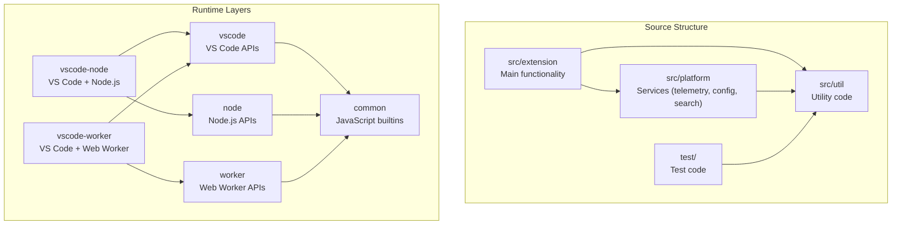
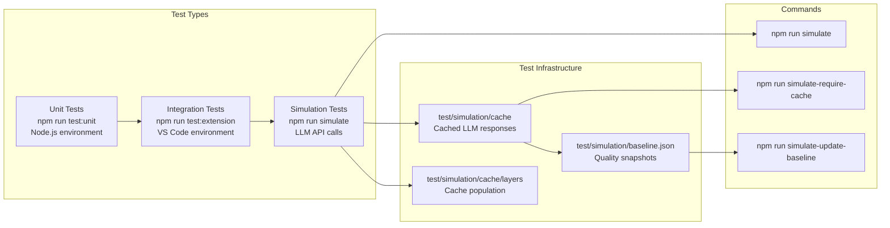
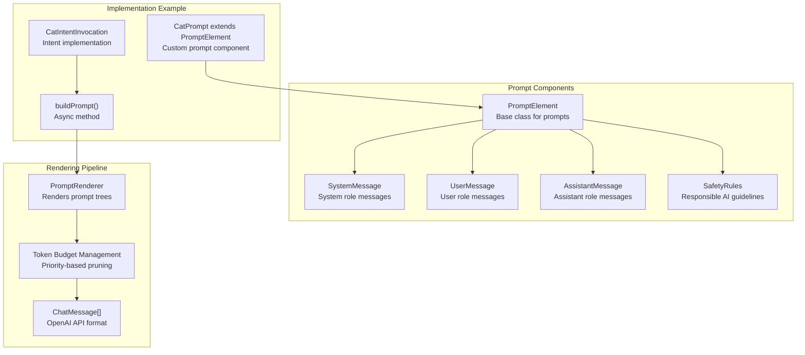
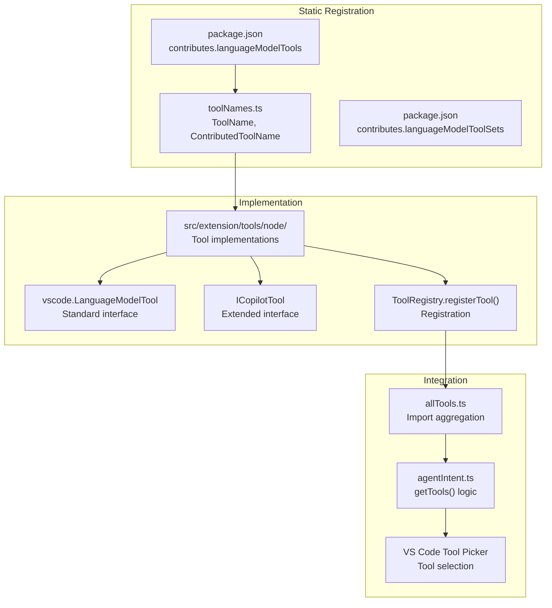
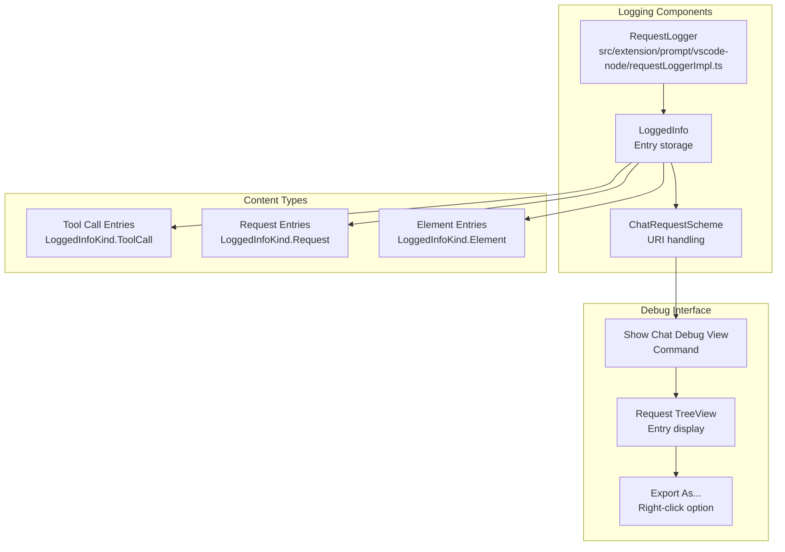

# Contributing Guidelines

<details>
<summary>Relevant source files</summary>

The following files were used as context for generating this wiki page:

- [CONTRIBUTING.md](CONTRIBUTING.md)
- [docs/media/debug-view.png](docs/media/debug-view.png)
- [docs/media/expandable-tool-result.png](docs/media/expandable-tool-result.png)
- [docs/media/file-widget.png](docs/media/file-widget.png)
- [docs/media/tool-log.png](docs/media/tool-log.png)
- [docs/tools.md](docs/tools.md)
- [src/extension/prompt/vscode-node/requestLoggerImpl.ts](src/extension/prompt/vscode-node/requestLoggerImpl.ts)

</details>


This document provides comprehensive guidelines for contributing to the GitHub Copilot Chat extension, covering development setup, architectural considerations, testing procedures, and debugging utilities. It serves as the primary reference for developers working on the extension's codebase.

For information about the overall extension architecture, see [Extension Architecture](#2). For details about specific development tools and automation, see [CI/CD & Automation](#12).

## Development Environment Setup

### Requirements and Initial Setup

The extension requires Node.js 22.x, Python 3.10-3.12, and Git Large File Storage (LFS) for running tests. The initial setup process involves several key steps:

```bash
npm install
npm run get_token
```

On Windows, you must run `Set-ExecutionPolicy Unrestricted` as administrator in PowerShell before setup.

The extension can be debugged using the "Launch Copilot Extension - Watch Mode" configuration, which automatically starts the build process and begins debugging. If this doesn't work, fallback to the "Launch Copilot Extension" configuration.

**Development Environment Flow**



Sources: [CONTRIBUTING.md:68-82]()

### VS Code Utilities Integration

The extension leverages utilities from the main VS Code repository through the `script/setup/copySources.ts` script. This allows access to base/common utilities like `async.ts`, `strings.ts`, and `map.ts` without manual copying and maintenance.

The copied modules are placed in `src/util/vs` and marked as read-only, with changes requiring updates to the main vscode repository.

Sources: [CONTRIBUTING.md:122-125]()

## Code Architecture and Layer System

### Layer Organization

The extension follows a strict layered architecture similar to VS Code, with each layer defining available runtime APIs:

| Layer | Runtime APIs | Dependencies |
|-------|-------------|--------------|
| `common` | JavaScript builtins, VS Code API types | None |
| `vscode` | VS Code APIs | `common` |
| `node` | Node.js APIs | `common, node` |
| `vscode-node` | VS Code + Node.js APIs | `common, vscode, node` |
| `worker` | Web Worker APIs | `common` |
| `vscode-worker` | VS Code + Web Worker APIs | `common, vscode, worker` |

**Code Architecture Layers**



Sources: [CONTRIBUTING.md:198-227]()

### Runtime Support

The extension supports both Node.js and web worker extension hosts, enabling operation on desktop and web environments. Runtime-specific code is organized in separate entry points:

- `./extension/extension/vscode-node/extension.ts` - Node.js extension host
- `./extension/extension/vscode-worker/extension.ts` - Web worker extension host

For web development, ensure `"browser": "./dist/web"` is in `package.json`, run `npm run web`, and configure the hidden setting `chat.experimental.serverlessWebEnabled` to `true`.

Sources: [CONTRIBUTING.md:228-249]()

### Contributions and Services

The extension uses a contribution and service pattern for component isolation and dependency injection. Contributions are automatically registered from:

- `./extension/extension/vscode/contributions.ts` - Cross-runtime contributions
- `./extension/extension/vscode-node/contributions.ts` - Node.js only
- `./extension/extension/vscode-worker/contributions.ts` - Web worker only

Similarly, services are registered in parallel service files in the same directories.

Sources: [CONTRIBUTING.md:250-265]()

## Testing Framework

### Testing Strategy Overview

The extension implements a comprehensive three-tier testing strategy:

**Testing Pipeline Architecture**



Sources: [CONTRIBUTING.md:83-121]()

### Unit and Integration Tests

Unit tests run in Node.js environment and test individual components in isolation. Integration tests execute within VS Code itself, testing the extension's behavior in its runtime environment.

Both test types can be run locally and require proper Node.js version and Git LFS setup.

Sources: [CONTRIBUTING.md:86-96]()

### Simulation Tests

Simulation tests reach out to Copilot API endpoints and invoke LLMs, requiring expensive computations. Each test runs 10 times to accommodate LLM stochasticity. Results are snapshotted in `test/simulation/baseline.json`.

LLM results are cached in `test/simulation/cache` to make reruns faster and deterministic. Cache population must be performed by VS Code team members, and PRs fail with uncommitted baseline changes.

Sources: [CONTRIBUTING.md:98-121]()

## TSX Prompt Development Framework

### Framework Architecture

The extension uses a TSX-based framework for composing prompts, solving dynamic composition and token budget management problems.

**TSX Prompt Framework**



Sources: [CONTRIBUTING.md:126-183]()

### Framework Benefits

The TSX framework provides several key advantages:

1. **Dynamic Composition**: Messages are represented as TSX component trees with priority-based pruning
2. **Token Budget Management**: Automatic pruning of low-priority messages when exceeding token limits
3. **Transparent Ownership**: Each intent controls its System, User, and Assistant messages
4. **Reusable Components**: Common elements like SafetyRules can be shared across prompts

### Implementation Pattern

```typescript
interface CatPromptProps extends BasePromptElementProps {
   query: string;
}

export class CatPrompt extends PromptElement<CatPromptProps, void> {
   render() {
      return (
         <>
            <SystemMessage>
               Respond to all messages as if you were a cat.
            </SystemMessage>
            <UserMessage>
               {this.props.query}
            </UserMessage>
         </>
      );
   }
}
```

Components can implement optional async `prepare()` methods for precomputation, with prepared state passed to the synchronous `render()` method.

Sources: [CONTRIBUTING.md:138-179]()

## Tool Development

### Tool Architecture

Tools are registered through VS Code's Language Model Tool API, with key components distributed across multiple files:

**Tool Development Pipeline**



Sources: [CONTRIBUTING.md:279-292](), [docs/tools.md:16-40]()

### Tool Implementation Requirements

Tools must follow specific patterns for registration, validation, and error handling:

1. **Static Declaration**: Tools are defined in `package.json` with `copilot_` prefix, model descriptions, and JSON schemas
2. **Implementation**: Tools implement `vscode.LanguageModelTool` or `ICopilotTool` for advanced functionality
3. **Validation**: Input validation uses `IPromptPathRepresentationService` for path handling
4. **Error Handling**: Errors must provide meaningful messages for LLM interpretation
5. **Confirmations**: Dangerous operations require `PreparedToolInvocation.confirmationMessages`

Sources: [docs/tools.md:16-53]()

### Tool Development Best Practices

Tools should be built-in only if they relate to core VS Code functionality or the search/edit/terminal agent loop. Consider external extension contribution for other use cases.

Tool descriptions must be detailed and unlocalized, explaining exact functionality, return information, and usage cases. Input schemas require absolute paths and careful consideration of required properties.

Sources: [docs/tools.md:11-30]()

## Debugging and Troubleshooting

### Request Logging System

The extension provides comprehensive request logging through the `RequestLogger` class and associated debugging tools.

**Request Logging Architecture**



Sources: [CONTRIBUTING.md:299-306](), [src/extension/prompt/vscode-node/requestLoggerImpl.ts:21-354]()

### Debug View Features

The "Show Chat Debug View" command provides a tree view with entries for each request, showing:

- Prompt sent to the model
- Enabled tools
- Response details
- Tool calls with individual entries
- Prompt-tsx debug view in Simple Browser

The debug view includes export functionality but may contain personal information requiring careful review before sharing.

Sources: [CONTRIBUTING.md:301-306]()

### Request Filtering and Configuration

The `RequestLogger` implements intelligent filtering to avoid logging cancelled requests from `XTabProviderId` unless explicitly configured via `ConfigKey.Internal.InlineEditsLogCancelledRequests`.

The logger maintains a maximum of 100 entries and provides automatic URI-based linking for easy navigation between related requests.

Sources: [src/extension/prompt/vscode-node/requestLoggerImpl.ts:99-109]()

## API Versioning and Updates

### Breaking Changes Protocol

When making breaking changes to proposed VS Code API:

1. **Update API Version**: Increment version in proposal .d.ts comment
2. **Adopt in Extension**: Update `package.json` `enabledApiProposals` with new version
3. **Simultaneous Deployment**: Changes must be adopted simultaneously with VS Code updates

Examples of breaking changes include renaming methods, changing parameters, or adding required static contributions.

Sources: [CONTRIBUTING.md:311-323]()

### Additive Changes Protocol

For additive API changes that maintain backward compatibility:

1. **No Version Update**: API version remains unchanged
2. **Engine Update**: Update `engines.vscode` date field in `package.json`
3. **Compatibility**: Older extensions continue working with new VS Code builds

Examples include new response types, API proposals, or interface methods.

Sources: [CONTRIBUTING.md:324-332]()

## Agent Mode Implementation

Agent mode is implemented as a specialized chat participant with enhanced capabilities:

Key files include:
- `agentPrompt.tsx` - Main agent prompt rendering
- `agentInstructions.tsx` - Agent system prompt
- `toolCallingLoop.ts` - Agentic loop execution
- `chatAgents.ts` - Participant registration and request handling

Agent mode uses standard VS Code chat participant API with `vscode.lm.invokeTool` for tool invocation, distinguished by a special flag in `package.json` and enhanced with proposed API capabilities.

Sources: [CONTRIBUTING.md:267-278]()