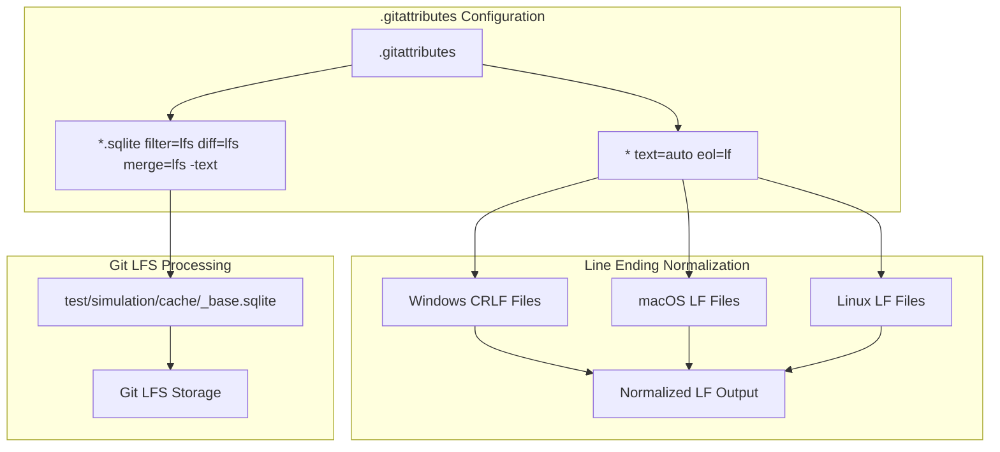
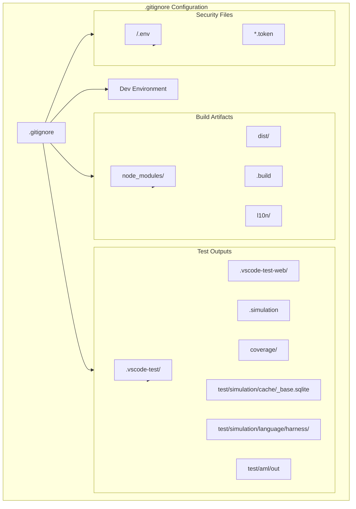
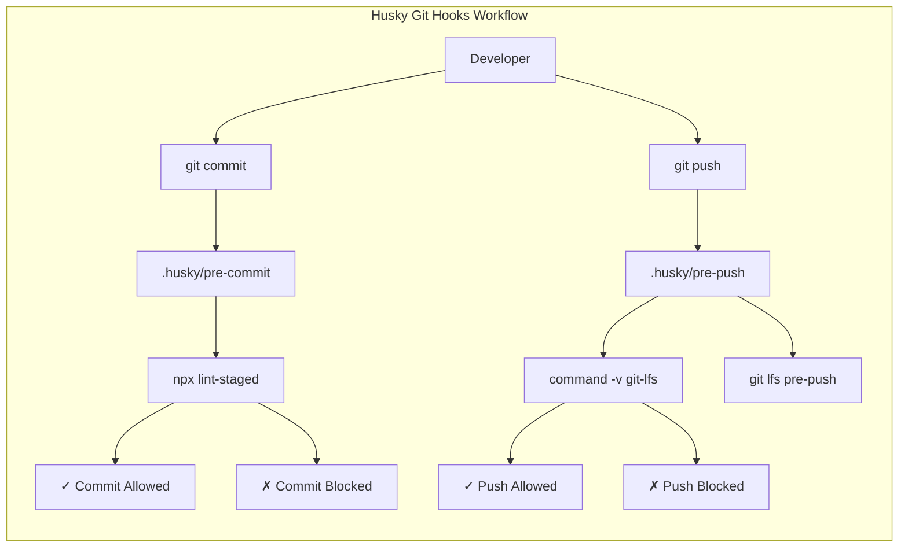
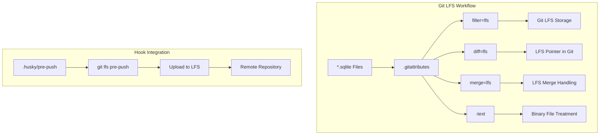

# Git Configuration

<details>
<summary>Relevant source files</summary>

The following files were used as context for generating this wiki page:

- [.husky/pre-commit](.husky/pre-commit)
- [.husky/pre-push](.husky/pre-push)

</details>


This document covers the Git hooks and quality maintenance setup for the GitHub Copilot Chat VS Code extension. The primary focus is on the pre-commit and pre-push hooks that maintain code quality through automated linting, formatting, and Git LFS operations. Supporting configuration includes file attributes, ignore patterns, and Large File Storage setup.

For information about the broader development environment setup, see page 9.1. For CI/CD automation that builds upon this Git configuration, see page 12.

## Git Attributes Configuration

The repository uses `.gitattributes` to enforce consistent file handling across different operating systems and configure Git LFS for specific file types.

### Line Ending Normalization

The repository enforces Unix-style line endings (`LF`) for all text files to maintain consistency across Windows, macOS, and Linux development environments.



**Sources:** [.gitattributes:1-1]()

### Git LFS Configuration

SQLite database files are configured to use Git LFS to prevent repository bloat from binary database files used in testing and simulation.

**Sources:** [.gitattributes:3-4]()

## Git Ignore Patterns

The `.gitignore` file excludes build artifacts, test outputs, secrets, and generated files from version control.

### Build and Distribution Files

| Pattern | Purpose |
|---------|---------|
| `node_modules/` | Node.js dependencies |
| `dist/` | Build output directory |
| `.build` | WebAssembly and build files |
| `l10n/` | Generated localization files |

### Test and Simulation Files

| Pattern | Purpose |
|---------|---------|
| `.vscode-test/` | VS Code test runner files |
| `.vscode-test-web/` | Web extension test files |
| `.simulation` | Simulation test outputs |
| `test/simulation/language/harness/` | Test harness files |
| `test/simulation/cache/_base.sqlite` | Base cache database |
| `coverage/` | Code coverage reports |
| `test/aml/out` | AML test outputs |

### Development Environment Files

| Pattern | Purpose |
|---------|---------|
| `.DS_Store` | macOS filesystem metadata |
| `__pycache__/` | Python bytecode cache |
| `.venv*` | Python virtual environments |
| `.ruff_cache/` | Ruff linter cache |
| `*.egg-info/` | Python package metadata |

### Security and Configuration Files

| Pattern | Purpose |
|---------|---------|
| `/.env` | Environment variables |
| `*.token` | Authentication tokens |



**Sources:** [.gitignore:1-35]()

## Git Hooks Setup

The repository uses Husky to manage Git hooks that enforce code quality and handle Git LFS operations.

### Pre-commit Hook

The pre-commit hook runs `lint-staged` to perform automated code quality checks on staged files before allowing commits.

```bash
set -e

npx lint-staged
```

### Pre-push Hook

The pre-push hook ensures Git LFS files are properly handled during push operations and validates that Git LFS is available.

```bash
set -e

# git-lfs hook
command -v git-lfs >/dev/null 2>&1 || { echo >&2 "\nThis repository is configured for Git LFS but 'git-lfs' was not found on your path. If you no longer wish to use Git LFS, remove this hook by deleting '.git/hooks/pre-push'.\n"; exit 2; }
git lfs pre-push "$@"
```



**Sources:** [.husky/pre-commit:1-5](), [.husky/pre-push:1-6]()

## Git LFS Integration

Git Large File Storage (LFS) is configured to handle SQLite database files that would otherwise bloat the repository.

### LFS File Types

The repository tracks the following file types with Git LFS:

| File Pattern | Filter | Diff | Merge | Text |
|-------------|--------|------|-------|------|
| `*.sqlite` | `lfs` | `lfs` | `lfs` | `-text` |

### LFS Workflow



**Sources:** [.gitattributes:3-4](), [.husky/pre-push:4-6]()

## Configuration Summary

The Git hooks and quality maintenance setup provides automated code quality enforcement:

1. **Pre-commit Quality Checks**: `.husky/pre-commit` runs `npx lint-staged` to enforce code quality
2. **Pre-push LFS Validation**: `.husky/pre-push` ensures Git LFS operations succeed
3. **Consistent Line Endings**: `.gitattributes` enforces LF line endings across platforms
4. **Binary File Handling**: SQLite databases use Git LFS via `.gitattributes` configuration
5. **Build Artifact Exclusion**: `.gitignore` prevents build outputs and sensitive files from being committed

This configuration ensures that code quality is maintained automatically through Git hooks while supporting efficient collaboration across multiple development environments.

**Sources:** [.gitattributes:1-4](), [.gitignore:1-35](), [.husky/pre-commit:1-5](), [.husky/pre-push:1-6]()