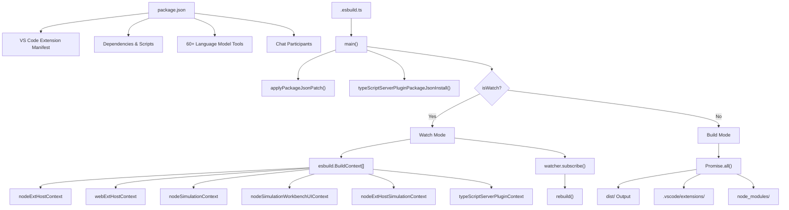
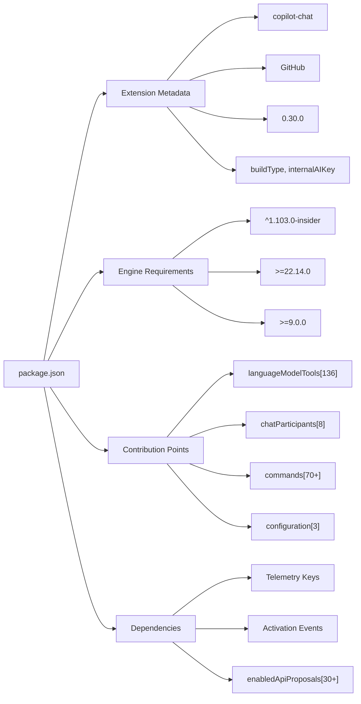
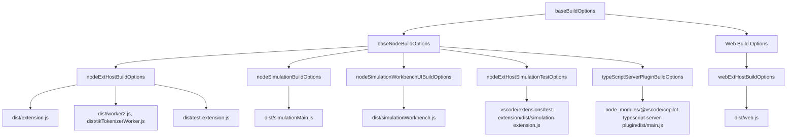
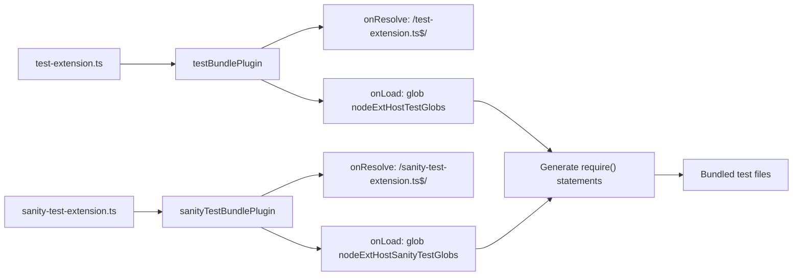
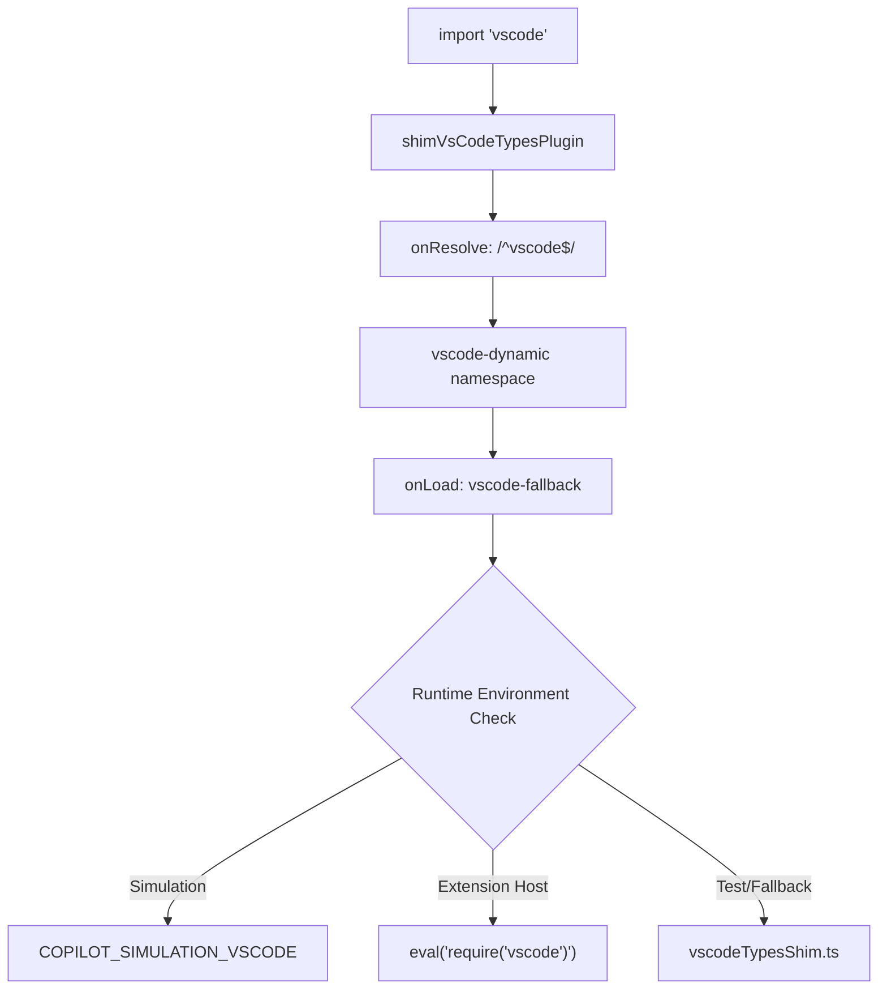
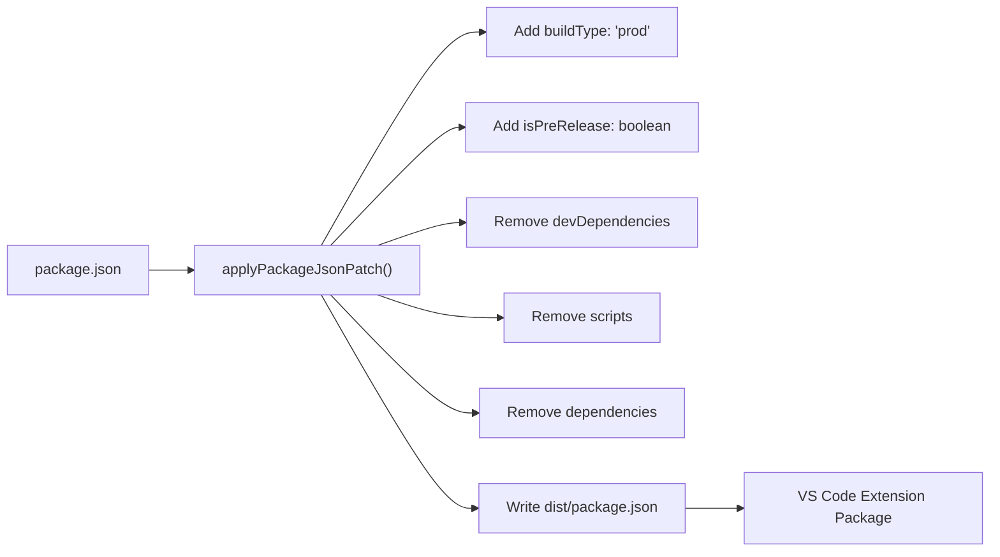
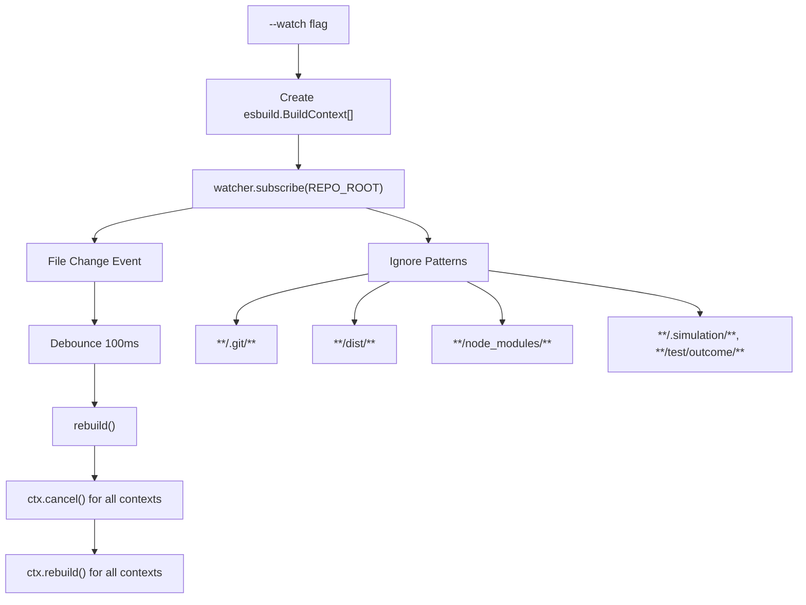
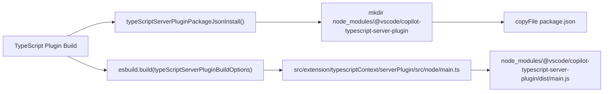

# Build System

Relevant source files

The following files were used as context for generating this wiki page:

- [package-lock.json](package-lock.json)
- [package.json](package.json)

This document explains the build configuration, package management, and deployment processes for the GitHub Copilot Chat extension. The build system orchestrates compilation for multiple runtime environments using esbuild, manages package dependencies and VS Code extension configuration through `package.json`, and handles deployment processes for both development and production environments.

For information about code quality enforcement during builds, see page 11 (Testing). For development environment setup, see page 9 (Development Environment).

## Overview and Architecture

The build system consists of two main components: package configuration managed through `package.json` and build orchestration handled by `.esbuild.ts`. The system supports multiple runtime environments, development/production modes, and deployment processes.

### Build System Architecture

Sources: [package.json:1-3000](), [.esbuild.ts:250-355]()

## Package Configuration and Management

The `package.json` file serves as the central configuration for the VS Code extension, defining metadata, dependencies, and the extensive contribution points that make up the Copilot Chat functionality.

### Extension Manifest Structure

### Language Model Tools Registry

The extension defines over 60 language model tools in the `languageModelTools` contribution point:

| Tool Category | Example Tools | Purpose |
|---------------|---------------|---------|
| Code Search | `copilot_searchCodebase`, `copilot_searchWorkspaceSymbols` | Search and indexing |
| File Operations | `copilot_readFile`, `copilot_createFile`, `copilot_applyPatch` | File manipulation |
| Terminal Operations | `copilot_runInTerminal`, `copilot_getTerminalOutput` | Command execution |
| Test Operations | `copilot_runTests`, `copilot_testFailure` | Testing workflows |
| Project Setup | `copilot_createNewWorkspace`, `copilot_createAndRunTask` | Project scaffolding |

Sources: [package.json:136-1217](), [package.json:1219-1284]()

## Build Configurations

The build system defines multiple build configurations through esbuild, each targeting a specific runtime environment with tailored optimization and bundling settings.

### esbuild Configuration Hierarchy

### Base Configuration Options

| Configuration | Purpose | Key Settings |
|---------------|---------|--------------|
| `baseBuildOptions` | Common settings for all builds | `bundle: true`, `treeShaking: true`, `minify: !isDev` |
| `baseNodeBuildOptions` | Node.js specific settings | `platform: 'node'`, extensive `external` dependencies |

Sources: [.esbuild.ts:18-49](), [.esbuild.ts:143-248]()

## Entry Points and Output Targets

The build system processes multiple entry points to generate bundles for different runtime environments and purposes.

### Node Extension Host Entry Points

| Entry Point | Output | Purpose |
|-------------|---------|---------|
| `src/extension/extension/vscode-node/extension.ts` | `dist/extension.js` | Main Node.js extension |
| `src/platform/parser/node/parserWorker.ts` | `dist/worker2.js` | Parser worker process |
| `src/platform/tokenizer/node/tikTokenizerWorker.ts` | `dist/tikTokenizerWorker.js` | Tokenizer worker |
| `src/platform/diff/node/diffWorkerMain.ts` | `dist/diffWorker.js` | Diff computation worker |
| `src/platform/tfidf/node/tfidfWorker.ts` | `dist/tfidfWorker.js` | TF-IDF calculation worker |
| `src/extension/onboardDebug/node/copilotDebugWorker/index.ts` | `dist/copilotDebugCommand.js` | Debug command worker |

### Web Extension Host Entry Points

| Entry Point | Output | Purpose |
|-------------|---------|---------|
| `src/extension/extension/vscode-worker/extension.ts` | `dist/web.js` | Web extension bundle |

### Simulation and Testing Entry Points

| Entry Point | Output | Purpose |
|-------------|---------|---------|
| `test/simulationMain.ts` | `dist/simulationMain.js` | Simulation test runner |
| `test/simulation/workbench/simulationWorkbench.tsx` | `dist/simulationWorkbench.js` | Workbench UI for simulation |
| `.vscode/extensions/test-extension/main.ts` | `.vscode/extensions/test-extension/dist/simulation-extension.js` | Test extension |

Sources: [.esbuild.ts:145-154](), [.esbuild.ts:166-168](), [.esbuild.ts:175-181](), [.esbuild.ts:185-187](), [.esbuild.ts:198-200]()

## Build Plugins

The build system uses custom esbuild plugins to handle special bundling requirements and dynamic module resolution.

### Test Bundle Plugin System

### VS Code Types Shim Plugin

The `shimVsCodeTypesPlugin` provides dynamic VS Code API resolution for different runtime environments:

Sources: [.esbuild.ts:58-108](), [.esbuild.ts:110-141]()

## Development vs Production Builds

The build system supports different modes controlled by command-line arguments and environment variables, with distinct optimizations and package configurations.

### Build Mode Configuration

| Mode | Trigger | Key Differences |
|------|---------|----------------|
| Development | `--dev` flag | `minify: false`, `sourcemap: 'linked'`, includes `dotenv` and `source-map-support` |
| Production | Default | `minify: true`, `sourcemap: false`, excludes dev dependencies |
| Pre-release | `--prerelease` flag | Sets `isPreRelease: true` in package.json patch |

### Package.json Deployment Processing

The `applyPackageJsonPatch()` function transforms the package.json for production deployment:

### Build Type Configuration

The extension package.json contains build-specific metadata:

| Field | Development Value | Production Value |
|-------|-------------------|------------------|
| `buildType` | `"dev"` | `"prod"` |
| `build` | `"1"` | Build number |
| `isPreRelease` | Not set | `true` for pre-release builds |

Sources: [.esbuild.ts:14-16](), [.esbuild.ts:336-353](), [package.json:10-11]()

## Watch Mode and File Monitoring

The build system provides efficient file watching for development workflows using the `@parcel/watcher` library.

### Watch Mode Implementation

### File Monitoring Configuration

The watcher ignores specific patterns to avoid unnecessary rebuilds:

| Pattern | Purpose |
|---------|---------|
| `**/.git/**` | Git repository files |
| `**/dist/**` | Build output directories |
| `**/node_modules/**` | Node.js dependencies |
| `**/.simulation/**` | Simulation test artifacts |
| `**/test/outcome/**` | Test result files |
| `**/*.sqlite*` | Database files |
| `**/*.txt`, `**/baseline*.json` | Test baseline files |

Sources: [.esbuild.ts:257-323](), [.esbuild.ts:279-298](), [.esbuild.ts:301-322]()

## TypeScript Server Plugin Build

The build system includes special handling for the TypeScript server plugin, which requires installation into the `node_modules` directory structure.

### Plugin Installation Process

The plugin build configuration excludes TypeScript itself as an external dependency since it's provided by the TypeScript language server runtime.

Sources: [.esbuild.ts:219-228](), [.esbuild.ts:230-248]()