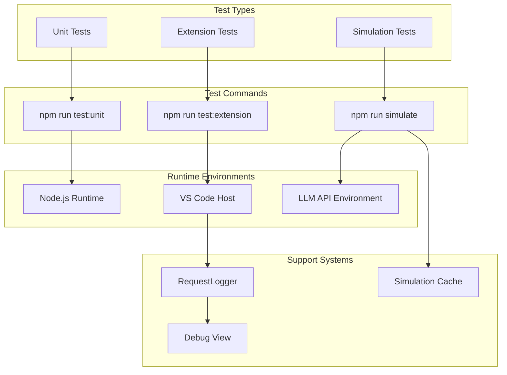
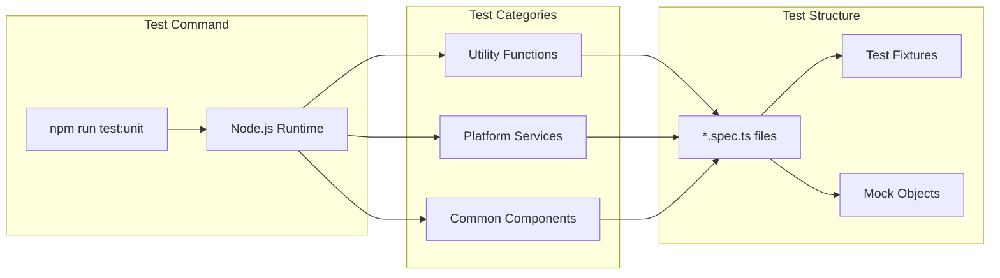
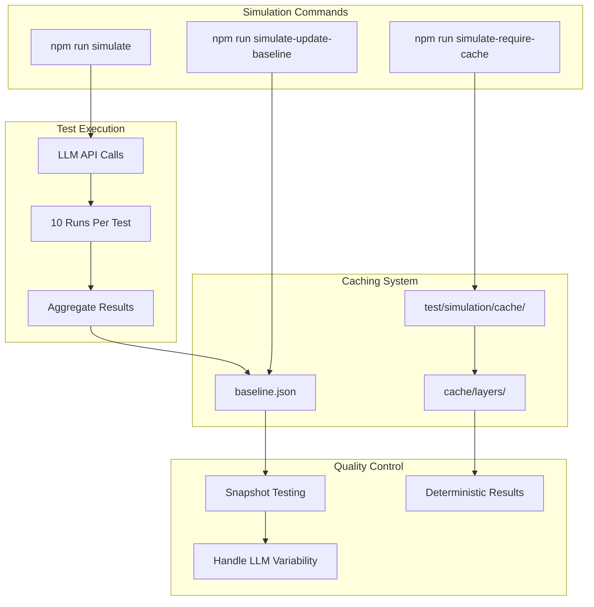
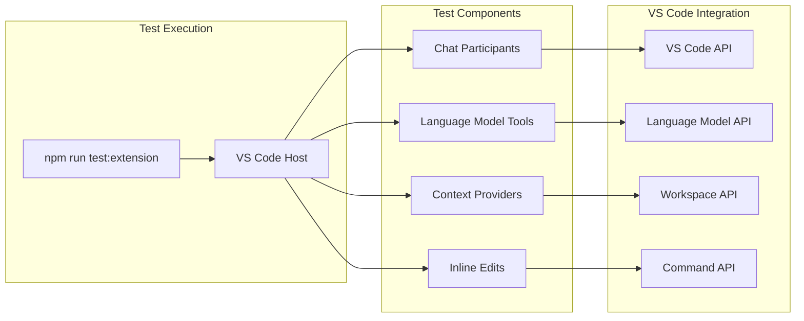
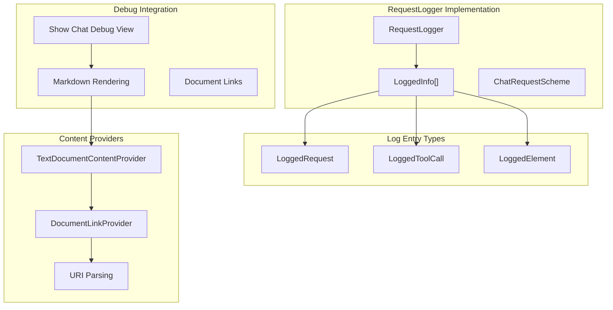
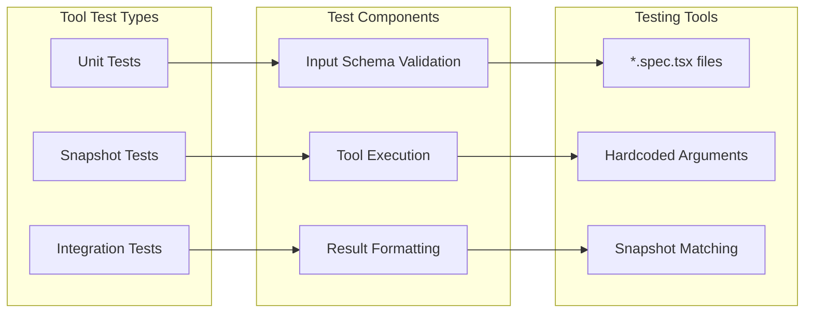
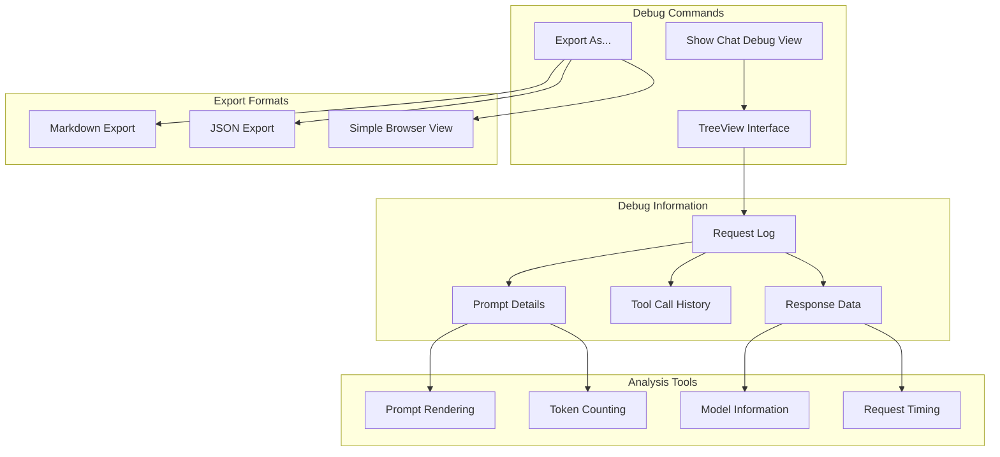
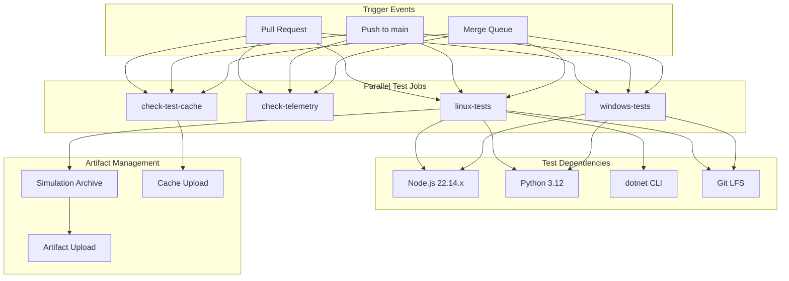

# Testing

Relevant source files

The following files were used as context for generating this wiki page:

- [CONTRIBUTING.md](CONTRIBUTING.md)
- [docs/media/debug-view.png](docs/media/debug-view.png)
- [docs/media/expandable-tool-result.png](docs/media/expandable-tool-result.png)
- [docs/media/file-widget.png](docs/media/file-widget.png)
- [docs/media/tool-log.png](docs/media/tool-log.png)
- [docs/tools.md](docs/tools.md)
- [src/extension/prompt/vscode-node/requestLoggerImpl.ts](src/extension/prompt/vscode-node/requestLoggerImpl.ts)

## Purpose and Scope

This document covers the testing framework and quality assurance processes for the GitHub Copilot Chat VS Code extension. The testing system includes unit tests, integration tests, simulation tests, and debugging tools to ensure the extension works correctly across different VS Code runtime environments.

For information about the build system that compiles the extension, see [Build System](10). For details about development environment setup, see [Development Environment](9).

## Testing Framework Overview

The extension employs a three-tier testing approach that validates functionality across different runtime environments and integration points.

### Testing Architecture

Sources: [CONTRIBUTING.md:83-121]()

## Unit Testing

Unit tests run in Node.js and validate individual components and utilities in isolation.

### Unit Test Execution

Unit tests focus on testing core functionality without requiring VS Code APIs or external dependencies. They validate utility functions, data structures, and business logic components.

Sources: [CONTRIBUTING.md:86-90]()

## Simulation Testing

Simulation tests interact with real Copilot API endpoints and LLMs to validate the extension's behavior in realistic scenarios.

### Simulation Test Architecture

Each simulation test runs 10 times to accommodate the stochastic nature of LLMs, with results cached in `test/simulation/cache` for reproducibility.

Sources: [CONTRIBUTING.md:98-121]()

## Extension Testing

Extension tests run within an actual VS Code environment to validate end-to-end functionality and VS Code API integration.

### Extension Test Environment

Extension tests validate the full integration with VS Code APIs, including chat participants, language model tools, context providers, and inline edit functionality.

Sources: [CONTRIBUTING.md:92-96]()

## Request Logging and Debugging

The extension includes comprehensive request logging and debugging tools to help with testing and troubleshooting.

### Request Logger System

The `RequestLogger` class tracks all chat requests, tool calls, and prompt elements, providing a comprehensive debugging interface through VS Code's debug view.

Sources: [src/extension/prompt/vscode-node/requestLoggerImpl.ts:21-354](), [CONTRIBUTING.md:299-306]()

## Tool Testing

Language model tools require specialized testing approaches to validate their integration with the chat system.

### Tool Testing Strategy

Tool tests validate input schemas, execution logic, and result formatting using snapshot testing to ensure consistent output.

### Tool Testing Guidelines

| Test Aspect | Approach | Purpose |
|-------------|----------|---------|
| Input Validation | Schema-based testing | Ensure proper parameter handling |
| Execution Logic | Hardcoded arguments | Validate core functionality |
| Result Formatting | Snapshot testing | Maintain consistent output |
| Error Handling | Exception testing | Verify proper error messages |

Sources: [docs/tools.md:68-77]()

## Debug View and Prompt Analysis

The extension provides debugging tools to analyze chat requests and prompt generation for testing purposes.

### Debug View System

The debug view provides detailed information about chat requests, including prompts, tool calls, and response data, essential for testing and troubleshooting.

Sources: [CONTRIBUTING.md:299-306]()

## CI/CD Test Integration

The testing system is fully integrated into the CI/CD pipeline, providing comprehensive validation for all pull requests and main branch pushes.

### Test Execution in CI/CD

The CI/CD system runs tests in parallel across multiple jobs and platforms, with sophisticated caching and artifact management to optimize execution time.

Sources: [.github/workflows/pr.yml:1-217]()