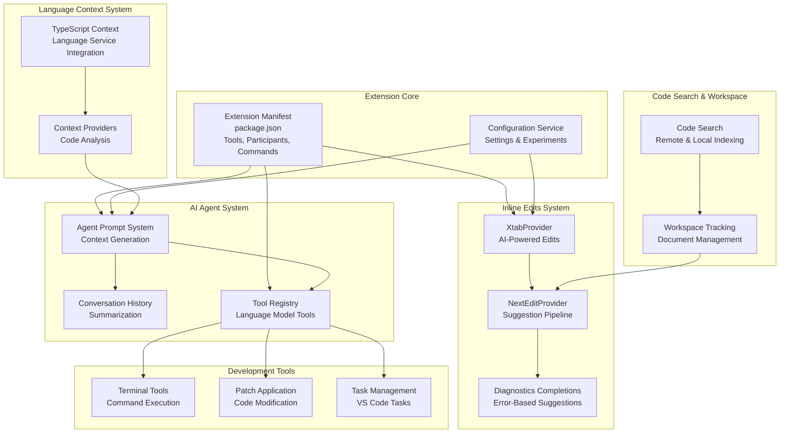
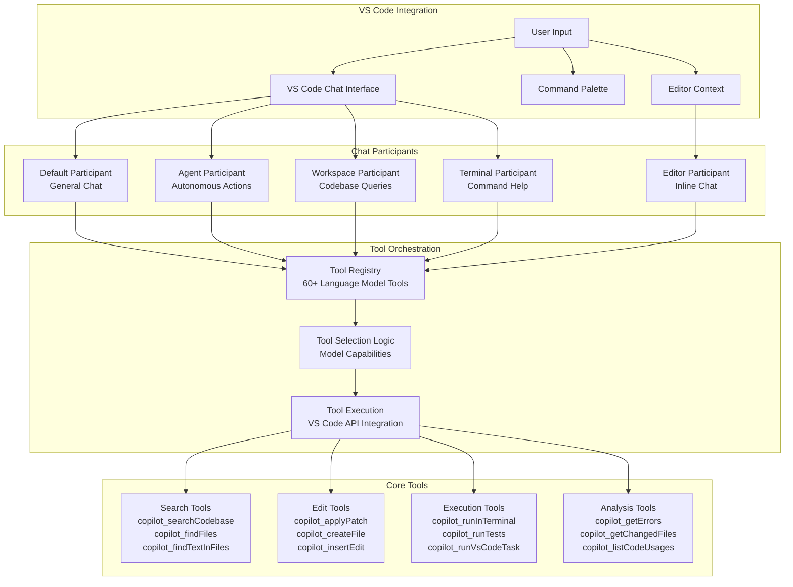
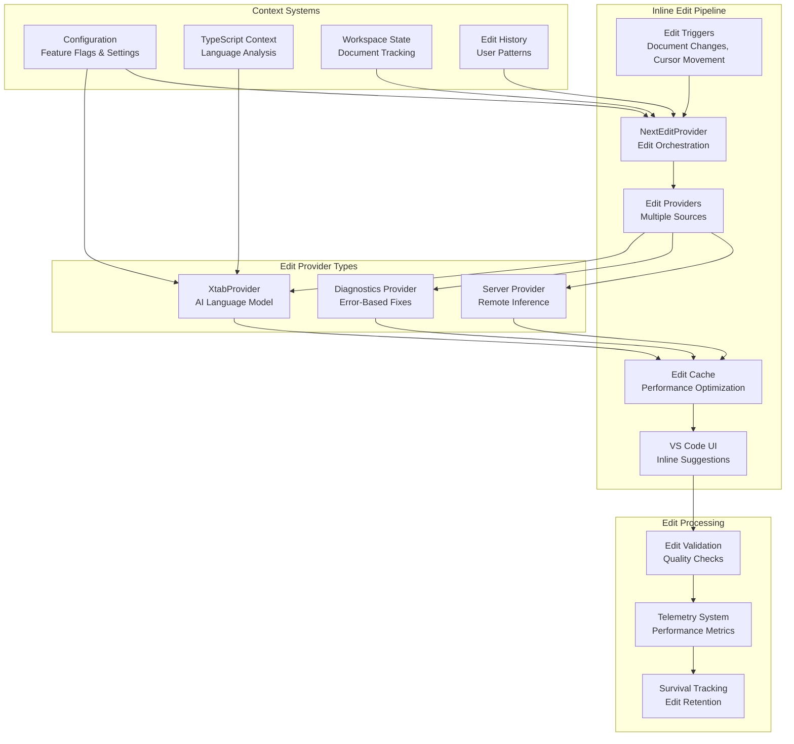
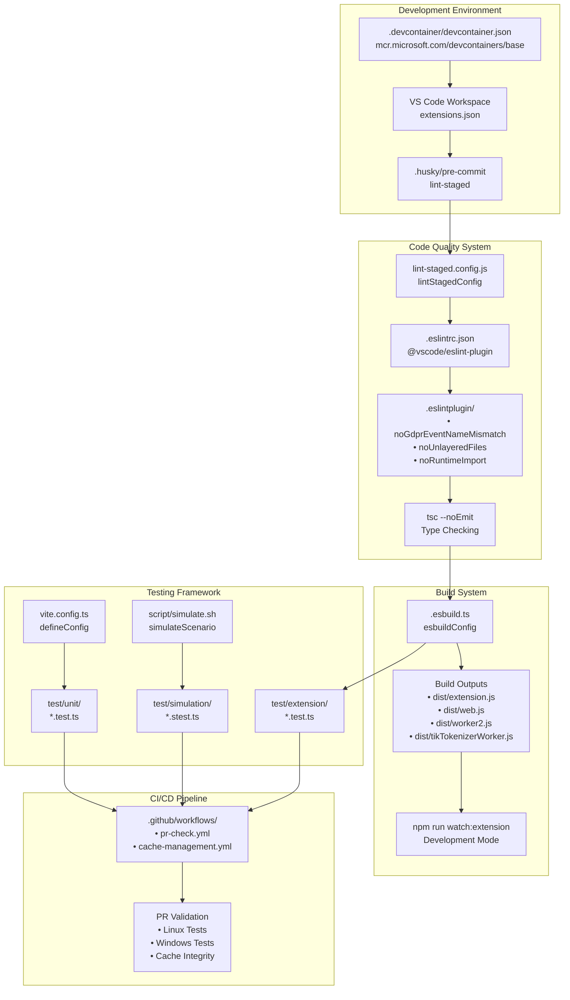

# Overview

Relevant source files

The following files were used as context for generating this wiki page:

- [CONTRIBUTING.md](CONTRIBUTING.md)
- [docs/media/debug-view.png](docs/media/debug-view.png)
- [docs/media/expandable-tool-result.png](docs/media/expandable-tool-result.png)
- [docs/media/file-widget.png](docs/media/file-widget.png)
- [docs/media/tool-log.png](docs/media/tool-log.png)
- [docs/tools.md](docs/tools.md)
- [package-lock.json](package-lock.json)
- [package.json](package.json)
- [src/extension/prompt/vscode-node/requestLoggerImpl.ts](src/extension/prompt/vscode-node/requestLoggerImpl.ts)

The GitHub Copilot Chat extension is a comprehensive VS Code extension that provides AI-powered conversational assistance, inline code editing, and autonomous development tools. This extension integrates multiple AI language models with VS Code's development environment to offer sophisticated code assistance through chat interfaces, real-time editing suggestions, and intelligent development workflows.

For detailed information about the extension's internal architecture and service systems, see [Extension Architecture](2). For chat functionality and language model tools, see [Chat Participants and Language Model Tools](3). For inline editing capabilities, see [Inline Edits System](4).

## Extension Purpose and Capabilities

The GitHub Copilot Chat extension serves as an AI-powered development assistant that integrates directly into Visual Studio Code. The extension provides multiple interaction modes including conversational chat with specialized participants, real-time inline editing, autonomous agent workflows, and context-aware code assistance.

### Core System Overview

The extension implements several interconnected systems:

| System | Description | Key Components |
|--------|-------------|----------------|
| **Chat Participants** | AI chat interface with specialized participants | `@agent`, `@workspace`, `@terminal` participants |
| **Language Model Tools** | 60+ specialized tools for code operations | `copilot_searchCodebase`, `copilot_applyPatch`, `copilot_runInTerminal` |
| **Inline Edits** | Real-time code suggestions and modifications | `XtabProvider`, `NextEditProvider`, diagnostics completions |
| **AI Agent System** | Multi-step autonomous coding workflows | Agent prompt system, conversation history, tool orchestration |
| **Language Context** | TypeScript/JavaScript code understanding | TypeScript server plugin, AST analysis, context providers |
| **Development Tools** | Terminal integration and task management | Terminal tools, patch application, VS Code tasks |

Sources: [package.json:1-40](), [CONTRIBUTING.md:1-332]()

## System Architecture Overview

The extension implements a sophisticated multi-layered architecture with several interconnected systems working together to provide AI-powered development assistance.

### High-Level System Architecture

Sources: [package.json:135-1043](), [CONTRIBUTING.md:266-280]()

### Chat Participants and Tool Integration

The extension provides multiple chat participants that work with an extensive set of language model tools:

Sources: [package.json:136-1043]()

## Inline Edit System Architecture

The extension provides sophisticated inline editing capabilities through multiple providers and caching systems:

Sources: [src/extension/prompt/vscode-node/requestLoggerImpl.ts:1-355]()

### Core Development Features

The extension provides comprehensive development assistance through several key features:

| Feature Category | Key Components | Description |
|------------------|----------------|-------------|
| **Chat Interface** | Chat participants, language model tools | Conversational AI with specialized participants like `@agent`, `@workspace` |
| **Code Search** | `copilot_searchCodebase`, `copilot_findFiles`, `copilot_findTextInFiles` | Semantic and text-based code search across the workspace |
| **Code Modification** | `copilot_applyPatch`, `copilot_createFile`, `copilot_insertEdit` | AI-powered code editing and file manipulation |
| **Terminal Integration** | `copilot_runInTerminal`, `copilot_getTerminalOutput` | Command execution and terminal interaction |
| **Testing Support** | `copilot_runTests`, `copilot_testFailure` | Test execution and failure analysis |
| **Workspace Analysis** | `copilot_getErrors`, `copilot_getChangedFiles`, `copilot_listCodeUsages` | Code analysis and workspace understanding |

Sources: [package.json:136-1043]()

## Development Workflow and Code Quality

### Development Pipeline with Code Quality Enforcement

Sources: [.github/copilot-instructions.md:263-274](), [.eslintignore:1-26]()

### Development Commands and Scripts

| Command | Purpose | Key Files |
|---------|---------|-----------|
| `npm install` | Install dependencies | `package.json`, `package-lock.json` |
| `npm run compile` | Development build | `.esbuild.ts`, `esbuildConfig` |
| `npm run watch:extension` | Watch mode for extension | `dist/extension.js` |
| `npm run watch:web` | Watch mode for web extension | `dist/web.js` |
| `npm run test:unit` | Unit tests with Vitest | `vite.config.ts`, `test/unit/` |
| `npm run test:extension` | VS Code extension tests | `test/extension/` |
| `npm run simulate` | Scenario-based tests | `script/simulate.sh`, `test/simulation/` |
| `npm run lint` | ESLint validation | `.eslintrc.json`, `.eslintplugin/` |
| `npm run lint:fix` | Auto-fix ESLint issues | `lint-staged.config.js` |

Sources: [.github/copilot-instructions.md:265-273]()

## Extension Activation and Service Architecture

The extension follows a service-oriented architecture with dependency injection via `IInstantiationService`. The activation flow proceeds through three main phases:

1. **Base Activation** ([src/extension/extension/vscode/extension.ts]()): Checks VS Code version compatibility, creates service infrastructure, and initializes the contribution system

2. **Service Registration**: Platform services (search, parsing, telemetry) and extension-specific services (chat, authentication) are registered with the service container

3. **Contribution Loading**: Chat participants, language model providers, command registrations, and UI contributions are loaded and activated

The extension makes extensive use of VS Code's proposed APIs for advanced functionality, including `chatParticipantPrivate`, `languageModelSystem`, `chatProvider`, `mappedEditsProvider`, and `aiTextSearchProvider`.

Sources: [.github/copilot-instructions.md:128-144](), [.github/copilot-instructions.md:247-261]()