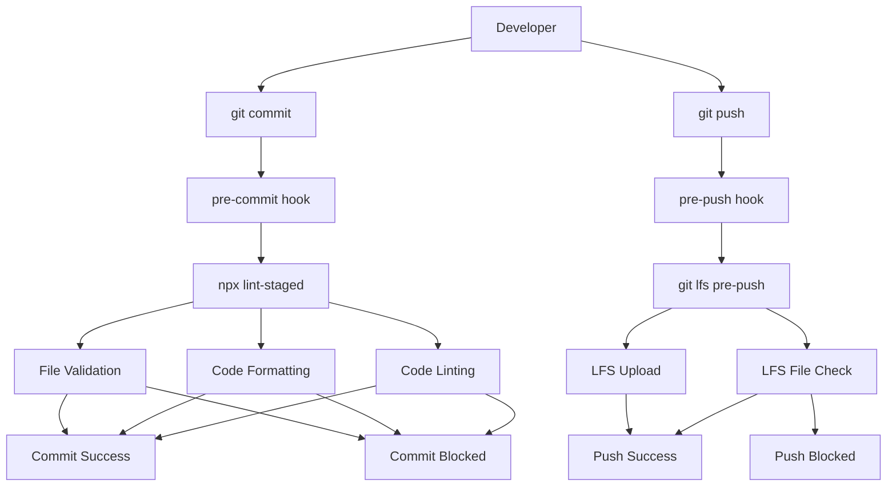
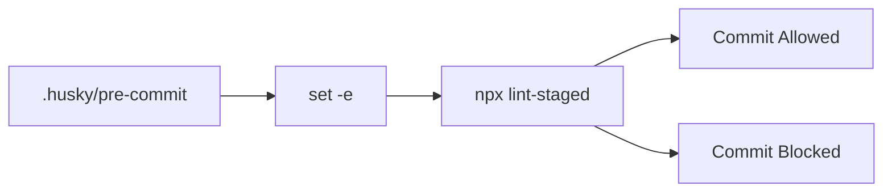
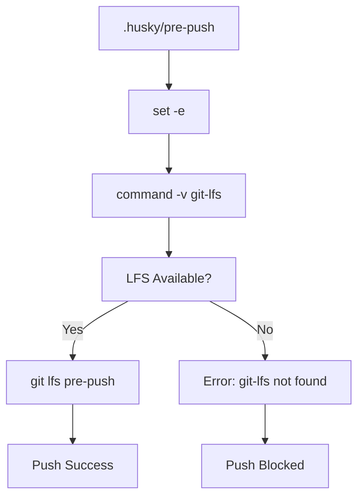
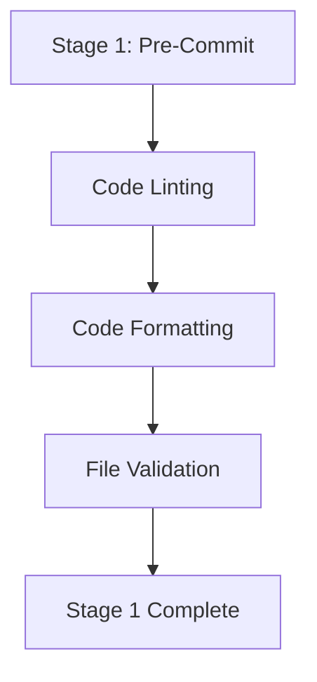
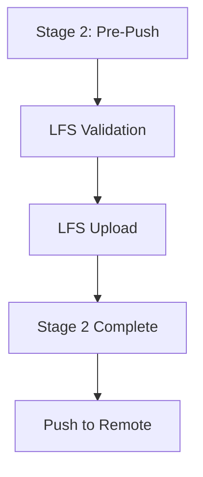
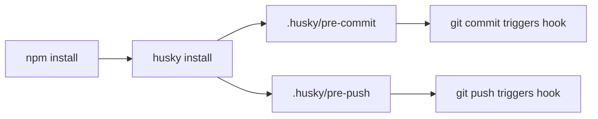

# CI/CD & Automation

Relevant source files

The following files were used as context for generating this wiki page:

- [.husky/pre-commit](.husky/pre-commit)
- [.husky/pre-push](.husky/pre-push)

## Purpose and Scope

This document covers the continuous integration and deployment automation systems used in the GitHub Copilot Chat extension. The automation primarily focuses on quality control through git hooks and pre-commit validation processes.

For information about the build configuration and package management, see [Build System](#10). For testing automation and quality assurance processes, see [Testing](#11). For git setup and configuration details, see [Git Configuration](#9.2).

## Git Hooks Architecture

The extension uses `husky` to manage git hooks that enforce code quality standards before commits and pushes. The automation is designed to catch issues early in the development workflow.

**Sources:** [.husky/pre-commit:1-4](), [.husky/pre-push:1-5]()

## Pre-Commit Automation

The pre-commit hook ensures code quality by running `lint-staged` on all staged files before they are committed to the repository.

### Hook Configuration

The pre-commit hook is configured with minimal error handling:

The `set -e` command ensures that the script exits immediately if any command returns a non-zero status, preventing commits when linting fails.

### Lint-Staged Integration

The `npx lint-staged` command runs configured linters and formatters only on staged files, improving performance by avoiding full repository scans on each commit.

**Sources:** [.husky/pre-commit:1-4]()

## Pre-Push Automation

The pre-push hook manages Git Large File Storage (LFS) integration, ensuring that large files are properly handled before pushing to the remote repository.

### LFS Validation Process

The hook performs the following validation:
1. Checks if `git-lfs` command is available in the system PATH
2. Displays an informative error message if LFS is not found
3. Runs the LFS pre-push hook to upload large files
4. Exits with status code 2 if LFS is missing but configured

### Error Handling

The pre-push hook includes comprehensive error messaging to guide developers when Git LFS is not properly configured:

| Condition | Action | Exit Code |
|-----------|--------|-----------|
| LFS Available | Run `git lfs pre-push` | 0 (success) |
| LFS Missing | Display error message | 2 (failure) |
| LFS Configured | Repository expects LFS | - |

**Sources:** [.husky/pre-push:1-5]()

## Quality Control Workflow

The automation creates a quality gate that prevents low-quality code from entering the repository through a two-stage validation process.

### Stage 1: Pre-Commit Validation

### Stage 2: Pre-Push Validation

### Automation Benefits

| Benefit | Implementation | Impact |
|---------|---------------|--------|
| Early Error Detection | Pre-commit linting | Prevents broken commits |
| Consistent Formatting | Automated code formatting | Maintains code style |
| LFS Integration | Pre-push LFS validation | Handles large files properly |
| Developer Feedback | Immediate error messages | Faster development cycle |

## Repository Integration

The git hooks are integrated into the development workflow through the `husky` package, which automatically installs the hooks when developers run `npm install` or `yarn install`.

### Hook Installation Process

The automation ensures that all developers working on the codebase have consistent quality checks applied to their contributions without requiring manual setup.

**Sources:** [.husky/pre-commit:1-4](), [.husky/pre-push:1-5]()