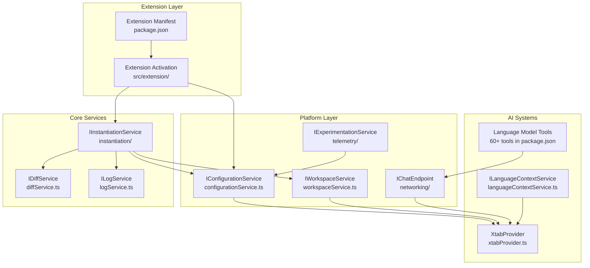
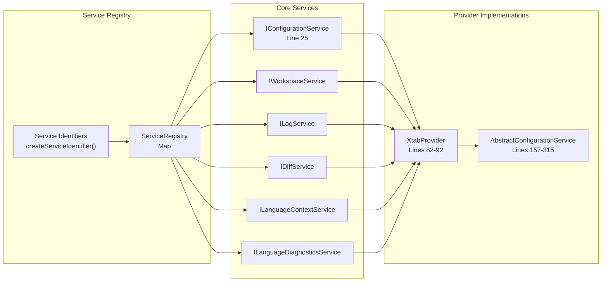
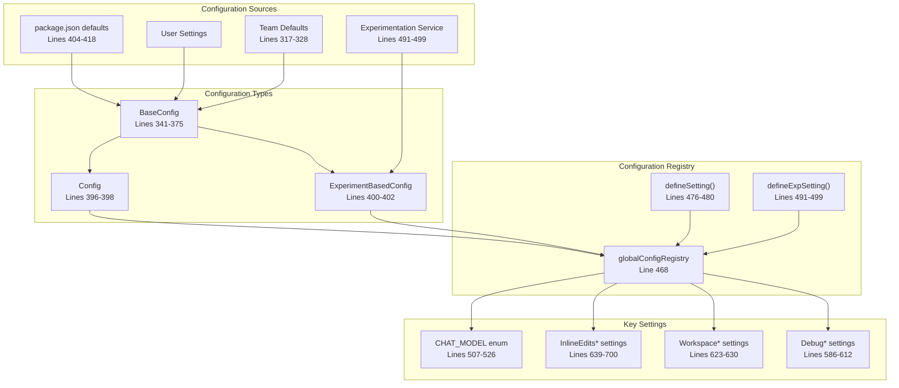
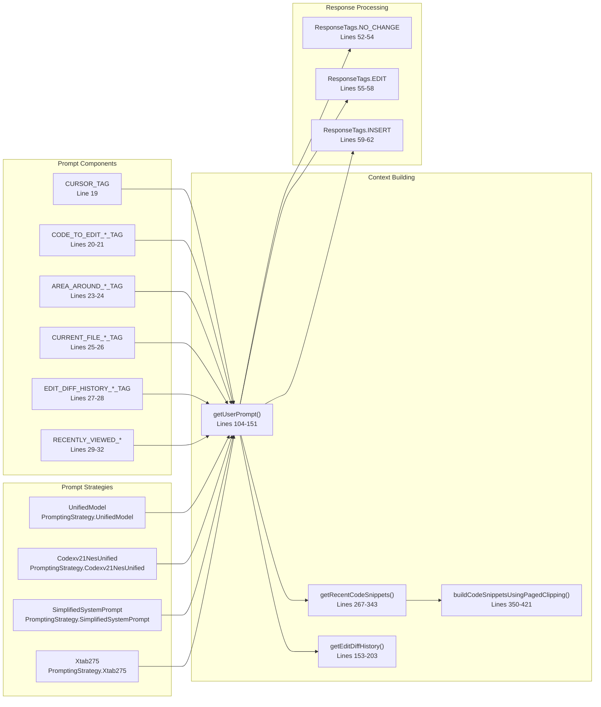

# Extension Architecture

Relevant source files

The following files were used as context for generating this wiki page:

- [package-lock.json](package-lock.json)
- [package.json](package.json)
- [src/extension/xtab/common/promptCrafting.ts](src/extension/xtab/common/promptCrafting.ts)
- [src/extension/xtab/node/xtabProvider.ts](src/extension/xtab/node/xtabProvider.ts)
- [src/extension/xtab/test/common/promptCrafting.spec.ts](src/extension/xtab/test/common/promptCrafting.spec.ts)
- [src/platform/configuration/common/configurationService.ts](src/platform/configuration/common/configurationService.ts)
- [src/platform/inlineEdits/common/dataTypes/xtabPromptOptions.ts](src/platform/inlineEdits/common/dataTypes/xtabPromptOptions.ts)

This document provides a comprehensive overview of the GitHub Copilot Chat extension's high-level architecture, focusing on the main systems, service dependencies, and component interactions. This covers the core architectural patterns, dependency injection framework, configuration management, and primary subsystems that enable AI-powered chat, inline edits, and development tools.

For detailed information about specific chat participants and language model tools, see [Chat Participants and Language Model Tools](#3). For inline edit system implementation details, see [Inline Edits System](#4). For configuration specifics, see [Configuration System](#6).

## Core Architecture Overview

The extension follows a layered architecture with dependency injection, centralized configuration, and modular subsystems. The foundation consists of platform services that support higher-level extension features.

Sources: [package.json:1-1042](), [src/platform/configuration/common/configurationService.ts:1-1042](), [src/extension/xtab/node/xtabProvider.ts:1-1042]()

## Service Container and Dependency Injection

The extension uses a sophisticated dependency injection system built around `IInstantiationService` which manages service lifecycles and dependencies. Services are identified by branded types and registered in a centralized container.

Sources: [src/platform/configuration/common/configurationService.ts:25](), [src/extension/xtab/node/xtabProvider.ts:82-92](), [src/platform/configuration/common/configurationService.ts:157-315]()

## Extension Manifest and Tool Registration

The `package.json` serves as the central registry for all extension capabilities, including 60+ language model tools, chat participants, and VS Code API integrations.

| Tool Category | Count | Key Examples |
|---------------|-------|--------------|
| Code Search | 4 | `copilot_searchCodebase`, `copilot_searchWorkspaceSymbols`, `copilot_listCodeUsages` |
| File Operations | 5 | `copilot_readFile`, `copilot_createFile`, `copilot_listDirectory` |
| Code Modification | 5 | `copilot_applyPatch`, `copilot_insertEdit`, `copilot_replaceString` |
| Terminal/Tasks | 6 | `copilot_runInTerminal`, `copilot_runVsCodeTask`, `copilot_createAndRunTask` |
| Development | 8 | `copilot_getErrors`, `copilot_runTests`, `copilot_testFailure` |
| AI Context | 3 | `copilot_think`, `copilot_updateUserPreferences`, `copilot_getVSCodeAPI` |

Sources: [package.json:136-1042]()

## Configuration Architecture

The configuration system uses a hierarchical approach with experiment-based settings, team-specific defaults, and validation. The `IConfigurationService` interface provides type-safe access to all settings.

Sources: [src/platform/configuration/common/configurationService.ts:341-375](), [src/platform/configuration/common/configurationService.ts:396-402](), [src/platform/configuration/common/configurationService.ts:468](), [src/platform/configuration/common/configurationService.ts:507-526]()

## XTab Provider Architecture

The `XtabProvider` is the core AI-powered inline edit system that provides real-time code suggestions. It implements the `StatelessNextEditProvider` interface and uses a sophisticated prompt crafting system.

```mermaid
graph TB
    subgraph "XtabProvider Core"
        XTABPROVIDER["XtabProvider<br/>Lines 70-137"]
        CHAINEDPROVIDER["ChainedStatelessNextEditProvider<br/>Line 93"]
        STATELESSPROVIDER["StatelessNextEditProvider<br/>Interface"]
    end
    
    subgraph "Provider Aspects"
        IGNOREIMPORTS["IgnoreImportChangesAspect<br/>Line 94"]
        IGNOREWHITESPACE["IgnoreTriviaWhitespaceChangesAspect<br/>Line 95"]
    end
    
    subgraph "Prompt System"
        PROMPTCRAFTING["promptCrafting.ts<br/>getUserPrompt()"]
        SYSTEMPROMPT["systemPromptTemplate<br/>Lines 34-67"]
        UNIFIEDPROMPT["unifiedModelSystemPrompt<br/>Lines 69-98"]
        PROMPTOPTIONS["PromptOptions<br/>xtabPromptOptions.ts"]
    end
    
    subgraph "Context Providers"
        LANGCTX["ILanguageContextService<br/>Lines 335-388"]
        DELAYER["Delayer<br/>Lines 98-99"]
        ENDPOINTS["XtabEndpoint<br/>IChatEndpoint"]
    end
    
    subgraph "Processing Pipeline"
        STREAMEDIT["streamEdits()<br/>Lines 391-631"]
        RESPONSEPROC["ResponseProcessor<br/>Lines 521-631"]
        TELEMETRY["StatelessNextEditTelemetryBuilder<br/>Lines 111-131"]
    end
    
    XTABPROVIDER --> CHAINEDPROVIDER
    CHAINEDPROVIDER --> STATELESSPROVIDER
    
    XTABPROVIDER --> IGNOREIMPORTS
    XTABPROVIDER --> IGNOREWHITESPACE
    
    XTABPROVIDER --> PROMPTCRAFTING
    PROMPTCRAFTING --> SYSTEMPROMPT
    PROMPTCRAFTING --> UNIFIEDPROMPT
    PROMPTCRAFTING --> PROMPTOPTIONS
    
    XTABPROVIDER --> LANGCTX
    XTABPROVIDER --> DELAYER
    XTABPROVIDER --> ENDPOINTS
    
    XTABPROVIDER --> STREAMEDIT
    STREAMEDIT --> RESPONSEPROC
    STREAMEDIT --> TELEMETRY
```

Sources: [src/extension/xtab/node/xtabProvider.ts:70-137](), [src/extension/xtab/common/promptCrafting.ts:34-67](), [src/extension/xtab/common/promptCrafting.ts:69-98](), [src/platform/inlineEdits/common/dataTypes/xtabPromptOptions.ts:1-75]()

## Prompt Crafting System

The prompt crafting system constructs contextual prompts for AI models by combining various sources of information including recently viewed code, edit history, and language context.

Sources: [src/extension/xtab/common/promptCrafting.ts:19-32](), [src/extension/xtab/common/promptCrafting.ts:104-151](), [src/extension/xtab/common/promptCrafting.ts:267-343](), [src/extension/xtab/node/xtabProvider.ts:52-62]()

## Data Flow Architecture

The extension follows a request-response pattern with streaming capabilities for real-time AI suggestions. The data flows through multiple transformation stages from user input to AI model response.

```mermaid
graph TB
    subgraph "Input Processing"
        USERREQUEST["StatelessNextEditRequest<br/>User Input"]
        DOCUMENTSTATE["StatelessNextEditDocument<br/>Document State"]
        CURSORPOS["Position & Selection<br/>Lines 153-157"]
    end
    
    subgraph "Context Gathering"
        ACTIVEDOC["activeDocument<br/>Lines 151-152"]
        EDITHISTORY["xtabEditHistory<br/>Lines 115-117"]
        LANGCONTEXT["LanguageContextResponse<br/>Lines 269-285"]
        RECENTDOCS["Recently Viewed Documents<br/>Lines 283-299"]
    end
    
    subgraph "Prompt Construction"
        EDITWINDOW["editWindow calculation<br/>Lines 181-189"]
        AREACONTEXT["areaAroundCodeToEdit<br/>Lines 202-210"]
        TAGGEDCONTENT["taggedCurrentFileContent<br/>Lines 257-265"]
        MESSAGES["Raw.ChatMessage[]<br/>Lines 291-297"]
    end
    
    subgraph "AI Processing"
        ENDPOINT["IChatEndpoint<br/>Lines 159-161"]
        STREAMSOURCE["FetchStreamSource<br/>Lines 415-419"]
        PREDICTION["Prediction<br/>Lines 289-290"]
        FETCHRESULT["ChatFetchResponse<br/>Lines 431-476"]
    end
    
    subgraph "Response Processing"
        LINESSTREAM["toLines() stream<br/>Lines 503-520"]
        RESPONSEPROC["Response Tag Processing<br/>Lines 524-583"]
        EDITGEN["Edit Generation<br/>Lines 555-580"]
        PUSHEDIT["PushEdit callback<br/>Lines 474-582"]
    end
    
    USERREQUEST --> DOCUMENTSTATE
    DOCUMENTSTATE --> CURSORPOS
    
    CURSORPOS --> ACTIVEDOC
    ACTIVEDOC --> EDITHISTORY
    EDITHISTORY --> LANGCONTEXT
    LANGCONTEXT --> RECENTDOCS
    
    RECENTDOCS --> EDITWINDOW
    EDITWINDOW --> AREACONTEXT
    AREACONTEXT --> TAGGEDCONTENT
    TAGGEDCONTENT --> MESSAGES
    
    MESSAGES --> ENDPOINT
    ENDPOINT --> STREAMSOURCE
    STREAMSOURCE --> PREDICTION
    PREDICTION --> FETCHRESULT
    
    FETCHRESULT --> LINESSTREAM
    LINESSTREAM --> RESPONSEPROC
    RESPONSEPROC --> EDITGEN
    EDITGEN --> PUSHEDIT
```

Sources: [src/extension/xtab/node/xtabProvider.ts:151-157](), [src/extension/xtab/node/xtabProvider.ts:269-285](), [src/extension/xtab/node/xtabProvider.ts:291-297](), [src/extension/xtab/node/xtabProvider.ts:503-583]()

## Key Architectural Patterns

### Service Locator Pattern
The extension uses `IInstantiationService` to manage service dependencies and lifecycle, with services identified by branded types created via `createServiceIdentifier()`.

### Configuration Hierarchy
Settings are resolved through a multi-layer system: user settings → team defaults → experimentation values → package.json defaults.

### Streaming Architecture
AI responses are processed as streams to provide real-time feedback, with `FetchStreamSource` managing the async iteration and `toLines()` converting to line-based processing.

### Aspect-Oriented Design
The `XtabProvider` uses aspects like `IgnoreImportChangesAspect` and `IgnoreTriviaWhitespaceChangesAspect` to filter suggestions through `ChainedStatelessNextEditProvider`.

### Prompt Engineering Pipeline
The system uses a sophisticated prompt construction pipeline with token budgeting, paged clipping, and context prioritization to optimize AI model input.

Sources: [src/platform/configuration/common/configurationService.ts:25](), [src/extension/xtab/node/xtabProvider.ts:93-96](), [src/extension/xtab/node/xtabProvider.ts:415-419](), [src/extension/xtab/common/promptCrafting.ts:350-421]()