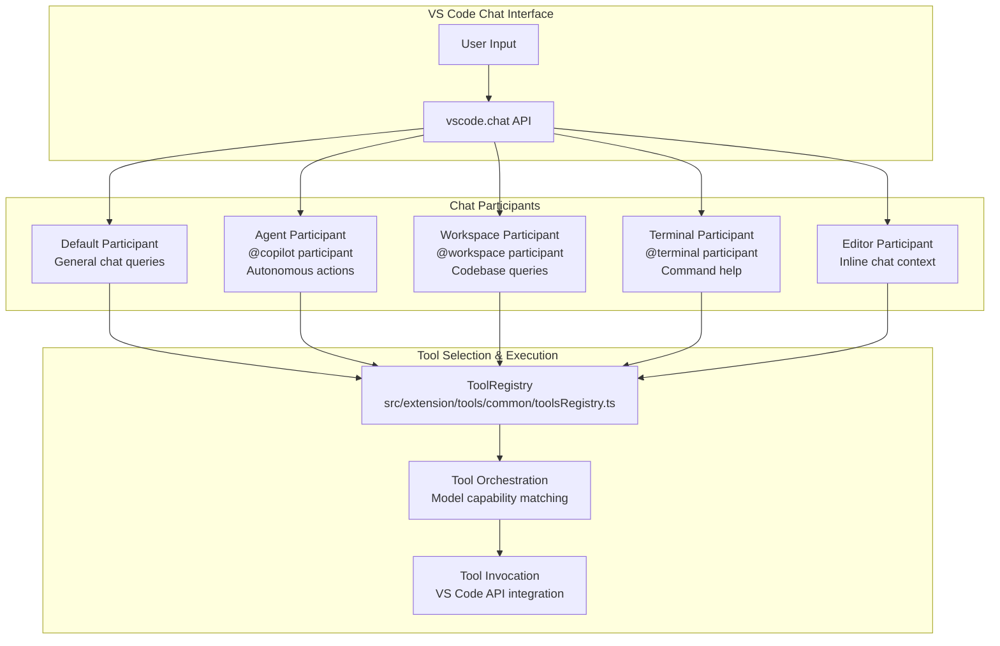
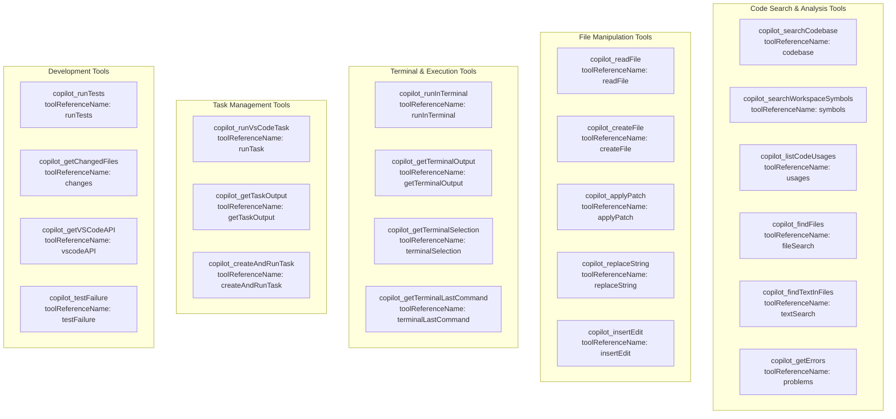
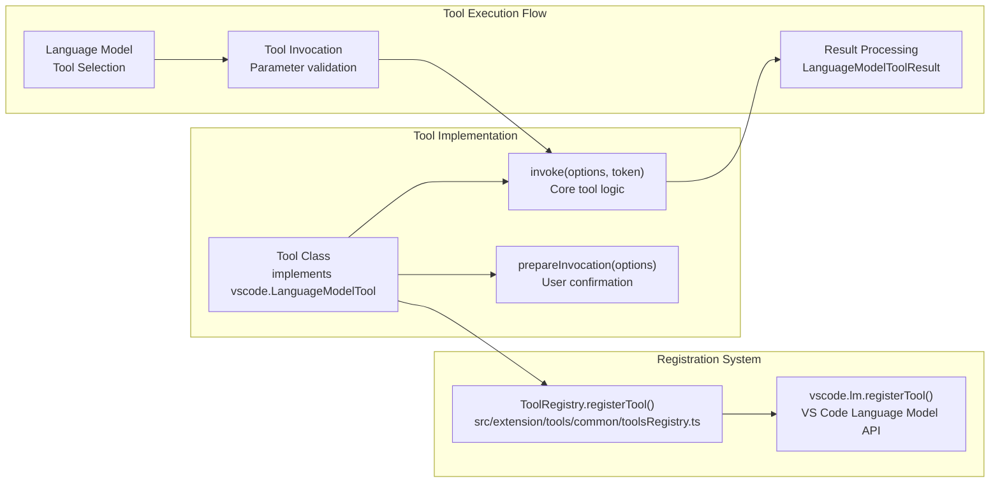
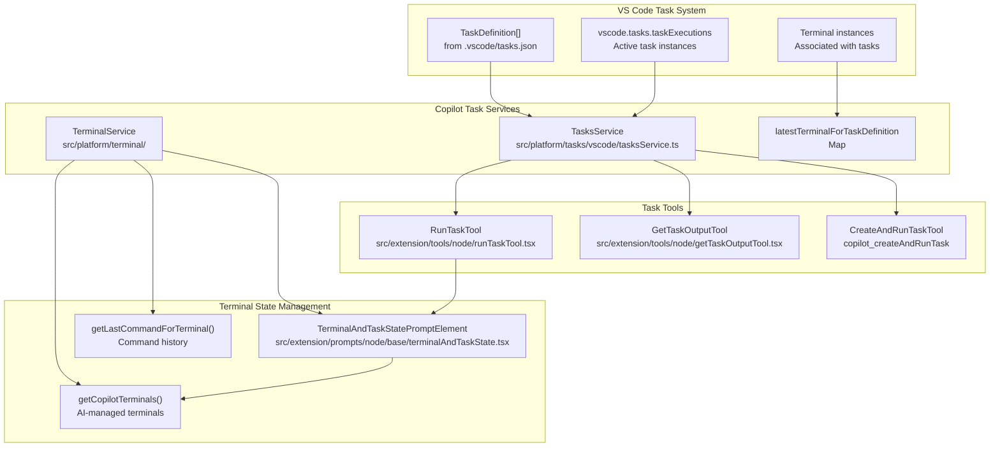
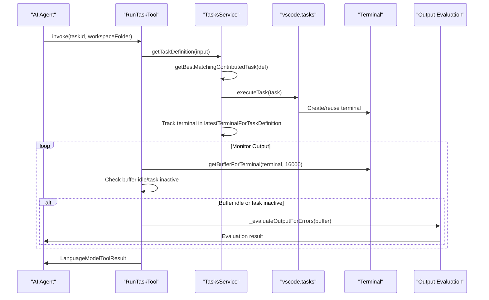
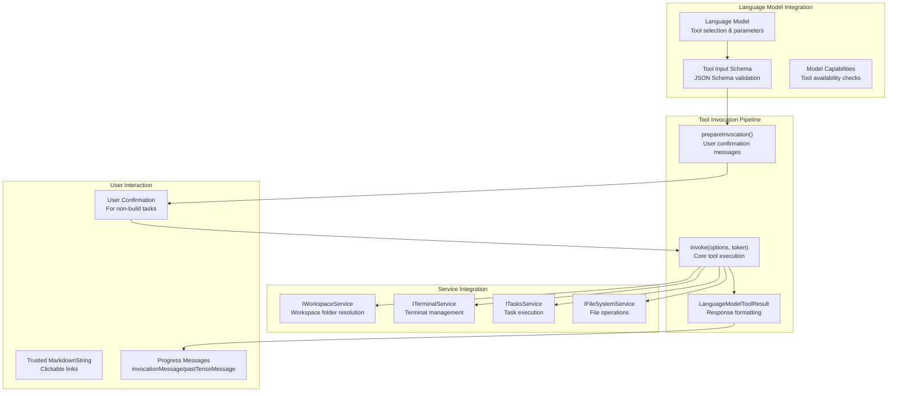
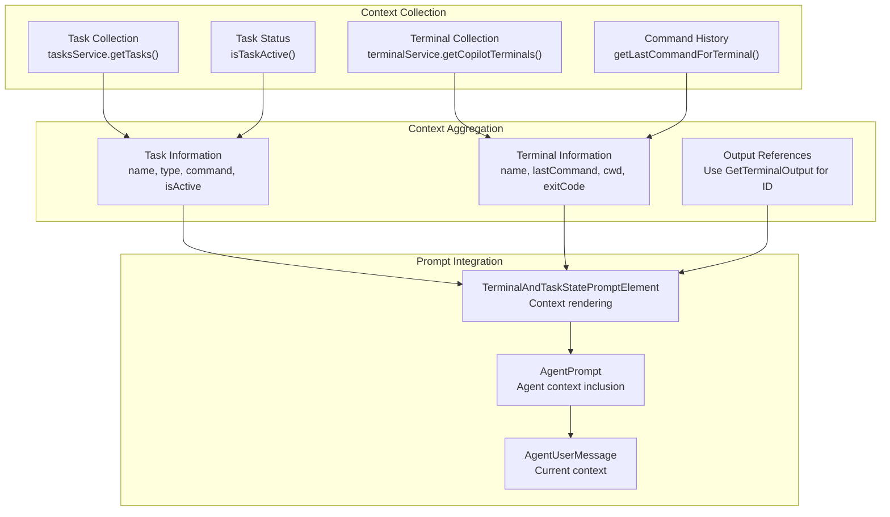

# Chat Participants and Language Model Tools

Relevant source files

The following files were used as context for generating this wiki page:

- [package-lock.json](package-lock.json)
- [package.json](package.json)
- [src/extension/prompts/node/agent/agentPrompt.tsx](src/extension/prompts/node/agent/agentPrompt.tsx)
- [src/extension/prompts/node/agent/test/terminalAndTaskPrompt.spec.tsx](src/extension/prompts/node/agent/test/terminalAndTaskPrompt.spec.tsx)
- [src/extension/prompts/node/base/terminalAndTaskState.tsx](src/extension/prompts/node/base/terminalAndTaskState.tsx)
- [src/extension/tools/node/getTaskOutputTool.tsx](src/extension/tools/node/getTaskOutputTool.tsx)
- [src/extension/tools/node/runTaskTool.tsx](src/extension/tools/node/runTaskTool.tsx)
- [src/platform/tasks/common/tasksService.ts](src/platform/tasks/common/tasksService.ts)
- [src/platform/tasks/common/testTasksService.ts](src/platform/tasks/common/testTasksService.ts)
- [src/platform/tasks/vscode/tasksService.ts](src/platform/tasks/vscode/tasksService.ts)
- [test/outcome/edit-toolcalling-panel.json](test/outcome/edit-toolcalling-panel.json)
- [test/outcome/fetchwebpagetool-toolcalling-panel.json](test/outcome/fetchwebpagetool-toolcalling-panel.json)
- [test/outcome/findfilestool-toolcalling-panel.json](test/outcome/findfilestool-toolcalling-panel.json)
- [test/outcome/notebooks-toolcalling-panel.json](test/outcome/notebooks-toolcalling-panel.json)
- [test/outcome/toolcalling-panel.json](test/outcome/toolcalling-panel.json)
- [test/simulation/baseline.json](test/simulation/baseline.json)

This document covers the core chat functionality of the GitHub Copilot Chat extension, including chat participants and the comprehensive language model tools system. It details how the extension provides AI-powered chat capabilities through multiple specialized participants and orchestrates over 60 language model tools for code analysis, editing, and workspace management.

For information about the inline edits system and edit providers, see [Inline Edits System](#4). For details about the AI agent prompt system and conversation history, see [Agent Prompt System](#3.1).

## Chat Participants Architecture

The extension implements multiple chat participants that handle different types of user interactions and contexts. Each participant specializes in specific domains and has access to relevant subsets of the language model tools.

Sources: [package.json:111-134](), [src/extension/prompts/node/agent/agentPrompt.tsx:1-50]()

## Language Model Tools Registry

The extension defines over 60 language model tools in its manifest, organized by functionality and integrated through a central registry system. Tools are registered using the `ToolRegistry.registerTool()` pattern and made available to language models through VS Code's language model tools API.

### Tool Categories and Organization

Sources: [package.json:136-1043](), [src/extension/tools/common/toolsRegistry.ts]()

### Tool Registration and Lifecycle

Tools follow a consistent registration pattern where each tool class implements the `vscode.LanguageModelTool` interface and registers itself with the central registry:

Sources: [src/extension/tools/node/runTaskTool.tsx:212](), [src/extension/tools/node/getTaskOutputTool.tsx:92]()

## Terminal and Task Integration

The extension provides sophisticated integration with VS Code's terminal and task systems, enabling AI agents to execute commands, manage build processes, and monitor task output.

### Task Management Architecture

Sources: [src/platform/tasks/vscode/tasksService.ts:23-56](), [src/extension/prompts/node/base/terminalAndTaskState.tsx:18-109](), [src/extension/tools/node/runTaskTool.tsx:27-135]()

### Task Execution Flow

The task execution system provides comprehensive lifecycle management, from task definition matching to output evaluation:

Sources: [src/extension/tools/node/runTaskTool.tsx:41-135](), [src/platform/tasks/vscode/tasksService.ts:206-305]()

## Tool Invocation and Result Processing

The extension implements a sophisticated tool invocation system that handles parameter validation, user confirmation, and result processing. Tools can be invoked directly by language models or referenced by users through the `toolReferenceName` system.

### Tool Invocation Architecture

Sources: [src/extension/tools/node/runTaskTool.tsx:153-179](), [src/extension/tools/node/getTaskOutputTool.tsx:55-69]()

## Terminal State Context Integration

The extension provides comprehensive terminal and task state context to AI agents through the `TerminalAndTaskStatePromptElement`, enabling intelligent decision-making about build processes, command execution, and workspace state.

### Context Information Flow

Sources: [src/extension/prompts/node/base/terminalAndTaskState.tsx:26-109](), [src/extension/prompts/node/agent/agentPrompt.tsx:281]()

The terminal and task state system enables AI agents to understand the current development environment state, including:

- **Active Tasks**: Background processes, build tasks, and their execution status
- **Terminal State**: Command history, working directories, and exit codes
- **Output Access**: References to terminal output through tool invocation
- **Task Dependencies**: Problem matchers, task groups, and dependency chains

This contextual information allows agents to make informed decisions about when to run builds, execute tests, or investigate command failures, creating a more intelligent and context-aware development assistant.

Sources: [src/extension/prompts/node/base/terminalAndTaskState.tsx:27-44](), [src/platform/tasks/vscode/tasksService.ts:161-169]()