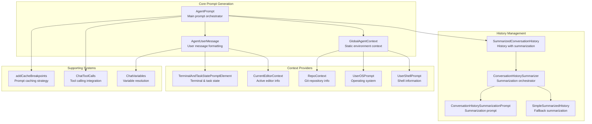
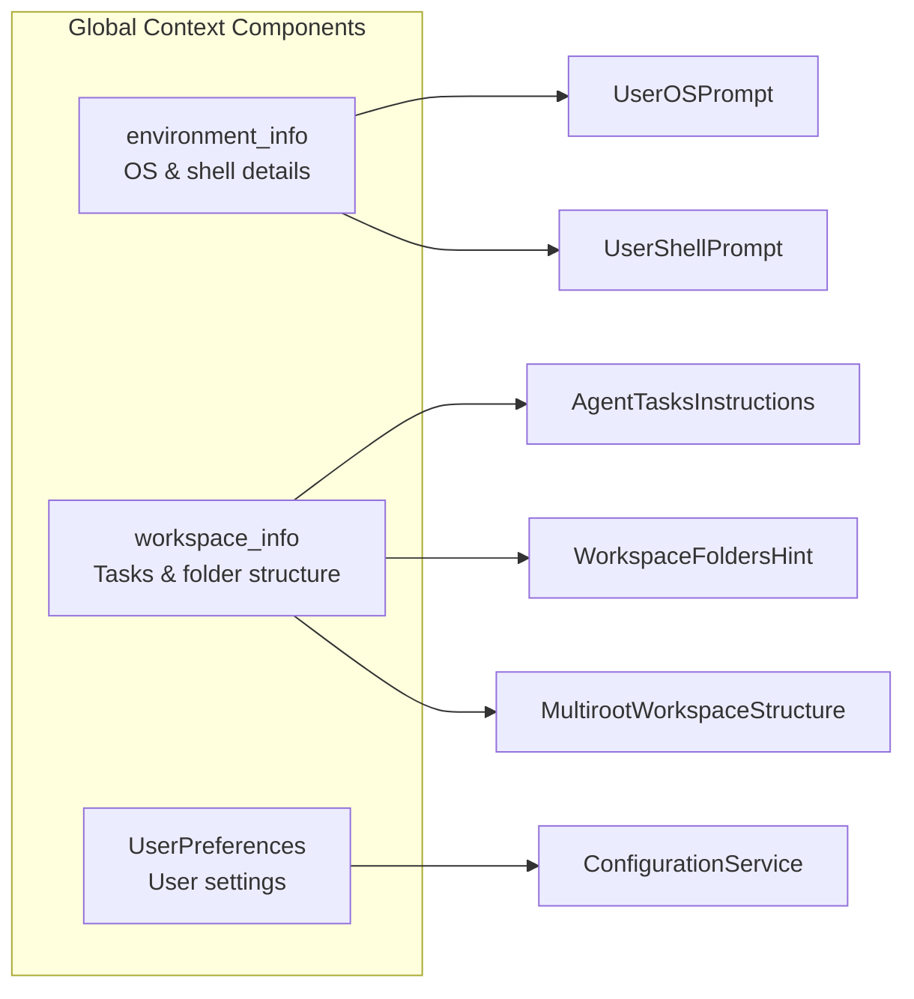
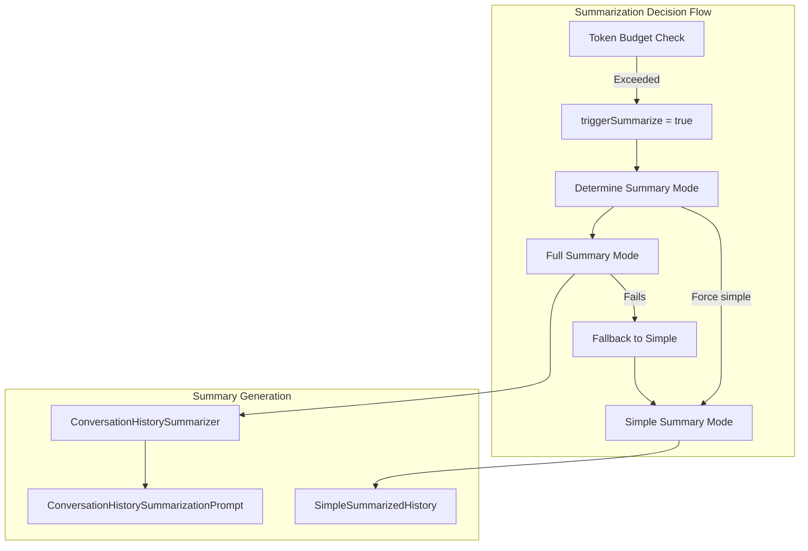
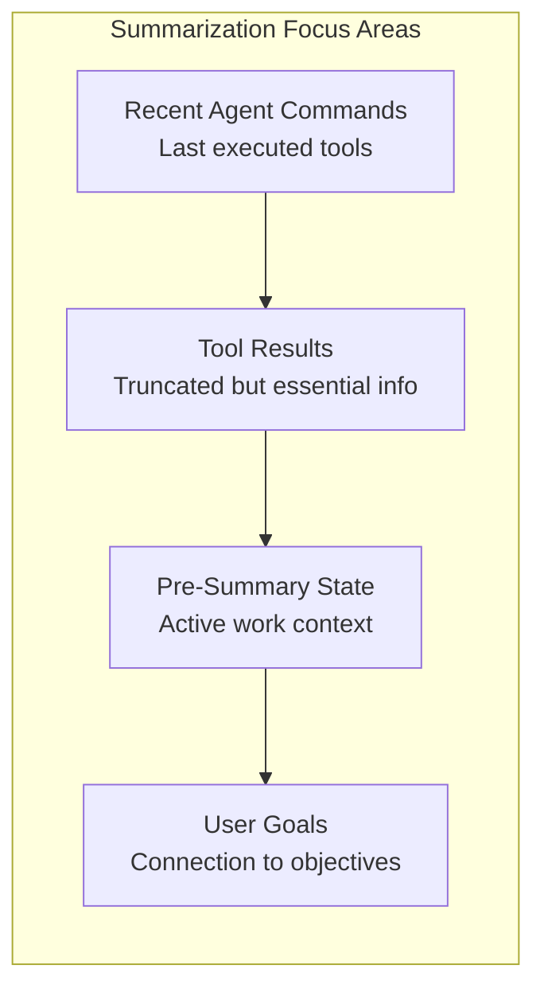
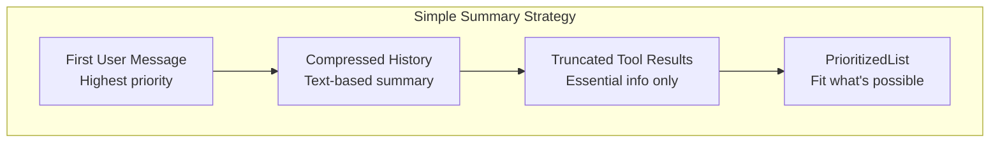
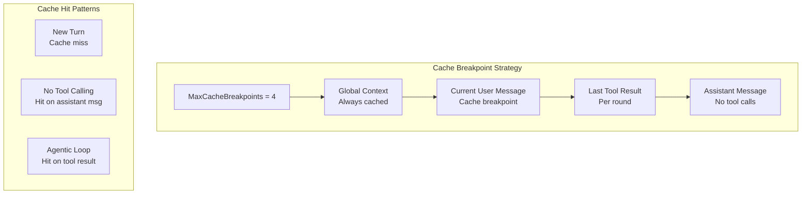
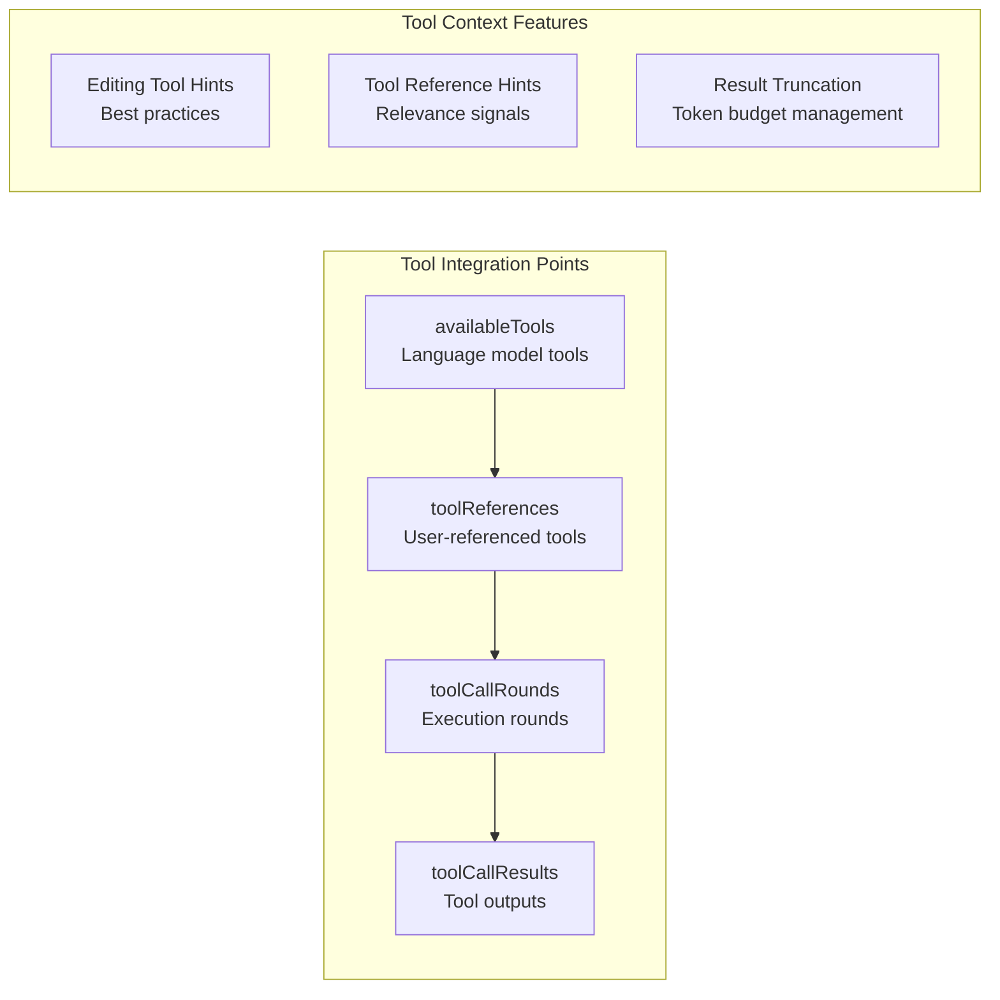
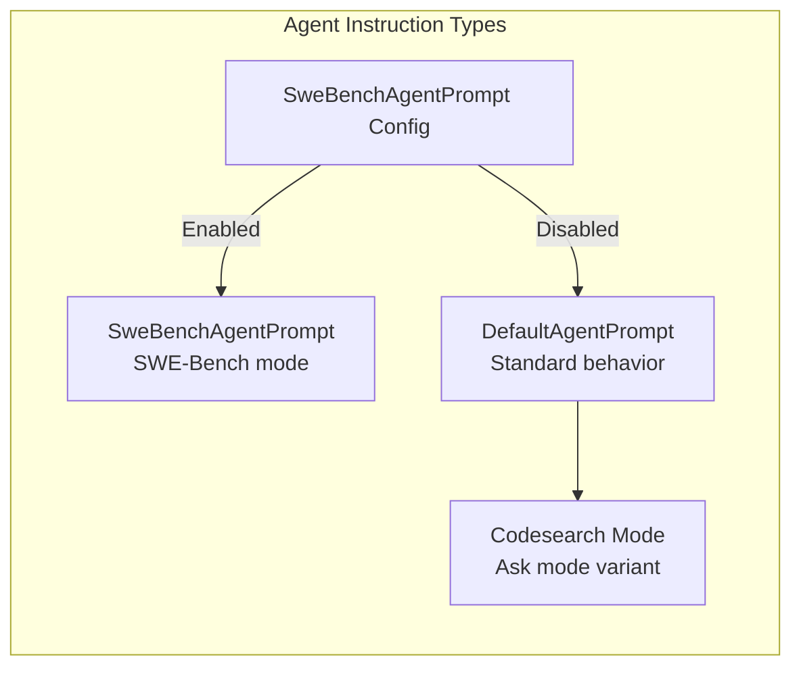

# Agent Prompt System

Relevant source files

The following files were used as context for generating this wiki page:

- [src/extension/intents/node/cacheBreakpoints.ts](src/extension/intents/node/cacheBreakpoints.ts)
- [src/extension/prompts/node/agent/agentPrompt.tsx](src/extension/prompts/node/agent/agentPrompt.tsx)
- [src/extension/prompts/node/agent/simpleSummarizedHistoryPrompt.tsx](src/extension/prompts/node/agent/simpleSummarizedHistoryPrompt.tsx)
- [src/extension/prompts/node/agent/summarizedConversationHistory.tsx](src/extension/prompts/node/agent/summarizedConversationHistory.tsx)
- [src/extension/prompts/node/agent/test/agentPrompt.spec.tsx](src/extension/prompts/node/agent/test/agentPrompt.spec.tsx)
- [src/extension/prompts/node/base/terminalAndTaskState.tsx](src/extension/prompts/node/base/terminalAndTaskState.tsx)
- [test/outcome/edit-toolcalling-panel.json](test/outcome/edit-toolcalling-panel.json)
- [test/outcome/fetchwebpagetool-toolcalling-panel.json](test/outcome/fetchwebpagetool-toolcalling-panel.json)
- [test/outcome/findfilestool-toolcalling-panel.json](test/outcome/findfilestool-toolcalling-panel.json)
- [test/outcome/notebooks-toolcalling-panel.json](test/outcome/notebooks-toolcalling-panel.json)
- [test/outcome/toolcalling-panel.json](test/outcome/toolcalling-panel.json)
- [test/simulation/baseline.json](test/simulation/baseline.json)

## Purpose and Scope

The Agent Prompt System is responsible for generating comprehensive AI agent prompts that enable autonomous operation within VS Code. This system manages conversation context, user environment information, and tool calling capabilities to provide AI agents with the necessary context to perform complex development tasks.

This document covers prompt generation, conversation history management, context building, and summarization strategies. For information about the individual language model tools available to agents, see [Terminal and Task Tools](#3.2) and [Code Modification Tools](#3.3). For the overall chat participant architecture, see [Chat Participants and Language Model Tools](#3).

## System Architecture

The Agent Prompt System consists of several interconnected components that work together to build comprehensive prompts for AI agents:

**Sources:** [src/extension/prompts/node/agent/agentPrompt.tsx:73-137](), [src/extension/prompts/node/agent/summarizedConversationHistory.tsx:328-374](), [src/extension/prompts/node/agent/simpleSummarizedHistoryPrompt.tsx:33-46]()

## Core Prompt Generation

### AgentPrompt Class

The `AgentPrompt` class is the main orchestrator for generating agent prompts. It combines system instructions, user context, and conversation history into a cohesive prompt structure.

```mermaid
graph TD
    subgraph "AgentPrompt Structure"
        SystemMessage["SystemMessage<br/>AI assistant identity & safety"]
        Instructions["DefaultAgentPrompt/SweBenchAgentPrompt<br/>Agent behavior instructions"]
        CustomInstructions["CustomInstructions<br/>User-defined instructions"]
        GlobalContext["GlobalAgentContext<br/>Environment & workspace info"]
        History["SummarizedConversationHistory<br/>Previous conversation turns"]
        CurrentMessage["AgentUserMessage<br/>Current user request"]
        ToolCalls["ChatToolCalls<br/>Tool execution results"]
    end
    
    SystemMessage --> Instructions
    Instructions --> CustomInstructions
    CustomInstructions --> GlobalContext
    GlobalContext --> History
    History --> CurrentMessage
    CurrentMessage --> ToolCalls
```

The prompt generation process varies based on whether cache breakpoints are enabled:

| Configuration | History Management | Summarization |
|---------------|-------------------|---------------|
| Cache Breakpoints Enabled | `SummarizedConversationHistory` | Automatic when context exceeds budget |
| Cache Breakpoints Disabled | `AgentConversationHistory` | Manual only |

**Sources:** [src/extension/prompts/node/agent/agentPrompt.tsx:73-137](), [src/extension/prompts/node/agent/agentPrompt.tsx:114-136]()

### GlobalAgentContext

The `GlobalAgentContext` provides static environment information that remains consistent throughout a conversation session:

**Sources:** [src/extension/prompts/node/agent/agentPrompt.tsx:172-189](), [src/extension/prompts/node/agent/agentPrompt.tsx:354-381]()

## Conversation History Management

### Summarization Strategy

The system implements a sophisticated conversation history management strategy that automatically summarizes content when token budgets are exceeded:

**Sources:** [src/extension/prompts/node/agent/summarizedConversationHistory.tsx:376-431](), [src/extension/prompts/node/agent/summarizedConversationHistory.tsx:416-430]()

### ConversationHistorySummarizationPrompt

The summarization prompt is highly structured to ensure comprehensive context preservation:

| Section | Purpose | Content |
|---------|---------|---------|
| Analysis | Systematic review process | Chronological review, intent mapping, technical inventory |
| Summary | Structured conversation summary | 8 sections covering objectives, technical foundation, codebase status |
| Recent Operations | Latest agent actions | Last commands, tool results, pre-summary state |
| Continuation Plan | Next steps | Pending tasks, priorities, immediate actions |

The prompt includes specific instructions for handling recent agent commands that triggered summarization:

**Sources:** [src/extension/prompts/node/agent/summarizedConversationHistory.tsx:45-146](), [src/extension/prompts/node/agent/summarizedConversationHistory.tsx:123-133]()

### SimpleSummarizedHistory Fallback

When full summarization fails, the system uses a compressed text-based approach:

**Sources:** [src/extension/prompts/node/agent/simpleSummarizedHistoryPrompt.tsx:33-46](), [src/extension/prompts/node/agent/simpleSummarizedHistoryPrompt.tsx:48-74]()

## Context Building

### AgentUserMessage Structure

The `AgentUserMessage` class formats user requests with comprehensive context:

```mermaid
graph TD
    subgraph "User Message Components"
        NotebookFormat["NotebookFormat<br/>Jupyter notebook context"]
        ChatVariables["ChatVariables<br/>File attachments & references"]
        ToolReferences["ToolReferencesHint<br/>Referenced tools"]
        ContextSection["Context Section<br/>Current state info"]
        EditorContext["CurrentEditorContext<br/>Active file & cursor"]
        RepoContext["RepoContext<br/>Git repository info"]
        ReminderInstructions["ReminderInstructions<br/>Behavior reminders"]
        UserRequest["UserRequest<br/>Actual user query"]
    end
    
    NotebookFormat --> ChatVariables
    ChatVariables --> ToolReferences
    ToolReferences --> ContextSection
    ContextSection --> EditorContext
    EditorContext --> RepoContext
    RepoContext --> ReminderInstructions
    ReminderInstructions --> UserRequest
```

**Sources:** [src/extension/prompts/node/agent/agentPrompt.tsx:238-296](), [src/extension/prompts/node/agent/agentPrompt.tsx:270-292]()

### Context Providers

The system includes specialized context providers for different aspects of the development environment:

| Provider | Purpose | Key Information |
|----------|---------|-----------------|
| `TerminalAndTaskStatePromptElement` | Terminal and task status | Active terminals, running tasks, command history |
| `CurrentEditorContext` | Active editor state | Current file, cursor position, selection |
| `RepoContext` | Git repository info | Repository name, branch, pull request |
| `UserOSPrompt` | Operating system | OS type for command generation |
| `UserShellPrompt` | Shell information | Shell type and syntax hints |

**Sources:** [src/extension/prompts/node/base/terminalAndTaskState.tsx:18-108](), [src/extension/prompts/node/agent/agentPrompt.tsx:406-474](), [src/extension/prompts/node/agent/agentPrompt.tsx:477-503]()

## Prompt Caching Strategy

### Cache Breakpoint System

The system implements a sophisticated caching strategy using cache breakpoints to improve performance:

The cache breakpoint allocation follows a specific strategy:

1. **Below Current User Message**: Last tool result in each round, current user message
2. **Above Current User Message**: Assistant messages with no tool calls
3. **Remaining Breakpoints**: System and custom instruction messages

**Sources:** [src/extension/intents/node/cacheBreakpoints.ts:30-80](), [src/extension/intents/node/cacheBreakpoints.ts:12-29]()

## Tool Integration

### Tool Calling Context

The agent prompt system integrates with the tool calling system to provide context about available tools and their results:

The system provides specific reminders based on available tools:

| Tool Type | Reminder |
|-----------|----------|
| `EditFile` | Use `// existing code...` marker to avoid repetition |
| `ReplaceString` | Include 3-5 lines of context before/after |
| `RunInTerminal` | Generate commands for user's shell |

**Sources:** [src/extension/prompts/node/agent/agentPrompt.tsx:599-622](), [src/extension/prompts/node/agent/agentPrompt.tsx:257-267](), [src/extension/prompts/node/agent/agentPrompt.tsx:321-336]()

## Configuration and Customization

### Agent Instructions

The system supports different agent instruction sets:

### Model-Specific Behavior

The system adapts behavior based on the language model family:

| Model Family | Specific Behavior |
|-------------|------------------|
| `gpt-4.1` | Keep-going reminders, attachment hints |
| Other models | Standard behavior |

**Sources:** [src/extension/prompts/node/agent/agentPrompt.tsx:84-90](), [src/extension/prompts/node/agent/agentPrompt.tsx:615-622](), [src/extension/prompts/node/agent/agentPrompt.tsx:264-266]()