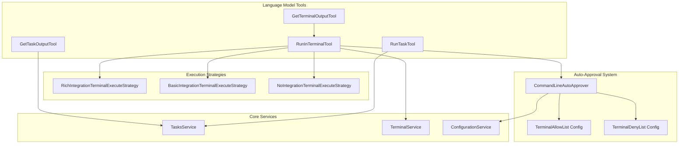
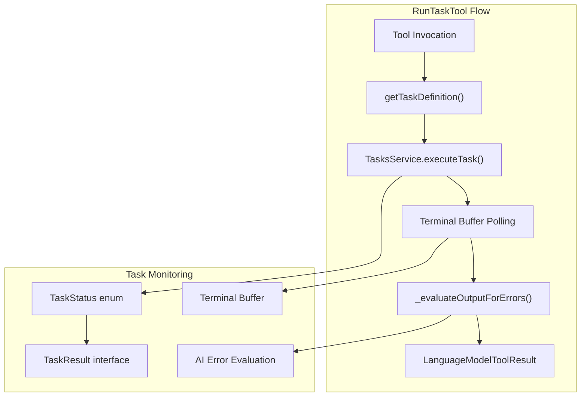
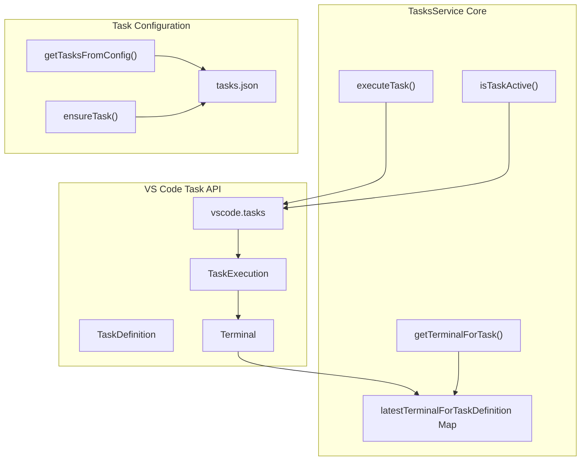
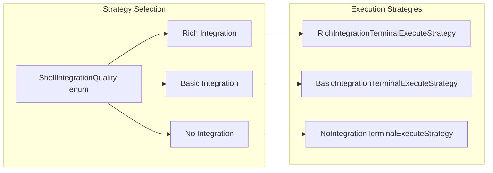
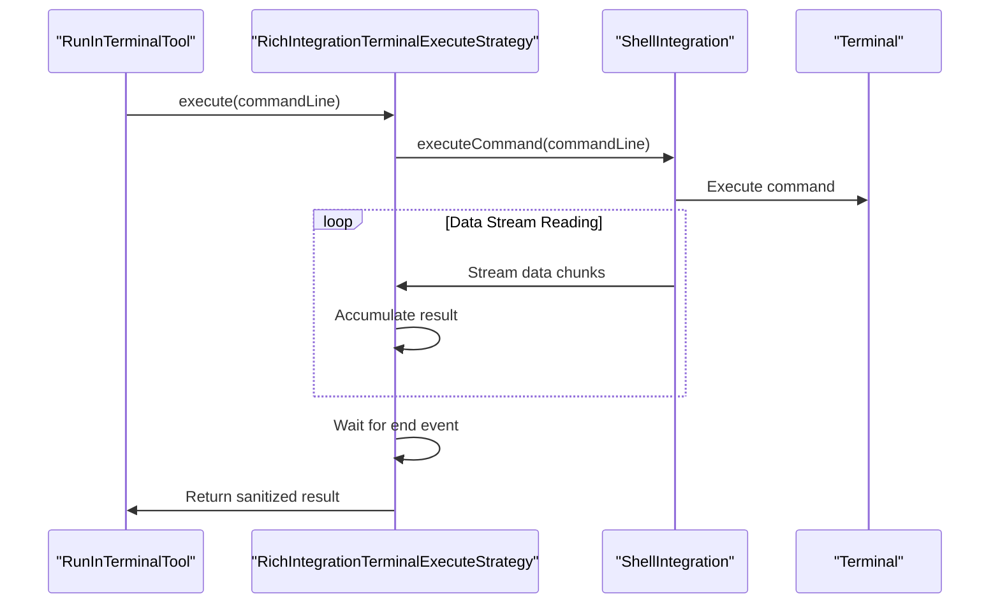
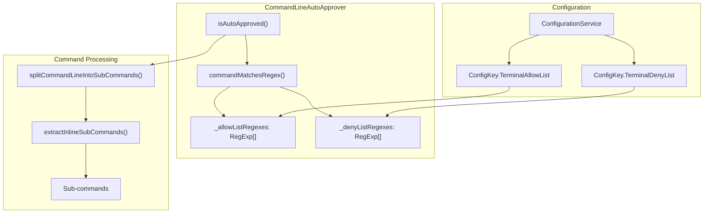
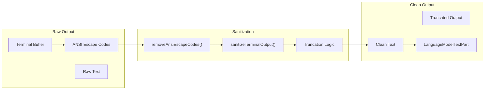
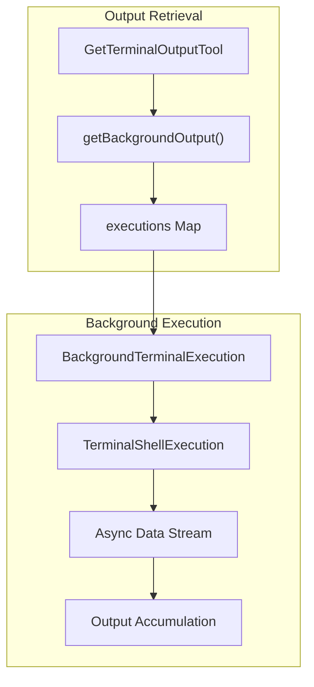

# Terminal and Task Tools

Relevant source files

The following files were used as context for generating this wiki page:

- [src/extension/prompts/node/agent/test/terminalAndTaskPrompt.spec.tsx](src/extension/prompts/node/agent/test/terminalAndTaskPrompt.spec.tsx)
- [src/extension/tools/node/getTaskOutputTool.tsx](src/extension/tools/node/getTaskOutputTool.tsx)
- [src/extension/tools/node/runInTerminalTool.tsx](src/extension/tools/node/runInTerminalTool.tsx)
- [src/extension/tools/node/runTaskTool.tsx](src/extension/tools/node/runTaskTool.tsx)
- [src/extension/tools/node/test/runInTerminalTool.spec.tsx](src/extension/tools/node/test/runInTerminalTool.spec.tsx)
- [src/extension/tools/node/test/toolUtils.terminal.spec.ts](src/extension/tools/node/test/toolUtils.terminal.spec.ts)
- [src/extension/tools/node/toolUtils.terminal.ts](src/extension/tools/node/toolUtils.terminal.ts)
- [src/platform/tasks/common/tasksService.ts](src/platform/tasks/common/tasksService.ts)
- [src/platform/tasks/common/testTasksService.ts](src/platform/tasks/common/testTasksService.ts)
- [src/platform/tasks/vscode/tasksService.ts](src/platform/tasks/vscode/tasksService.ts)

This section covers the terminal command execution and VS Code task management capabilities within the GitHub Copilot Chat extension. The system provides language model tools that can execute commands in terminals, run VS Code tasks, and retrieve their output. It includes sophisticated command auto-approval mechanisms, multiple terminal execution strategies, and comprehensive output handling.

For information about other language model tools like code modification and search, see [Code Modification Tools](#3.3). For details on the overall tool registry and orchestration, see [Chat Participants and Language Model Tools](#3).

## Tool Architecture Overview

The terminal and task tools form a cohesive system that bridges AI language models with VS Code's terminal and task execution capabilities.

Sources: [src/extension/tools/node/runTaskTool.tsx:27-39](), [src/extension/tools/node/runInTerminalTool.tsx:36-66](), [src/extension/tools/node/getTaskOutputTool.tsx:26-35](), [src/extension/tools/node/toolUtils.terminal.ts:571-648]()

## Task Execution System

The task execution system provides tools for running and monitoring VS Code tasks through the language model interface.

### RunTaskTool Implementation

The `RunTaskTool` class executes VS Code tasks and monitors their output through a sophisticated polling mechanism:

| Component | Purpose | Key Methods |
|-----------|---------|-------------|
| `getTaskDefinition()` | Parses task ID and resolves task | [src/extension/tools/node/runTaskTool.tsx:192-209]() |
| `executeTask()` | Executes task via TasksService | [src/platform/tasks/vscode/tasksService.ts:206-305]() |
| `_evaluateOutputForErrors()` | Uses AI to evaluate terminal output | [src/extension/tools/node/runTaskTool.tsx:137-151]() |
| Buffer polling | Monitors terminal output changes | [src/extension/tools/node/runTaskTool.tsx:66-110]() |

Sources: [src/extension/tools/node/runTaskTool.tsx:41-135](), [src/platform/tasks/vscode/tasksService.ts:206-305]()

### Task Service Architecture

The `TasksService` manages the lifecycle of VS Code tasks and maintains mappings between task definitions and their associated terminals.

Sources: [src/platform/tasks/vscode/tasksService.ts:23-306](), [src/platform/tasks/common/tasksService.ts:24-71]()

## Terminal Execution System

The terminal execution system provides multiple strategies for running commands based on shell integration capabilities.

### Execution Strategy Selection

### Terminal Execution Strategies

| Strategy | Shell Integration | Command Execution | Output Reliability |
|----------|------------------|-------------------|-------------------|
| `RichIntegrationTerminalExecuteStrategy` | Full with command detection | `shellIntegration.executeCommand()` | High - exact sequences |
| `BasicIntegrationTerminalExecuteStrategy` | Basic without command detection | `shellIntegration.executeCommand()` | Medium - polling required |
| `NoIntegrationTerminalExecuteStrategy` | None | `terminal.sendText()` | Low - timing based |

Each strategy implements the `ITerminalExecuteStrategy` interface with different approaches to command execution and output collection.

Sources: [src/extension/tools/node/toolUtils.terminal.ts:140-394](), [src/extension/tools/node/runInTerminalTool.tsx:156-206]()

### Rich Integration Strategy

The rich integration strategy leverages VS Code's shell integration API to get precise command execution tracking and reliable output collection.

Sources: [src/extension/tools/node/toolUtils.terminal.ts:156-249]()

## Command Auto-Approval System

The command auto-approval system provides configurable allow/deny lists for terminal commands to reduce confirmation prompts for safe operations.

### Auto-Approval Architecture

### Command Line Parsing

The system parses complex command lines to extract all sub-commands for individual approval:

| Function | Purpose | Shell Support |
|----------|---------|---------------|
| `splitCommandLineIntoSubCommands()` | Splits on operators like `&&`, `||`, `|` | sh, zsh, pwsh |
| `extractInlineSubCommands()` | Extracts `$(...)`, backticks, `<(...)` | sh, zsh, pwsh |
| `isPowerShell()` | Detects PowerShell variants | All platforms |

The approval logic follows this precedence:
1. **Deny list** - Commands matching deny patterns are blocked
2. **Allow list** - Commands matching allow patterns are approved
3. **Default** - All other commands require confirmation

Sources: [src/extension/tools/node/toolUtils.terminal.ts:571-648](), [src/extension/tools/node/toolUtils.terminal.ts:659-810]()

## Output Handling and Sanitization

The system provides comprehensive output handling with sanitization and length limits to prevent context overflow.

### Output Sanitization Pipeline

The `sanitizeTerminalOutput()` function implements intelligent truncation:
- **Maximum length**: 60KB to prevent context overflow
- **Truncation strategy**: Keep 40% from start, 60% from end
- **Truncation message**: Clear indication of removed content

### Background Terminal Management

Background terminals maintain persistent output collection through the `BackgroundTerminalExecution` class, allowing retrieval of long-running command output.

Sources: [src/extension/tools/node/runInTerminalTool.tsx:412-461](), [src/extension/tools/node/runInTerminalTool.tsx:394-410]()

## Integration with VS Code

The terminal and task tools integrate deeply with VS Code's terminal and task systems through several key interfaces:

### Terminal Integration Points

| Integration | Purpose | Implementation |
|-------------|---------|----------------|
| `vscode.Terminal` | Terminal instance management | [src/extension/tools/node/toolUtils.terminal.ts:76-87]() |
| `vscode.TerminalShellIntegration` | Shell integration API | [src/extension/tools/node/toolUtils.terminal.ts:89-137]() |
| `vscode.tasks` | Task execution API | [src/platform/tasks/vscode/tasksService.ts:34-56]() |
| `PreparedTerminalToolInvocation` | Terminal tool preparation | [src/extension/tools/node/runInTerminalTool.tsx:267-305]() |

The system provides seamless integration with VS Code's existing terminal and task infrastructure while adding AI-powered command execution and monitoring capabilities.

Sources: [src/extension/tools/node/runInTerminalTool.tsx:267-305](), [src/platform/tasks/vscode/tasksService.ts:23-306](), [src/extension/tools/node/toolUtils.terminal.ts:36-138]()