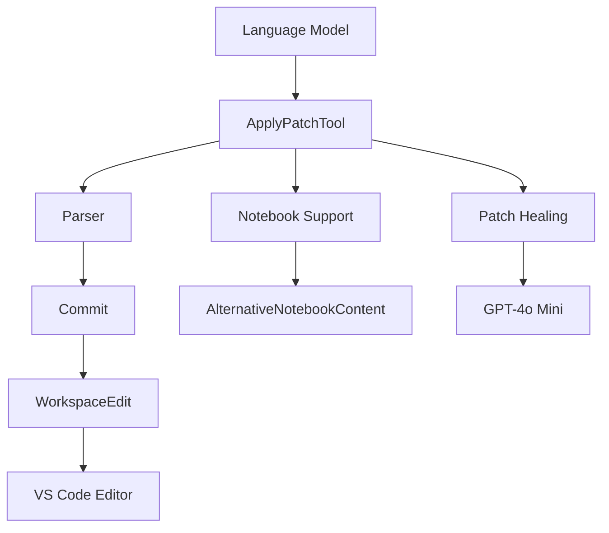
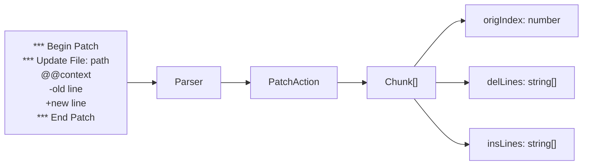
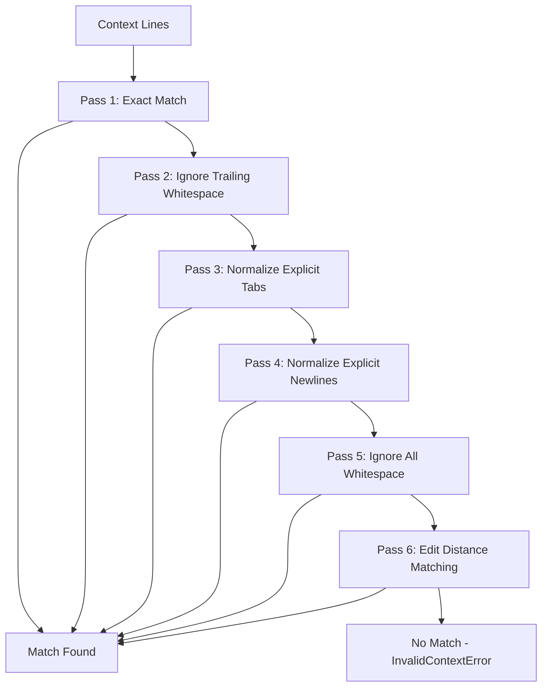
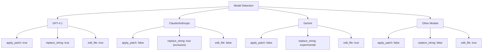
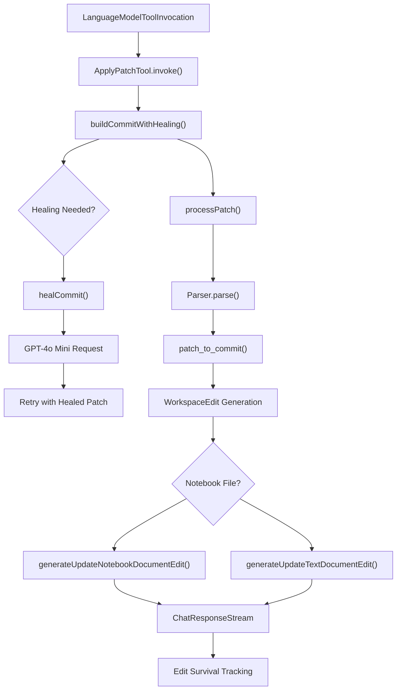
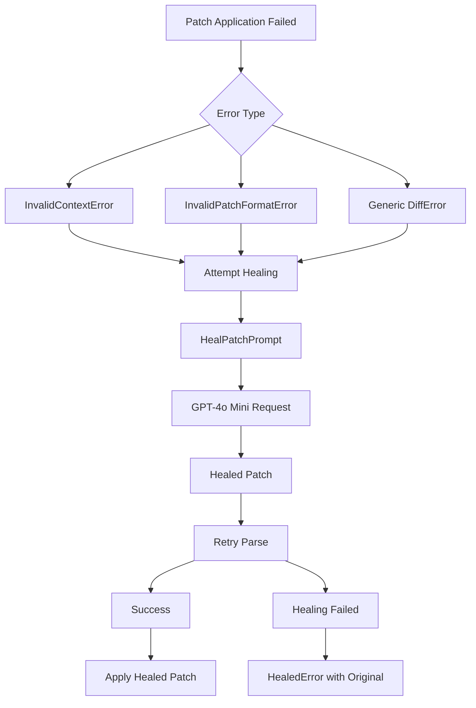
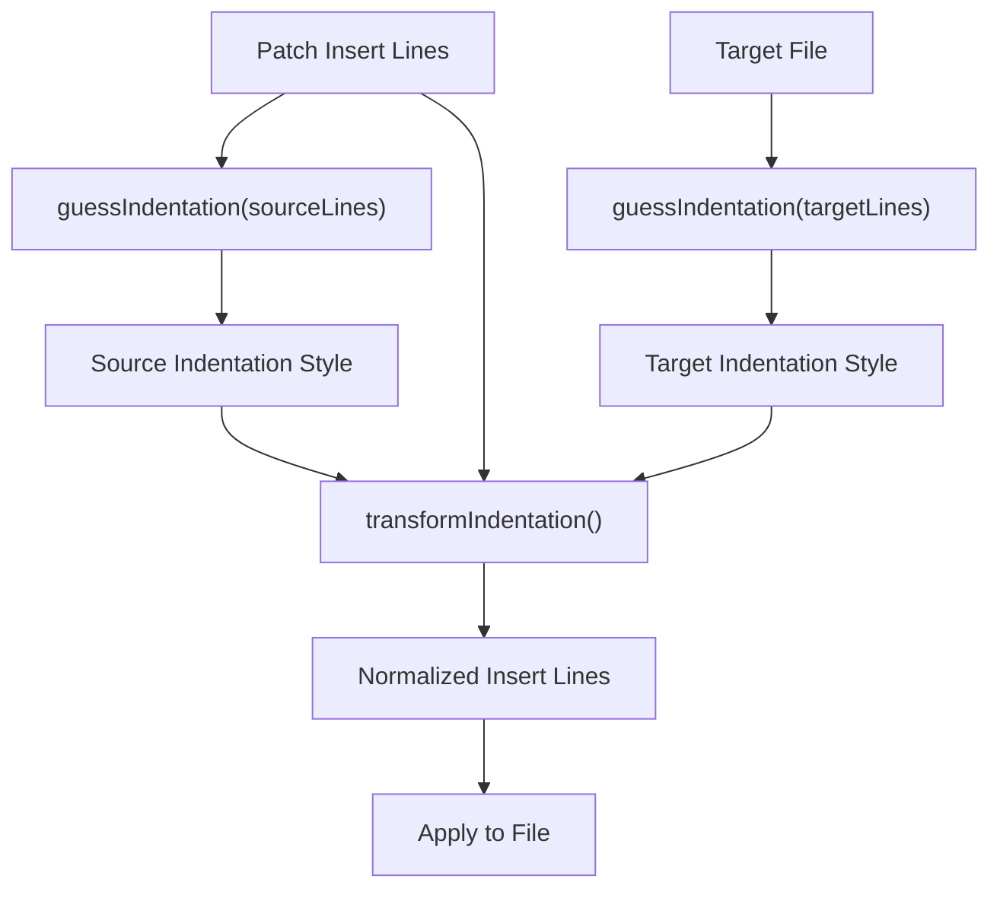
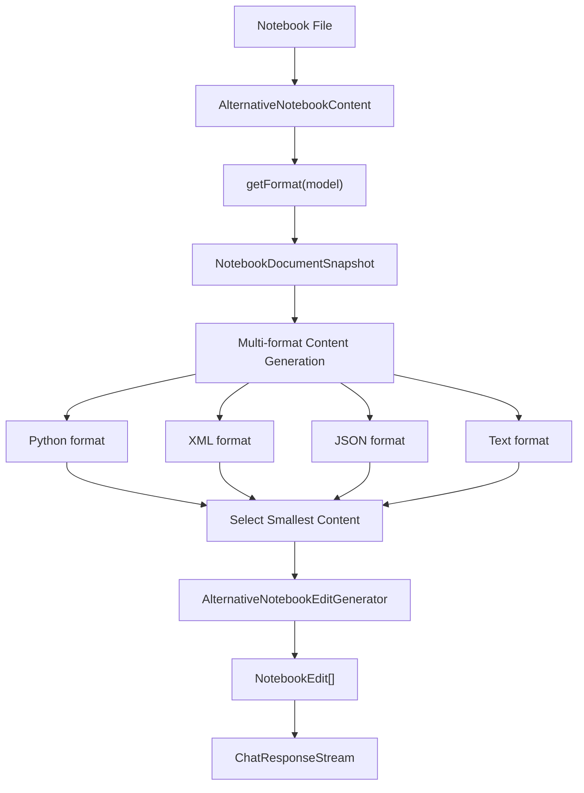

# Code Modification Tools

Relevant source files

The following files were used as context for generating this wiki page:

- [src/extension/byok/vscode-node/ollamaProvider.ts](src/extension/byok/vscode-node/ollamaProvider.ts)
- [src/extension/intents/node/agentIntent.ts](src/extension/intents/node/agentIntent.ts)
- [src/extension/prompt/node/indentationGuesser.ts](src/extension/prompt/node/indentationGuesser.ts)
- [src/extension/prompt/node/test/indentationGuesser.spec.ts](src/extension/prompt/node/test/indentationGuesser.spec.ts)
- [src/extension/tools/node/applyPatch/parser.ts](src/extension/tools/node/applyPatch/parser.ts)
- [src/extension/tools/node/applyPatchTool.tsx](src/extension/tools/node/applyPatchTool.tsx)
- [src/extension/tools/node/test/applyPatch.spec.ts](src/extension/tools/node/test/applyPatch.spec.ts)
- [src/extension/tools/test/node/applyPatch/parser.spec.ts](src/extension/tools/test/node/applyPatch/parser.spec.ts)
- [src/platform/endpoint/common/chatModelCapabilities.ts](src/platform/endpoint/common/chatModelCapabilities.ts)

This document covers the code modification tools system, which provides AI language models with the ability to edit files through structured patch operations. The primary tool is `apply_patch`, which allows models to make precise edits to source code files using a specialized diff format.

For information about inline edit suggestions, see [Inline Edits System](#4). For general chat participants and tool orchestration, see [Chat Participants and Language Model Tools](#3).

## Overview

The code modification tools system centers around the `ApplyPatchTool` class, which implements the `apply_patch` language model tool. This tool processes patch instructions from AI models and applies them to workspace files, handling both text files and Jupyter notebooks.

**Core Tool Architecture**

Sources: [src/extension/tools/node/applyPatchTool.tsx:81-101](), [src/extension/tools/node/applyPatch/parser.ts:164-179]()

## Patch Format and Processing Pipeline

The system uses a specialized patch format that differs from standard unified diff format. The `Parser` class handles the conversion from patch text to actionable file changes.

### Patch Format Structure

**Patch Processing Components**

| Component | Purpose | File Location |
|-----------|---------|---------------|
| `Parser` | Parses patch text into structured changes | [src/extension/tools/node/applyPatch/parser.ts:164-179]() |
| `PatchAction` | Represents file-level operations (ADD/DELETE/UPDATE) | [src/extension/tools/node/applyPatch/parser.ts:135-141]() |
| `Chunk` | Represents line-level changes within a file | [src/extension/tools/node/applyPatch/parser.ts:129-134]() |
| `Commit` | Final changeset ready for application | [src/extension/tools/node/applyPatch/parser.ts:62-64]() |

Sources: [src/extension/tools/node/applyPatch/parser.ts:49-64](), [src/extension/tools/node/applyPatch/parser.ts:129-145]()

### Context Matching and Fuzzy Logic

The parser implements sophisticated context matching with multiple fallback strategies:

**Context Matching Strategy**

Sources: [src/extension/tools/node/applyPatch/parser.ts:465-600](), [src/extension/tools/node/applyPatch/parser.ts:69-85]()

## Model Capabilities and Tool Selection

Different AI models support different code modification tools based on their capabilities:

**Model Capability Detection**

| Function | Purpose | Models |
|----------|---------|---------|
| `modelSupportsApplyPatch` | Checks if model supports apply_patch tool | GPT-4.1, o4-mini |
| `modelSupportsReplaceString` | Checks if model supports replace_string tool | Claude, Anthropic |
| `modelCanUseReplaceStringExclusively` | Checks if model can use replace_string without edit_file | Claude, Anthropic |

Sources: [src/platform/endpoint/common/chatModelCapabilities.ts:28-45](), [src/extension/intents/node/agentIntent.ts:50-81]()

## Tool Integration and Invocation

The `ApplyPatchTool` integrates with the VS Code language model tools API and handles the complete patch application workflow:

**Tool Workflow Components**

Sources: [src/extension/tools/node/applyPatchTool.tsx:209-425](), [src/extension/tools/node/applyPatchTool.tsx:473-528]()

## Error Handling and Patch Healing

The system implements automatic patch healing when initial application fails:

### Healing Process

**Error Types and Handling**

| Error Type | Description | Telemetry Key |
|------------|-------------|---------------|
| `InvalidContextError` | Context lines not found in file | `invalidContext`, `invalidContext-eof` |
| `InvalidPatchFormatError` | Malformed patch syntax | `invalidPatchText`, `missingEndPatch` |
| `DiffError` | General patch processing error | `processPatchFailed` |

Sources: [src/extension/tools/node/applyPatch/parser.ts:146-158](), [src/extension/tools/node/applyPatchTool.tsx:439-511]()

## Indentation and Formatting

The system handles indentation normalization to ensure consistent code formatting:

**Indentation Processing**

| Function | Purpose | Input | Output |
|----------|---------|-------|--------|
| `guessIndentation` | Analyzes file to determine indentation style | Text lines | `IGuessedIndentation` |
| `transformIndentation` | Converts between indentation styles | Content + source/target styles | Converted content |
| `replace_explicit_tabs` | Normalizes `\t` sequences to actual tabs | String with `\t` | String with tabs |

Sources: [src/extension/prompt/node/indentationGuesser.ts:134-257](), [src/extension/tools/node/applyPatch/parser.ts:457-463]()

## Notebook Support

The system provides specialized handling for Jupyter notebook files:

**Notebook Integration Components**

Sources: [src/extension/tools/node/applyPatchTool.tsx:163-207](), [src/extension/tools/node/applyPatchTool.tsx:289-304]()

## Telemetry and Monitoring

The system tracks various metrics for patch application success and edit survival:

| Telemetry Event | Purpose | Key Metrics |
|-----------------|---------|-------------|
| `applyPatchToolInvoked` | Track tool usage and outcomes | `outcome`, `model`, `healed`, `isNotebook` |
| `applyPatchHealRate` | Monitor healing success rate | `success` |
| `applyPatch.trackEditSurvival` | Track long-term edit retention | `survivalRateFourGram`, `survivalRateNoRevert` |

Sources: [src/extension/tools/node/applyPatchTool.tsx:531-567](), [src/extension/tools/node/applyPatchTool.tsx:500-510]()