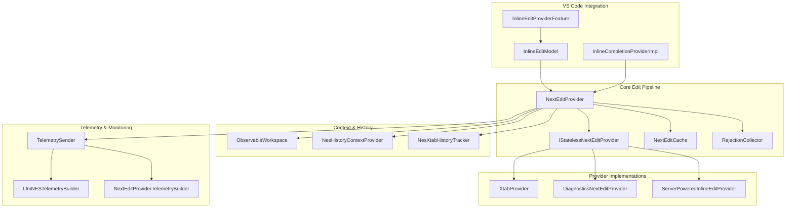
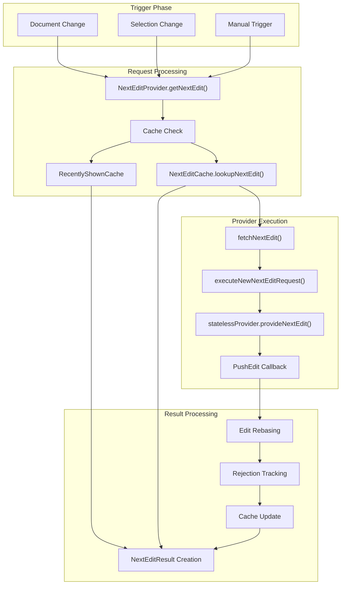
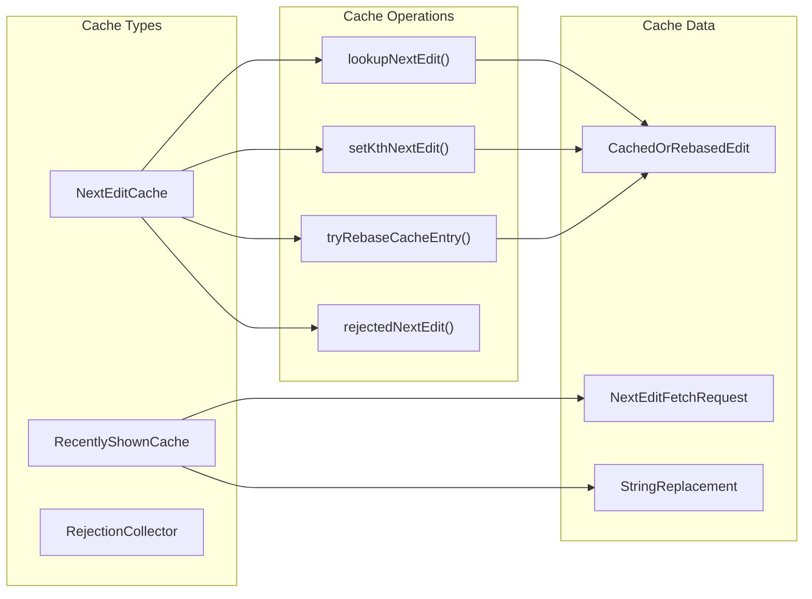
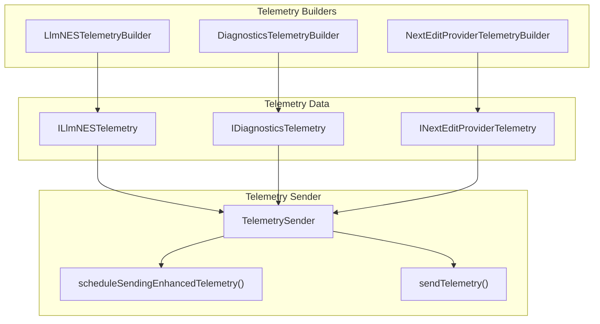

# Inline Edits System

<details>
<summary>Relevant source files</summary>

The following files were used as context for generating this wiki page:

- [src/extension/inlineEdits/node/nextEditProvider.ts](src/extension/inlineEdits/node/nextEditProvider.ts)
- [src/extension/inlineEdits/node/nextEditProviderTelemetry.ts](src/extension/inlineEdits/node/nextEditProviderTelemetry.ts)
- [src/extension/inlineEdits/node/serverPoweredInlineEditProvider.ts](src/extension/inlineEdits/node/serverPoweredInlineEditProvider.ts)
- [src/extension/inlineEdits/test/node/nextEditProviderCaching.spec.ts](src/extension/inlineEdits/test/node/nextEditProviderCaching.spec.ts)
- [src/extension/inlineEdits/vscode-node/inlineEditModel.ts](src/extension/inlineEdits/vscode-node/inlineEditModel.ts)
- [src/extension/inlineEdits/vscode-node/inlineEditProviderFeature.ts](src/extension/inlineEdits/vscode-node/inlineEditProviderFeature.ts)
- [src/platform/inlineEdits/common/inlineEditLogContext.ts](src/platform/inlineEdits/common/inlineEditLogContext.ts)
- [src/platform/inlineEdits/common/statelessNextEditProvider.ts](src/platform/inlineEdits/common/statelessNextEditProvider.ts)
- [src/platform/inlineEdits/common/statelessNextEditProviders.ts](src/platform/inlineEdits/common/statelessNextEditProviders.ts)
- [src/util/common/tracing.ts](src/util/common/tracing.ts)

</details>


## Purpose and Scope

The Inline Edits System provides AI-powered code suggestions that appear inline as users type or navigate through code. This system generates contextual edits based on recent user modifications, document history, and language context. It integrates with VS Code's inline completion API to deliver seamless code assistance.

For information about chat-based code modifications, see [Code Modification Tools](#3.3). For language-specific context analysis, see [Language Context System](#5).

## Architecture Overview

The system follows a layered architecture with caching, telemetry, and multiple provider types:

### High-Level System Architecture



Sources: [src/extension/inlineEdits/node/nextEditProvider.ts:63-665](), [src/extension/inlineEdits/vscode-node/inlineEditModel.ts:29-60](), [src/extension/inlineEdits/vscode-node/inlineEditProviderFeature.ts:36-163]()

## Core Components

### NextEditProvider

The `NextEditProvider` class orchestrates the entire inline edit pipeline. It manages caching, handles user interactions, and coordinates with stateless providers:

| Component | Responsibility |
|-----------|---------------|
| Cache Management | Stores and retrieves previously generated edits |
| Rejection Tracking | Prevents showing previously rejected suggestions |
| Request Coordination | Manages multiple concurrent edit requests |
| Telemetry Integration | Tracks performance and user behavior |

### IStatelessNextEditProvider Interface

The core abstraction for edit providers, defining the contract for generating inline edits:

```typescript
interface IStatelessNextEditProvider {
    readonly ID: string;
    readonly dependsOnSelection?: boolean;
    readonly showNextEditPreference?: ShowNextEditPreference;
    provideNextEdit(request: StatelessNextEditRequest, pushEdit: PushEdit, logContext: InlineEditRequestLogContext, cancellationToken: CancellationToken): Promise<StatelessNextEditResult>;
}
```

### Request Data Structures

| Structure | Purpose |
|-----------|---------|
| `StatelessNextEditRequest` | Contains document context, edit history, and request metadata |
| `StatelessNextEditDocument` | Represents a document with recent edits and language context |
| `StatelessNextEditResult` | Wraps the result with telemetry and error information |
| `NextEditResult` | Final result with caching metadata and display preferences |

Sources: [src/platform/inlineEdits/common/statelessNextEditProvider.ts:34-41](), [src/extension/inlineEdits/node/nextEditProvider.ts:46-55]()

## Request Flow

### Edit Request Pipeline



Sources: [src/extension/inlineEdits/node/nextEditProvider.ts:121-270](), [src/extension/inlineEdits/node/nextEditProvider.ts:303-367]()

### Edit Generation Process

The system follows a sophisticated flow to generate and cache edits:

1. **Cache Lookup**: First checks `RecentlyShownCache` and `NextEditCache` for existing edits
2. **Document Processing**: Processes recent edits and creates `StatelessNextEditDocument` instances
3. **Provider Execution**: Calls the configured `IStatelessNextEditProvider` with request context
4. **Streaming Results**: Providers use `PushEdit` callback to stream multiple edit suggestions
5. **Result Caching**: Successful edits are cached with rebasing information for future use

Sources: [src/extension/inlineEdits/node/nextEditProvider.ts:272-301](), [src/extension/inlineEdits/node/nextEditProvider.ts:386-580]()

## Caching System

### NextEditCache Architecture

The caching system optimizes performance by storing and reusing previously generated edits:



### Cache Configuration

The system uses several experimental configurations to control caching behavior:

| Configuration | Purpose |
|---------------|---------|
| `isRevisedCacheStrategy` | Enables improved cache lookup algorithm |
| `isCacheTracksRejections` | Stores rejection information in cache |
| `isRecentlyShownCacheEnabled` | Controls recently shown edit caching |

Sources: [src/extension/inlineEdits/node/nextEditProvider.ts:136-141](), [src/extension/inlineEdits/node/nextEditCache.ts]()

## Provider Types

### XtabProvider

The primary AI-powered provider that generates edits using language models:

- **Context Building**: Constructs prompts with document context and edit history
- **Model Integration**: Interfaces with language models for edit generation
- **Prompt Engineering**: Uses sophisticated prompt templates for better results

### DiagnosticsNextEditProvider

Generates edits based on compiler diagnostics and error information:

- **Error Analysis**: Analyzes language server diagnostics
- **Fix Suggestions**: Provides targeted fixes for common issues
- **Import Resolution**: Handles missing import statements

### ServerPoweredInlineEditProvider

Delegates edit generation to an external HTTP service:

- **Request Serialization**: Converts requests to JSON format
- **Remote Processing**: Sends requests to external inference servers
- **Response Handling**: Processes streaming edit responses

Sources: [src/extension/inlineEdits/node/serverPoweredInlineEditProvider.ts:40-133](), [src/extension/inlineEdits/vscode-node/features/diagnosticsInlineEditProvider.ts]()

## Telemetry and Monitoring

### Telemetry Architecture

The system includes comprehensive telemetry for monitoring performance and user behavior:



### Tracked Metrics

| Metric Category | Examples |
|-----------------|----------|
| Performance | `nextEditProviderDuration`, `statelessNextEditProviderDuration` |
| User Behavior | `acceptance`, `wasPreviouslyRejected`, `isShown` |
| Content Analysis | `promptLineCount`, `nEditsSuggested`, `lineDistanceToMostRecentEdit` |
| System Health | `fetchResult`, `noNextEditReasonKind`, `hasNextEdit` |

Sources: [src/extension/inlineEdits/node/nextEditProviderTelemetry.ts:116-541](), [src/extension/inlineEdits/node/nextEditProviderTelemetry.ts:543-764]()

## Configuration

### Key Configuration Options

The system uses extensive configuration to control behavior:

| Configuration Key | Purpose |
|------------------|---------|
| `InlineEditsEnabled` | Global feature toggle |
| `InlineEditsProviderId` | Selects which provider to use |
| `InlineEditsAsyncCompletions` | Enables asynchronous completion mode |
| `InlineEditsYieldToCopilot` | Controls interaction with GitHub Copilot |
| `InlineEditsDebounceOnSelectionChange` | Configures selection change debouncing |

### Experimental Features

Many features are controlled by experimentation service flags:

- **Provider Selection**: Dynamic switching between different edit providers
- **Caching Strategies**: A/B testing of different cache implementations
- **UI Behavior**: Configurable display preferences and timing

Sources: [src/extension/inlineEdits/vscode-node/inlineEditProviderFeature.ts:38-43](), [src/platform/configuration/common/configurationService.ts]()

## Integration Points

### VS Code Extension Integration

The system integrates with VS Code through several key interfaces:

- **InlineCompletionProvider**: Implements VS Code's inline completion API
- **Command Registration**: Provides debug commands for internal users
- **Configuration Integration**: Uses VS Code's configuration system
- **Authentication**: Integrates with Copilot authentication

### Language Service Integration

The system coordinates with language services for enhanced context:

- **TypeScript Integration**: Uses TypeScript language service for context
- **Diagnostics Integration**: Leverages compiler diagnostics for suggestions
- **Workspace Analysis**: Analyzes workspace structure and dependencies

Sources: [src/extension/inlineEdits/vscode-node/inlineCompletionProvider.ts](), [src/extension/inlineEdits/vscode-node/inlineEditProviderFeature.ts:133-136]()