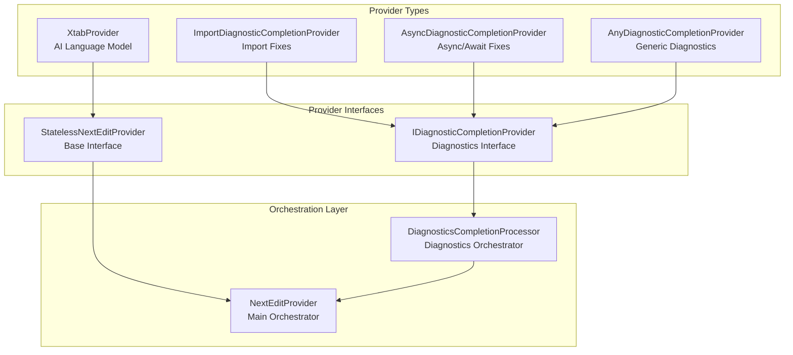
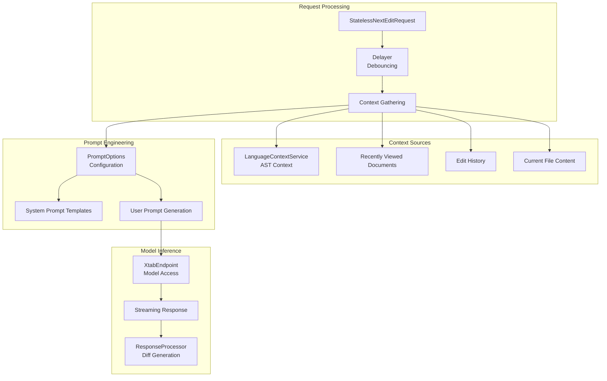
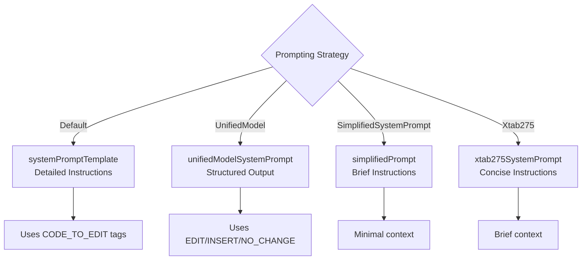
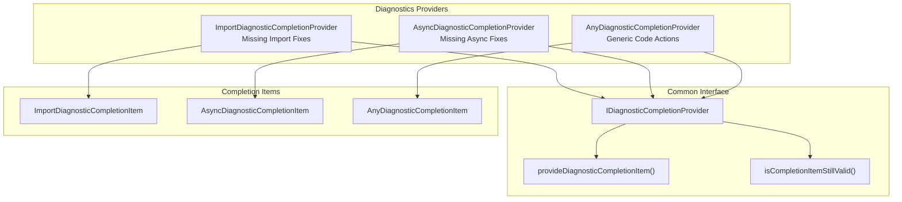
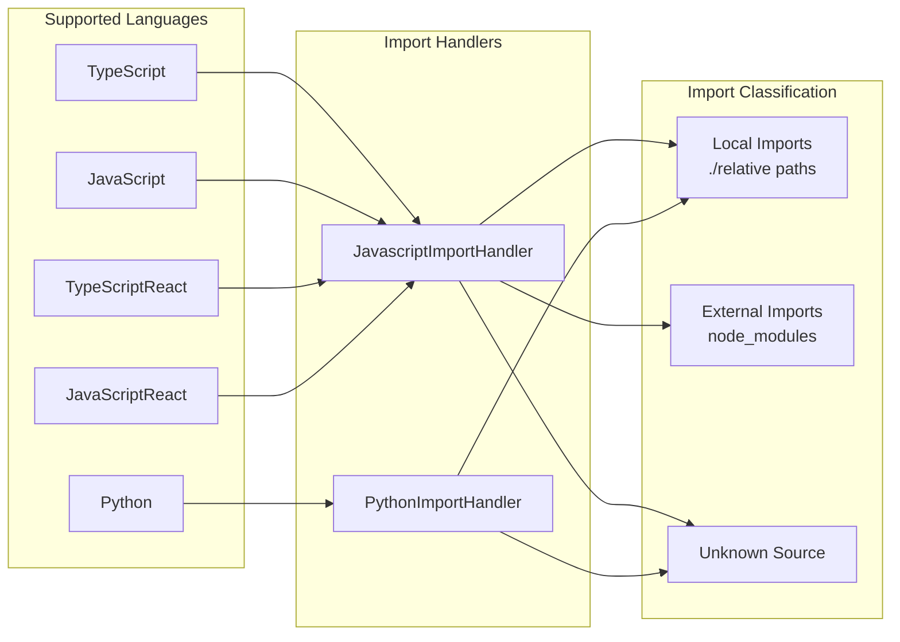
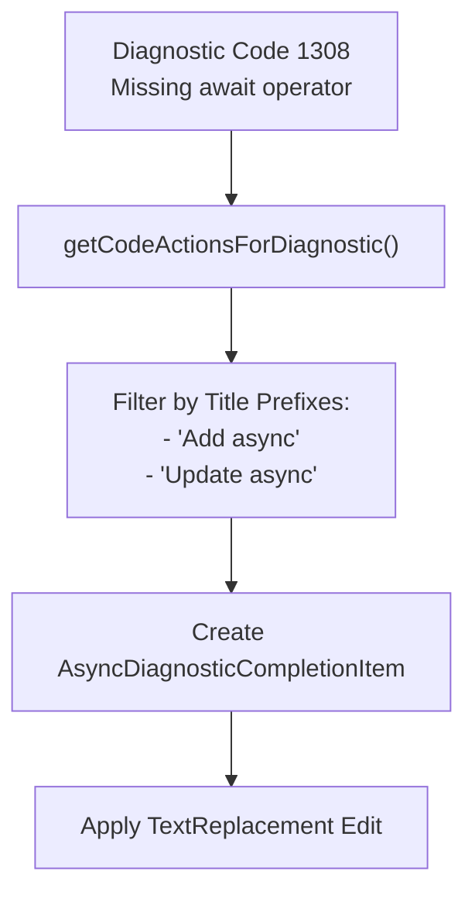
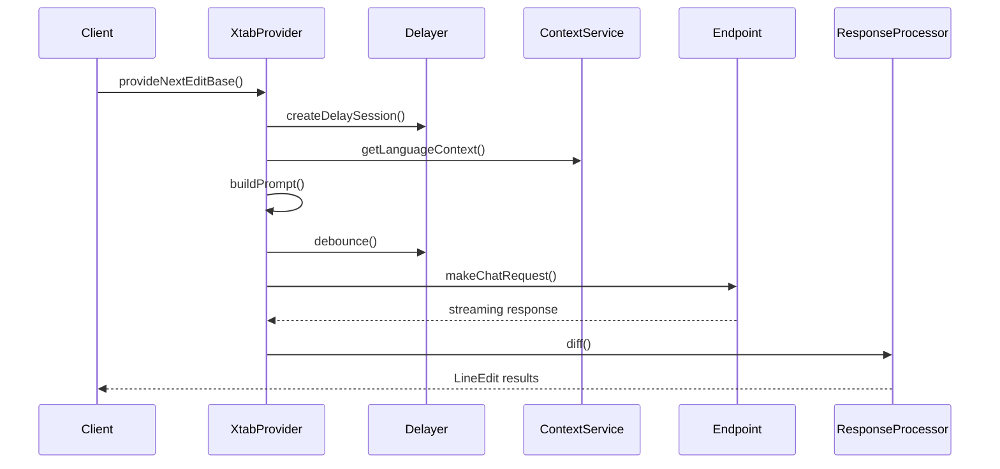
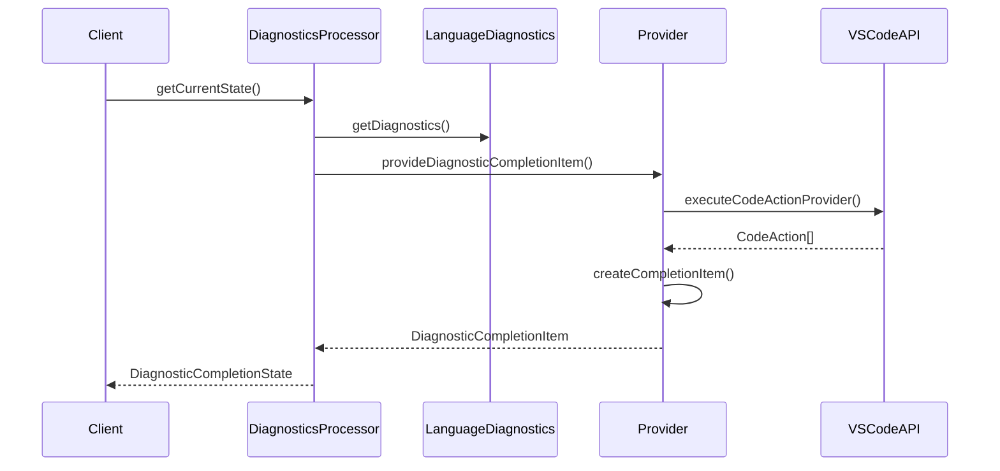
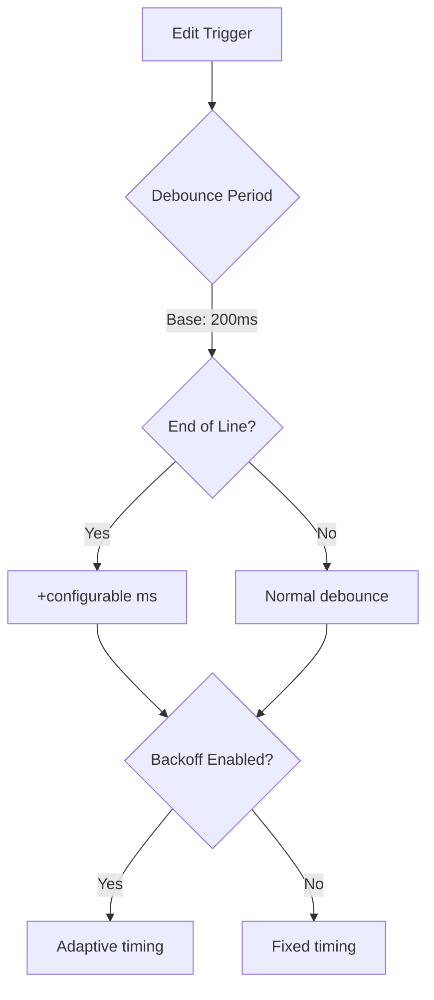
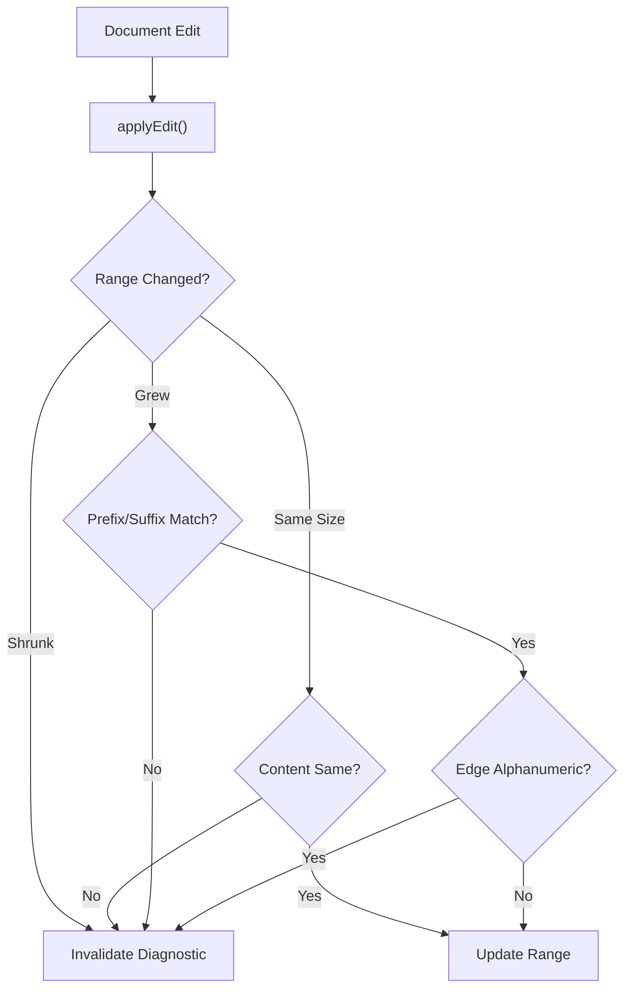

# Edit Providers

Relevant source files

The following files were used as context for generating this wiki page:

- [src/extension/inlineEdits/test/vscode-node/diagnosticsCollection.spec.ts](src/extension/inlineEdits/test/vscode-node/diagnosticsCollection.spec.ts)
- [src/extension/inlineEdits/vscode-node/features/diagnosticsBasedCompletions/anyDiagnosticsCompletionProvider.ts](src/extension/inlineEdits/vscode-node/features/diagnosticsBasedCompletions/anyDiagnosticsCompletionProvider.ts)
- [src/extension/inlineEdits/vscode-node/features/diagnosticsBasedCompletions/asyncDiagnosticsCompletionProvider.ts](src/extension/inlineEdits/vscode-node/features/diagnosticsBasedCompletions/asyncDiagnosticsCompletionProvider.ts)
- [src/extension/inlineEdits/vscode-node/features/diagnosticsBasedCompletions/diagnosticsCompletions.ts](src/extension/inlineEdits/vscode-node/features/diagnosticsBasedCompletions/diagnosticsCompletions.ts)
- [src/extension/inlineEdits/vscode-node/features/diagnosticsBasedCompletions/importDiagnosticsCompletionProvider.ts](src/extension/inlineEdits/vscode-node/features/diagnosticsBasedCompletions/importDiagnosticsCompletionProvider.ts)
- [src/extension/inlineEdits/vscode-node/features/diagnosticsCompletionProcessor.ts](src/extension/inlineEdits/vscode-node/features/diagnosticsCompletionProcessor.ts)
- [src/extension/inlineEdits/vscode-node/features/diagnosticsInlineEditProvider.ts](src/extension/inlineEdits/vscode-node/features/diagnosticsInlineEditProvider.ts)
- [src/extension/xtab/common/promptCrafting.ts](src/extension/xtab/common/promptCrafting.ts)
- [src/extension/xtab/node/xtabProvider.ts](src/extension/xtab/node/xtabProvider.ts)
- [src/extension/xtab/test/common/promptCrafting.spec.ts](src/extension/xtab/test/common/promptCrafting.spec.ts)
- [src/platform/configuration/common/configurationService.ts](src/platform/configuration/common/configurationService.ts)
- [src/platform/inlineEdits/common/dataTypes/xtabPromptOptions.ts](src/platform/inlineEdits/common/dataTypes/xtabPromptOptions.ts)
- [src/platform/inlineEdits/common/workspaceEditTracker/workspaceDocumentEditTracker.ts](src/platform/inlineEdits/common/workspaceEditTracker/workspaceDocumentEditTracker.ts)

This document covers the edit provider system in the GitHub Copilot Chat extension, which provides AI-powered inline code suggestions and diagnostics-based completions. Edit providers are responsible for generating contextual code edits that appear as inline suggestions in VS Code.

For information about the broader inline edits system architecture, see [Inline Edits System](#4). For workspace and document tracking mechanisms, see [Workspace and Document Tracking](#4.2).

## Provider Architecture

The edit provider system consists of multiple specialized providers that implement different strategies for generating inline code edits:

Sources: [src/extension/xtab/node/xtabProvider.ts:70-100](), [src/extension/inlineEdits/vscode-node/features/diagnosticsBasedCompletions/importDiagnosticsCompletionProvider.ts:179-206](), [src/extension/inlineEdits/vscode-node/features/diagnosticsBasedCompletions/asyncDiagnosticsCompletionProvider.ts:27-33](), [src/extension/inlineEdits/vscode-node/features/diagnosticsBasedCompletions/anyDiagnosticsCompletionProvider.ts:37-43]()

## XtabProvider - AI Language Model Provider

The `XtabProvider` is the primary AI-powered edit provider that generates code completions using language models. It extends `ChainedStatelessNextEditProvider` and implements sophisticated context gathering and prompt engineering.

### Core Architecture

Sources: [src/extension/xtab/node/xtabProvider.ts:70-100](), [src/extension/xtab/node/xtabProvider.ts:110-137](), [src/extension/xtab/node/xtabProvider.ts:391-500]()

### Context Gathering Strategy

The `XtabProvider` employs multiple context sources to inform its completions:

| Context Source | Purpose | Configuration |
|---|---|---|
| Language Context | AST-based semantic information | `InlineEditsXtabLanguageContextEnabled` |
| Recently Viewed Documents | Cross-file context | `InlineEditsXtabNRecentlyViewedDocuments` |
| Edit History | User editing patterns | `InlineEditsXtabDiffNEntries` |
| Current File | Surrounding code context | `InlineEditsXtabCurrentFileMaxTokens` |

Sources: [src/extension/xtab/node/xtabProvider.ts:335-388](), [src/platform/inlineEdits/common/dataTypes/xtabPromptOptions.ts:31-74]()

### Prompt Engineering

The system supports multiple prompting strategies controlled by configuration:

Sources: [src/extension/xtab/common/promptCrafting.ts:34-102](), [src/extension/xtab/node/xtabProvider.ts:217-248]()

## Diagnostics-Based Edit Providers

Diagnostics-based providers generate code completions by analyzing VS Code diagnostics (errors, warnings) and providing appropriate fixes through code actions.

### Provider Hierarchy

Sources: [src/extension/inlineEdits/vscode-node/features/diagnosticsBasedCompletions/diagnosticsCompletions.ts:109-115](), [src/extension/inlineEdits/vscode-node/features/diagnosticsBasedCompletions/importDiagnosticsCompletionProvider.ts:179-206](), [src/extension/inlineEdits/vscode-node/features/diagnosticsBasedCompletions/asyncDiagnosticsCompletionProvider.ts:27-33]()

### Import Diagnostics Provider

The `ImportDiagnosticCompletionProvider` specializes in resolving missing import statements by analyzing "Cannot find name" diagnostics and suggesting appropriate imports.

#### Language Support and Import Detection

Sources: [src/extension/inlineEdits/vscode-node/features/diagnosticsBasedCompletions/importDiagnosticsCompletionProvider.ts:181-206](), [src/extension/inlineEdits/vscode-node/features/diagnosticsBasedCompletions/importDiagnosticsCompletionProvider.ts:368-445]()

### Async Diagnostics Provider

The `AsyncDiagnosticCompletionProvider` handles TypeScript error code 1308, which indicates missing `async` keywords in function declarations.

#### Async Code Action Processing

Sources: [src/extension/inlineEdits/vscode-node/features/diagnosticsBasedCompletions/asyncDiagnosticsCompletionProvider.ts:75-106]()

## Configuration System

Edit providers are extensively configurable through the `IConfigurationService`, with settings controlling behavior, performance, and experimentation.

### XtabProvider Configuration

| Setting | Purpose | Default |
|---|---|---|
| `InlineEditsXtabProviderUrl` | Override model endpoint | `undefined` |
| `InlineEditsXtabProviderModelName` | Override model name | `undefined` |
| `InlineEditsXtabNRecentlyViewedDocuments` | Context document count | `5` |
| `InlineEditsXtabCurrentFileMaxTokens` | Current file token limit | `2000` |
| `InlineEditsXtabLanguageContextEnabled` | Enable AST context | `false` |
| `InlineEditsXtabUseUnifiedModel` | Use structured output | `false` |

Sources: [src/platform/configuration/common/configurationService.ts:655-682]()

### Diagnostics Configuration

| Setting | Purpose | Default |
|---|---|---|
| `InlineEditsDiagnosticsExplorationEnabled` | Enable generic diagnostics provider | `false` |
| `InlineEditsIgnoreCompletionsDisablement` | Ignore completions disabled state | `false` |
| `InlineEditsDebounce` | Debounce delay in milliseconds | `200` |

Sources: [src/platform/configuration/common/configurationService.ts:683-684](), [src/platform/configuration/common/configurationService.ts:640-647]()

## Request Processing Flow

The edit provider system processes requests through a sophisticated pipeline involving debouncing, context gathering, and result streaming.

### XtabProvider Request Flow

Sources: [src/extension/xtab/node/xtabProvider.ts:110-137](), [src/extension/xtab/node/xtabProvider.ts:391-500]()

### Diagnostics Request Flow

Sources: [src/extension/inlineEdits/vscode-node/features/diagnosticsCompletionProcessor.ts:286-308](), [src/extension/inlineEdits/vscode-node/features/diagnosticsBasedCompletions/diagnosticsCompletions.ts:160-184]()

## Performance and Caching

Edit providers implement sophisticated caching and performance optimization strategies:

### Debouncing Strategy

The `Delayer` class implements adaptive debouncing based on user behavior:

Sources: [src/extension/xtab/node/xtabProvider.ts:177-178](), [src/platform/configuration/common/configurationService.ts:647-650]()

### Diagnostics Caching

The `DiagnosticsCollection` class efficiently tracks and invalidates cached diagnostics:

Sources: [src/extension/inlineEdits/vscode-node/features/diagnosticsCompletionProcessor.ts:56-164]()

## Telemetry and Observability

Edit providers include comprehensive telemetry for performance monitoring and debugging:

### Telemetry Data Points

| Metric | Provider | Purpose |
|---|---|---|
| `ttft` | XtabProvider | Time to first token |
| `modelName` | XtabProvider | Model identifier |
| `nLinesOfCurrentFileInPrompt` | XtabProvider | Context size |
| `type` | Diagnostics | Completion type |
| `droppedReasons` | Diagnostics | Why completions were rejected |
| `distanceToUnknownDiagnostic` | Diagnostics | Proximity to unsupported issues |

Sources: [src/extension/xtab/node/xtabProvider.ts:427-464](), [src/extension/inlineEdits/vscode-node/features/diagnosticsCompletionProcessor.ts:342-371]()