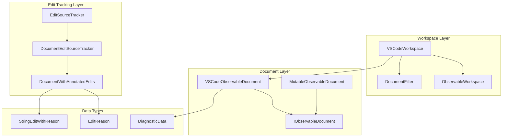
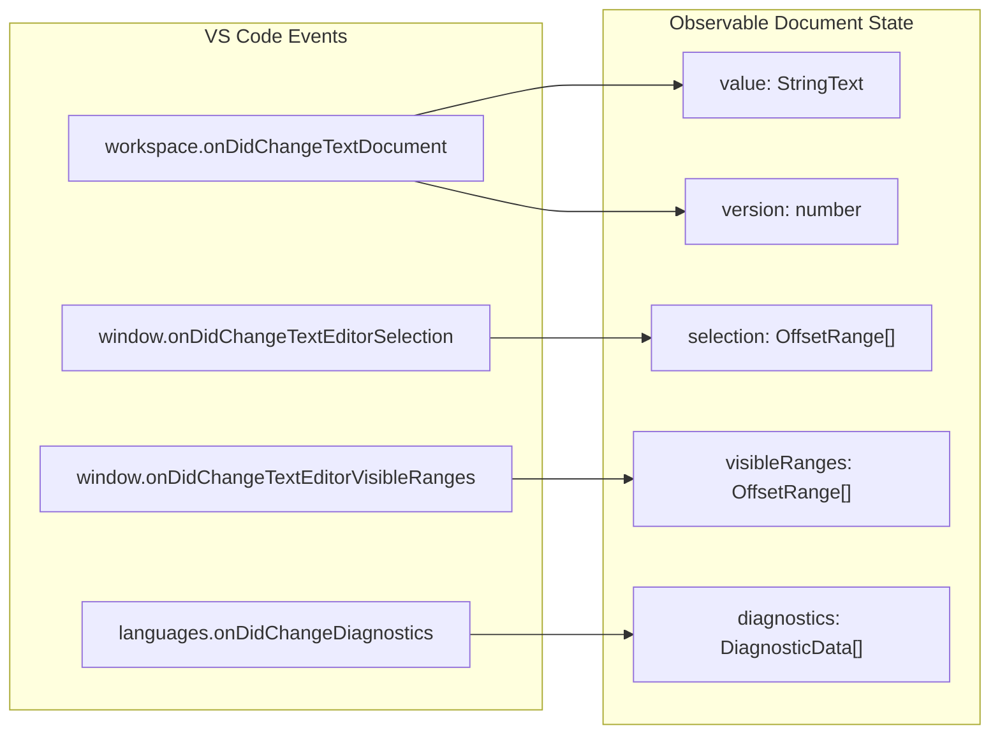
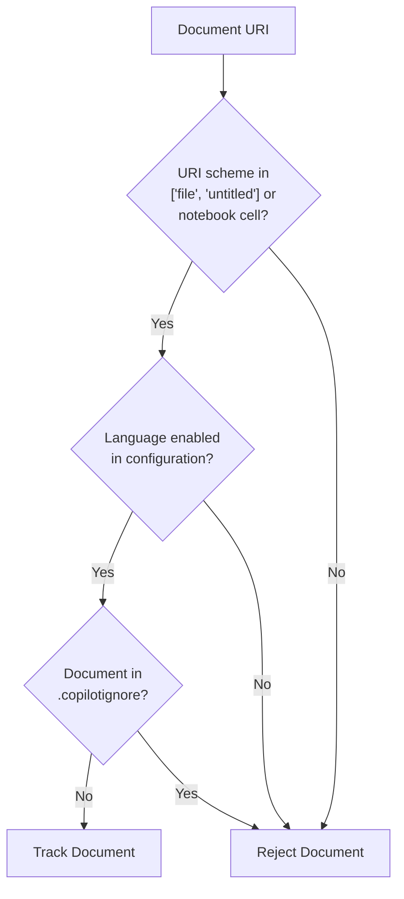
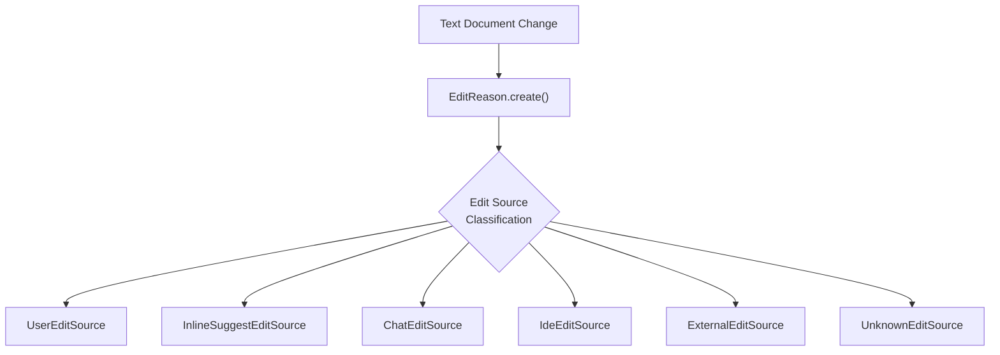
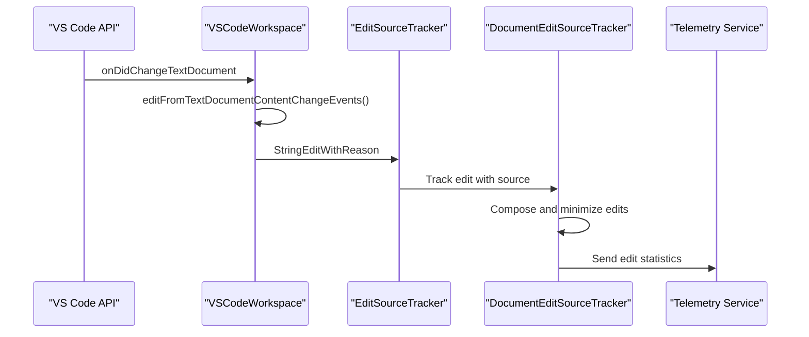
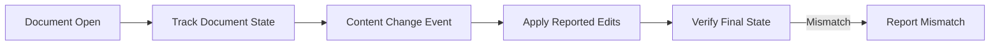
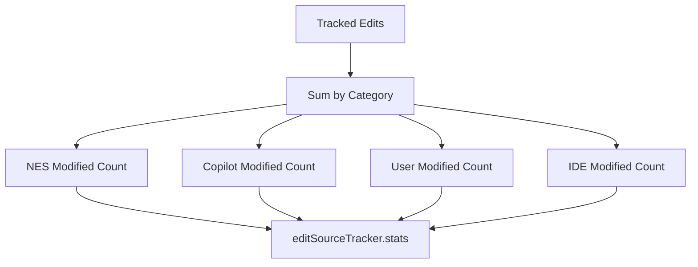

# Workspace and Document Tracking

Relevant source files

The following files were used as context for generating this wiki page:

- [src/extension/inlineEdits/common/documentWithAnnotatedEdits.ts](src/extension/inlineEdits/common/documentWithAnnotatedEdits.ts)
- [src/extension/inlineEdits/common/editSourceTrackingImpl.ts](src/extension/inlineEdits/common/editSourceTrackingImpl.ts)
- [src/extension/inlineEdits/common/editTracker.ts](src/extension/inlineEdits/common/editTracker.ts)
- [src/extension/inlineEdits/vscode-node/parts/vscodeWorkspace.ts](src/extension/inlineEdits/vscode-node/parts/vscodeWorkspace.ts)
- [src/platform/inlineEdits/common/dataTypes/diagnosticData.ts](src/platform/inlineEdits/common/dataTypes/diagnosticData.ts)
- [src/platform/inlineEdits/common/editReason.ts](src/platform/inlineEdits/common/editReason.ts)
- [src/platform/inlineEdits/common/observableWorkspace.ts](src/platform/inlineEdits/common/observableWorkspace.ts)

This document covers the workspace and document tracking system that monitors document states, text changes, and edit sources in the VS Code extension. The system provides observable interfaces for documents, tracks edit origins, and manages document lifecycle events for the inline edits system.

For information about the actual edit providers that consume this tracking data, see [Edit Providers](#4.1). For details about the language context system that uses workspace information, see [Language Context System](#5).

## System Architecture

The workspace tracking system is built around observable patterns and provides real-time monitoring of document states, changes, and metadata. The core architecture consists of workspace observers, document trackers, and edit source classification.

### Core Components

Sources: [src/extension/inlineEdits/vscode-node/parts/vscodeWorkspace.ts:30-208](), [src/platform/inlineEdits/common/observableWorkspace.ts:18-240](), [src/extension/inlineEdits/common/editTracker.ts:18-161]()

## Document Lifecycle Management

The `VSCodeWorkspace` class manages the lifecycle of documents and provides observable interfaces for tracking document states. It integrates with VS Code's workspace APIs to monitor document open/close events, text changes, and editor state changes.

### Document State Tracking

The system tracks multiple aspects of document state:

| Property | Type | Description |
|----------|------|-------------|
| `value` | `StringText` | Current document content |
| `version` | `number` | Document version number |
| `selection` | `OffsetRange[]` | Current cursor selections |
| `visibleRanges` | `OffsetRange[]` | Currently visible text ranges |
| `diagnostics` | `DiagnosticData[]` | Error and warning diagnostics |
| `languageId` | `LanguageId` | Document language identifier |

Sources: [src/extension/inlineEdits/vscode-node/parts/vscodeWorkspace.ts:214-239](), [src/platform/inlineEdits/common/observableWorkspace.ts:83-99]()

### Document Filtering

The `DocumentFilter` class determines which documents should be tracked by the system. It applies several filtering criteria to avoid monitoring irrelevant documents.

The filtering logic in `DocumentFilter.isTrackingEnabled()` checks:
- URI scheme must be `file`, `untitled`, or notebook cell
- Language must be enabled in configuration
- Document must not be in `.copilotignore`

Sources: [src/extension/inlineEdits/vscode-node/parts/vscodeWorkspace.ts:258-300]()

## Edit Source Tracking

The edit tracking system monitors document changes and classifies them by source (user, AI, IDE, etc.). This enables detailed analytics about how different tools contribute to document modifications.

### Edit Classification

The system classifies edits into categories:

| Edit Source | Description | Metadata |
|-------------|-------------|----------|
| `UserEditSource` | Direct user typing | Cursor events |
| `InlineSuggestEditSource` | AI completions | Extension ID, completion type |
| `ChatEditSource` | Chat-based edits | Sidebar vs inline |
| `IdeEditSource` | IDE features | Format, suggest |
| `ExternalEditSource` | External file changes | Reload from disk |
| `UnknownEditSource` | Unclassified changes | - |

Sources: [src/extension/inlineEdits/common/documentWithAnnotatedEdits.ts:88-195](), [src/platform/inlineEdits/common/editReason.ts:76-131]()

### Edit Tracking Flow

The edit tracking process:
1. VS Code fires document change events
2. `VSCodeWorkspace` converts events to `StringEditWithReason`
3. `EditSourceTracker` distributes to per-document trackers
4. `DocumentEditSourceTracker` accumulates and processes edits
5. Telemetry is sent for analytics

Sources: [src/extension/inlineEdits/vscode-node/parts/vscodeWorkspace.ts:66-78](), [src/extension/inlineEdits/common/editTracker.ts:80-151]()

## Document State Verification

The system includes a verification mechanism to ensure VS Code's content change API reports consistent document states. This helps detect and report API inconsistencies.

### Verification Process

The `VerifyTextDocumentChanges` class tracks document states and verifies that applying reported edits produces the expected final state:

The verification tracks:
- Previous document text and line endings
- Content change events from VS Code
- Expected vs actual final document state
- Telemetry for inconsistencies

Sources: [src/extension/inlineEdits/vscode-node/parts/vscodeWorkspace.ts:307-382]()

## Telemetry and Analytics

The system provides comprehensive telemetry about edit patterns and document usage. This data helps understand how different AI tools and user actions contribute to code development.

### Edit Source Analytics

The telemetry system tracks:
- Character counts by edit source
- Edit survival rates over time
- Git branch and commit context
- Language-specific statistics

Two tracking modes are used:
- **Long-term tracking**: Resets on branch/commit changes
- **5-minute windows**: Short-term edit patterns

Sources: [src/extension/inlineEdits/common/editSourceTrackingImpl.ts:128-240](), [src/extension/inlineEdits/common/editSourceTrackingImpl.ts:374-441]()

## Integration with VS Code APIs

The workspace tracking system integrates deeply with VS Code's APIs to provide comprehensive document monitoring:

### API Integration Points

| VS Code API | Usage | Observable Output |
|-------------|-------|-------------------|
| `workspace.onDidChangeTextDocument` | Text change monitoring | `StringEditWithReason` |
| `window.onDidChangeTextEditorSelection` | Selection tracking | `OffsetRange[]` |
| `window.onDidChangeTextEditorVisibleRanges` | Viewport tracking | `OffsetRange[]` |
| `languages.onDidChangeDiagnostics` | Error/warning tracking | `DiagnosticData[]` |
| `workspace.textDocuments` | Document lifecycle | `IObservableDocument[]` |

The system converts VS Code events into observable streams that can be consumed by other parts of the extension, particularly the inline edits system.

Sources: [src/extension/inlineEdits/vscode-node/parts/vscodeWorkspace.ts:66-105](), [src/extension/inlineEdits/vscode-node/parts/vscodeWorkspace.ts:245-256]()